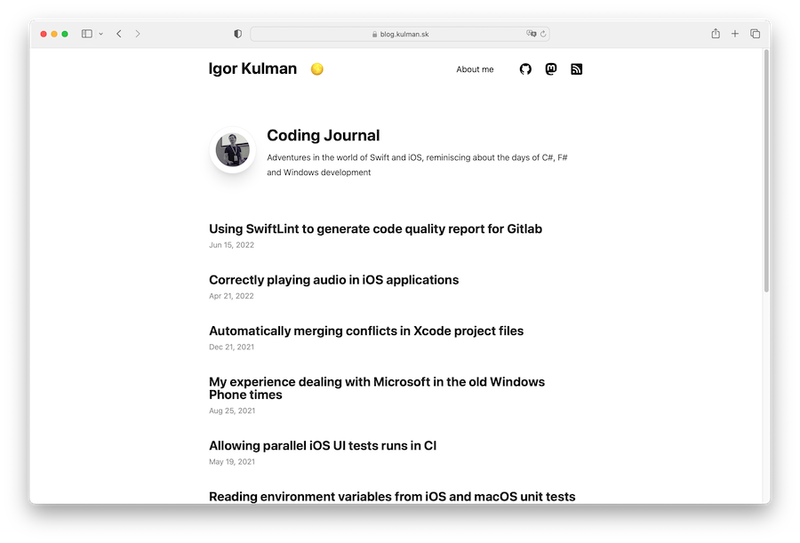

# Coding Journal

Source code for my programming blog located at [blog.kulman.sk](https://blog.kulman.sk). 

### Built With

* [Hugo](http://gohugo.io) - Static site generator
* [Beautiful Hugo](https://github.com/halogenica/beautifulhugo) - Theme
* [Netlify](https://www.netlify.com/) - Hosting

### Author

Igor Kulman - igor@kulman.sk
