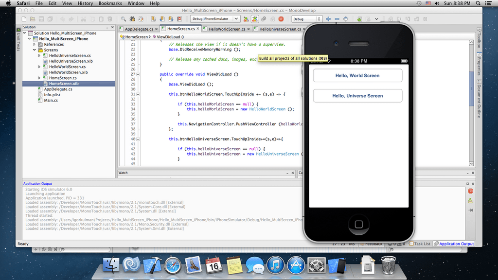

+++
title = "MonoTouch: iOS development for .NET programmers"
author = "Igor Kulman"
date = "2012-12-19"
url = "/monotouch-ios-development-for-net-programmers/"
categories = ["Programming in general"]
tags = ["Csharp","iOS","Mono"]
+++
Beeing [quite disappointed with the Windows Phone platform recently][1] I started to look for other ways to use my .NET skills and to develop for a mobile platform at the same time. I found [MonoTouch][2], a product from Xamarin that allows you to build iOS apps using C# with Mono. 

**What is MonoTouch?**

MonoTouch is a product or a framework do develop iOS apps using [Mono][3] (an open-source .NET implementation). It allows you to use C# (hopefuly also F# although I have not been able to get it to work yet) and all the .NET features libraries you use and like and of course your existing codebase. No Objective-C knowledge is required, but you will have to learn about the iOS ecosystem an iOS SDK. The iOS SDK is also needed, so you cannot do the development in Windows, you have to use a Mac. There are ways to get MacOS X working on a PC as a native install or in VMWare / VirtualBox, if you just want to try it out, but it may not be legal.

<!--more-->

**How does the development work?**

When using MonoTouch you create a new project in MonoDevelop that comes with MonoTouch. The UI files (*.xib) cannot be modified using MonoDevelop so you have to use XCode. You define your UI in XCode like you would as a native developer, creating outlets and actions. MonoTouch watches the project files you make in XCode and generates matching C# files, that allow you to use all the UI elements created in XCode from your C# code. This method is prefered, but you can create the whole UI in code and never use XCode. 

The iOS development uses MVC pattern, but it does not look like the MVC pattern I am used to. It looks to me more like WinForms development than WPF or other XAML-based technology using MVVM. Just to be clear, MonoTouch would not shield you from the iOS specific stuff, it just porjects the iOS SDK methods and properties to Mono. But it still C# (check out the Write beautiful code section on the [MonoTouch website][2]).

The MonoTouch project compiles to native ARM code. 

**Should you use it?**

That depends. If you are a .NET developer, MonoTouch is definitely the way to do your iOS development. If you will be in a position to decide between native iOS development and MonoTouch, definetely [check out this StackOverflow question][4]. 

The prices start at $399 for indie developers and companies with less then 10 employees. The evaluation version allows you to develop a full application and test it in the simulator, but you have to have a commercial license to deploy to a real device and to the AppStore.

 [1]: http://blog.kulman.sk/why-i-do-not-like-windows-phone-programming-anymore/
 [2]: http://xamarin.com/monotouch
 [3]: http://www.mono-project.com/Main_Page
 [4]: http://stackoverflow.com/questions/1583856/how-to-decide-between-monotouch-and-objective-c
