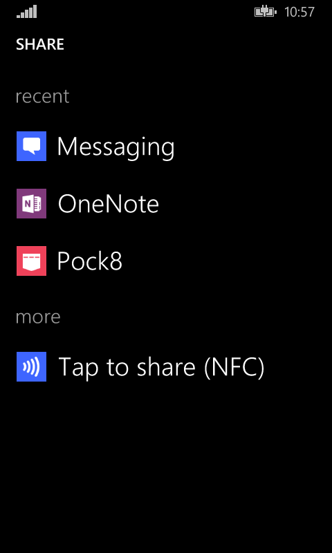

+++
title = "Making your Windows Phone Silverlight 8.1 app a Share Contract target"
author = "Igor Kulman"
date = "2014-04-23"
url = "/making-your-windows-phone-silverlight-8-1-app-a-share-contract-target/"
categories = ["Windows Phone"]
tags = ["Csharp","Caliburn-Micro","Windows Phone","XAML"]
+++
Windows Phone 8.1 introduced many interesting new thing, the one I personally like the best as a developer is the Share Contract. The Share Contract allows your apps to share data using an unified and easy way and also to receive data from other apps. This functionality is important for my [Pock8][1] app, which is a Pocket client. By making Pock8 app a Share Contract target, the app can receive links from other apps, more importantly from the built-in webrowser (IE). This makes the app even more easy to use and valuable. 



The problem is that [all the documentation I found][3] and also [the sample app][4] are for Windows Runtime. Pock8 is a Silverligt app and I have no intentions to rewrite it to Windows Runtime. 

I had to make some digging and I finally found the solution in a build video called [Contracts and Pickers: Building Apps that Work Together on Windows][5]. 

<!--more-->

First you have to add the **Share Contract** ability to the new manifest file (Package.appxmanifest, the Declarations tab). If you want to receive links, Choose **weblink** as data format. This step is the same for Windows Runtime and for Silverlight apps, but all the other steps differ. 

You can determine if your application was launched normally or as a Share Contract target in the application Launching event. If you cast the **LaunchingEventArgs** to **ShareLaunchingEventArgs** and the result is not null, your application was launched as a Share Contract target. The video recommend creating an internal property of type **ShareOperation** in App.xaml.cs and saving the data from **ShareLaunchingEventArgs** there:

```csharp
public class AssociationUriMapper : UriMapperBase
{
  public override Uri MapUri([NotNull] Uri uri)
  {
   
    var op = (Application.Current as App).ShareOperation;
    if (op != null)
    {
      var link = op.Data.GetWebLinkAsync().GetResults();
      return new Uri("/Views/AddedView.xaml?Uri=" + HttpUtility.UrlEncode(link.ToString()), UriKind.Relative);

      // Otherwise perform normal launch.
      return uri;
    }
}
```

(I use Caliburn.Micro so I do it in the OnLaunch method of the Bootstrapper)

The next thing to do is to show a separate sharing page instead of the page you would normally show when your app starts. Create a **AssociationUriMapper** like you [would do when registering for a protocol][6] and simply check the **ShareOperation** property in App.xaml.cs:

If you use Caliburn.Micro as I do, do not forget to register the AssociationUriMapper in the Boostrappers CreatePhoneApplicationFrame method:

```csharp
protected override PhoneApplicationFrame CreatePhoneApplicationFrame()
{
  var frame = new PhoneApplicationFrame();
  frame.UriMapper = new AssociationUriMapper();
  return frame;
}   
```

 [1]: http://t.co/YMtrM84rwI
 [3]: http://msdn.microsoft.com/en-us/library/windows/apps/xaml/hh871367.aspx
 [4]: http://msdn.microsoft.com/en-us/library/windows/apps/xaml/hh871363.aspx
 [5]: http://channel9.msdn.com/Events/Build/2014/2-520
 [6]: http://msdn.microsoft.com/en-us/library/windowsphone/develop/jj206987(v=vs.105).aspx
