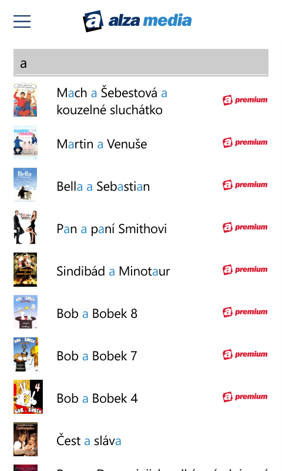

+++
title = "Highlighting letters in TextBlock in Windows Phone 8.1 and Windows 8.1"
author = "Igor Kulman"
date = "2015-10-17"
url = "/highlighting-letters-in-textblock-in-windows-phone-8-1-and-windows-8-1/"
categories = ["Windows Phone","Windows Store"]
tags = ["Windows Phone","Windows Store","XAML"]
keywords = ["Windows Phone","Windows Store","XAML"]
+++
In my current project I had to implement an interesting feature for both Windows Phone 8.1 and Windows 8.1 project of the Universal app. The idea is simply. The users want to search for a movie. They enter a search term into a TextBox and a list of results is shown. The results should have the search term highlighted in them.



<!--more-->

The standard TextBlock used to display the movie titles does not support any kind of letter highlighting, so I had to write a custom one. I created a custom UserControl. The UserControl contains a few dependency properties Text, HighlightedText, HighlightBrush and a TextBlock. When Text or HighlightedText change, the Text is then split into multiple Runs that are added to the TextBlock.

```csharp
private void Update()
{
    if (string.IsNullOrEmpty(Text) || string.IsNullOrEmpty(HighlightedText))
    {
        TB.Inlines.Clear();
        return;
    }

    TB.Inlines.Clear();
    var parts = Regex.Split(Text, HighlightedText, RegexOptions.IgnoreCase);
    var len = 0;
    foreach (var part in parts)
    {
        len = len + part.Length + 1;

        TB.Inlines.Add(new Run
        {
            Text = part
        });

        if (Text.Length >= len)
        {
            var highlight = Text.Substring(len - 1, HighlightedText.Length); //to match the case

            TB.Inlines.Add(new Run
            {
                Text = highlight,
                Foreground = HighlightBrush
            });
        }
    }
}
```

The whole working custom control is available at Github: <https://github.com/igorkulman/Kulman.WPA81.HighlightTextBox>.

{}
