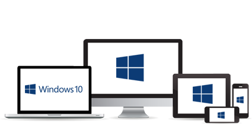

+++
Description = "When Microsoft announced the Windows 10 developer platform, they also announced bridges to make porting apps from Android, iOS and Web easier. Those bridges are now either dead (Android) or unusable (iOS) but there is another tool that can be considered a bridge left. It is called Mobilize.net Silverlight Bridge and it is not from Microsoft. It promises converting existing Windows Phone 8 (Silverlight apps) to the Universal Windows Platform. Considering the majority of apps in the Windows Phone Store are Windows Phone 8 apps and the fact that Android and iOS developers do not really care about Windows, Mobilize.net seem to be the most useful of the bridges, because there is no easy porting apps from Windows Phone 8 to UWP, just rewriting. So I tried it out."
Tags = ["Windows Phone", "UWP", "XAML"]
author = "Igor Kulman"
date = "2015-12-18T09:29:12+01:00"
title = "Mobilize.net: Converting Windows Phone 8 apps to UWP? Not really"
url = "/mobilize-net-converting-windows-phone-apps-to-uwp"

+++

When Microsoft announced the Windows 10 developer platform, they also announced bridges to make porting apps from Android, iOS and Web easier. Those bridges are now either dead (Android) or unusable (iOS) but there is another tool that can be considered a bridge left. It is called [Mobilize.net Silverlight](http://www.mobilize.net/download-silverlight-bridge) Bridge and it is not from Microsoft. It promises converting existing Windows Phone 8 (Silverlight apps) to the Universal Windows Platform. Considering the majority of apps in the Windows Phone Store are Windows Phone 8 apps and the fact that Android and iOS developers do not really care about Windows, Mobilize.net seem to be the most useful of the bridges, because there is no easy porting apps from Windows Phone 8 to UWP, just rewriting. So I tried it out.

Mobilize.net is currently in technical preview. After you download and install it, it integrates into Visual Studio 2015 and there is a new context menu for Windows Phone 8 project, allowing you to convert them to UWP apps. If you use it, you get a dialog windows and a conversion process that will fail most of the times with a strange error. At least for me it did. 

<!--more-->

I got in touch with their support and I found out the reason for the conversion always failing. They do not support C# 6 all and mine, and probably all yours, project use C# 6. If you look at the error logs a bit closer, you will see error messages about failed tokenization. This is really strange, it looks like they are parsing the source code as text, instead of just using Roslyn. I do not get why, but they probably have a reason for this. 

If you go through all the trouble and remove all the C# 6 features from your project, the conversion will succeed. You will get a UWP project, that will most likely not compile. There are two main reasons for this. 

Mobilize.net changes your XAML to fix namespaces and replace controls that changed since Windows Phone 8, but it does not fix XAML features that were not available in UWP. And there are quite a few of them, from StringFormat in bindings to OpacityMask on images. You will have to fix your XAML manually and while you are at this, you will also have to rewrite your XAML to accommodate for the fact that there is not just one fixed resolution like it was in Windows Phone 8. Your XAML has to be responsive now. Mobilize.net did not really help here.

The seconds problem are third party libraries. There are [some mappings available for popular third party libraries](https://github.com/MobilizeNet/UWPConversionMappings). This mapping do two things. First they make sure the UWP project uses the correct Nuget packages and then they map namespaces, both in XAML and C#, that changed when the third party library transitioned from Windows Phone 8 to UWP. Chances are that there are no UWP versions of some or even the majority of the third party libraries you use. Probably because the functionality is nor longer available all the API has completely changed. 

I reached out to the Mobilize.net support asking about these two things, but I never got an answer.

In conclusion, if your app is not trivial, you use C# 6, third party libraries and all the available XAML features, your experience will not be very good. If you app is well written (MVVM, abstractions) your are better with creating a new UWP project, pasting your code and rewriting your XAML. If your app is more trivial, Mobilize.net will probably work well for you. But in this case, rewriting your app to UWP without it would be probably takes the same amount of time. 
