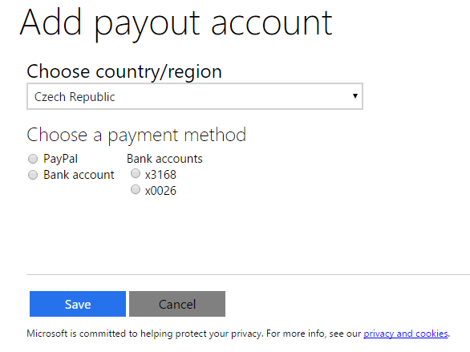

+++
title = "Problems getting paid from the Windows Store, again"
author = "Igor Kulman"
date = "2015-07-21"
url = "/problems-getting-paid-from-the-windows-store-again/"
categories = ["Windows Phone","Windows Store"]
tags = ["Windows Store", "Windows Phone"]
+++
I do not make much money on my Windows Phone apps (who does?), but when the payout time comes every couple of months, I expect the money to be delivered. Dealing with Microsoft, I should know better. 

**Failed payment**

Last month I looked into the Dev Center and saw that my scheduled payment failed, telling me to contact the support. So I did. The result was one moth of exchanging email without a solution.

**Dealing with support**

The Microsoft employee told me that I am in a small group of people with this problem. I do not know if I have such a bad look always be in a problematic supposedly small group, or that the group are not that small. He told me that Microsoft will retry the payment. The payment was supposedly retried on June 24th and succeeded. So they say. 

_Great news, your June payout was returned due to an internal issue; however, the payout of 5264.17 CZK has been re-attempted and was successfully completed on June 24th. If you have not received the payout then please review this transaction with your bank. Please let me know if you have any further questions._

I never got the money. The employee asked me a few times if I got the money and then resigned, telling me that it is my problem and I should check with my bank. Of course I checked with my bank, they do not have the money. If they had, they would transfer it to my account.

<!--more-->

**Will it happen again?**

So the support is not helpful, I think I will never see this money and I can just hope the next payment in a couple of months will be successful. Will it?

I took a look at my payout settings in the new Dev Center and it is a mess

It previous pages is telling my that everything is ok and my data is valid, but is it? Those four radios do not give me the confidence to believe it. Especially seeing my old account (x3168) that was there in the Windows Store and I deleted it. I used to get the payment to the x0026 account that was in my Windows Phone Store account. 

Funny thing about this form, I never found out how to delete this old account. If you select it, you can only edit it, no way to delete it. If I select the correct account and click save, nothing changes, the radios all remain unselected. I do now know it is a bug or another great Microsoft UI. 

So I guess maybe the next payment will also get lost somewhere ..
