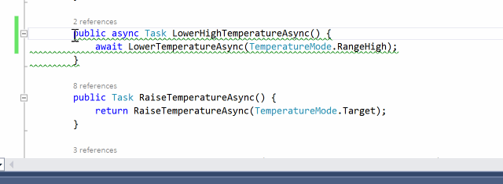

+++
title = "Visual Studio extensions to make your life easier"
author = "Igor Kulman"
date = "2015-11-02"
url = "/visual-studio-extensions-to-make-your-life-easier/"
Tags = ["Visual Studio", "Extensions", "Productivity", "Development Tools"]
+++
This blog post is inspired by the [7 open-source Visual Studio Extensions to make your life easier][1] article. In the article Igal Tabachnik showed his favorite Visual Studio extensions, that were quite interesting. I also use a few Visual Studio extensions that make my life easier, so I decided to share.

<!--more-->

**[Indent Guides][2]**

Small and simple extension with just one task, displaying indent and page width guides in Visual Studio text editor windows. There are three styles of guides: solid, dotted and dashed, available in thin and thick varieties and customizable color.

**[VSColorOutput][4]**

VSColorOutput can change the color of a line emitted to the output window based on specified rules. The rules consist of regular expressions. Rules map to classifications which in turn map to colors. The default patterns will color build errors in red, warnings in yellow/gold and successful build messages in green. It also colors the output of debug messages when running an app, so you can easily sort exceptions and your custom debug messages containing certain words.

**[Rename Visual Studio Windows Title][6]**

By default, Visual Studio shows the name of the opened solution name in the title. This makes it easier to navigate among multiple instances of Visual Studio. You see the solution name next to the Visual Studio icon in the taskbar and also in the task manager, when you have to (and we all sometimes have to) kill the right Visual Studio because it stopped responding. You can use it with Git and show the branch or any other info. For more information about this extension, see a [separate blog post I wrote][7].

**[AsyncFixer][9]**

AsyncFixer helps developers in finding and correcting 3 common async/await misuses. AsyncFixer was tested with hundreds of C# apps and successfully handles many corner cases. AsyncFixer will work just in the IDE and work as an analyzer on every project you open in Visual Studio. It can also operate in batch mode to correct all misuses in the document, project, or solution.

 [1]: http://hmemcpy.com/2015/10/7-open-source-visual-studio-extensions-to-make-your-life-easier/
 [2]: https://visualstudiogallery.msdn.microsoft.com/e792686d-542b-474a-8c55-630980e72c30
 [3]: http://i1.visualstudiogallery.msdn.s-msft.com/e792686d-542b-474a-8c55-630980e72c30/image/file/105611/1/screen.png
 [4]: https://www.visualstudiogallery.msdn.microsoft.com/f4d9c2b5-d6d7-4543-a7a5-2d7ebabc2496
 [5]: https://visualstudiogallery.msdn.microsoft.com/f4d9c2b5-d6d7-4543-a7a5-2d7ebabc2496/image/file/63101/9/screenshot.png?Id=63101
 [6]: https://visualstudiogallery.msdn.microsoft.com/f3f23845-5b1e-4811-882f-60b7181fa6d6
 [7]: http://blog.kulman.sk/quick-tip-showing-solution-branch-name-in-visual-studio-title/
 [8]: http://blog.kulman.sk/wp-content/uploads/2015/07/trayalya.png
 [9]: https://visualstudiogallery.msdn.microsoft.com/03448836-db42-46b3-a5c7-5fc5d36a8308
 [10]: https://i1.visualstudiogallery.msdn.s-msft.com/03448836-db42-46b3-a5c7-5fc5d36a8308/image/file/154241/1/asyncfixer-1.gif
