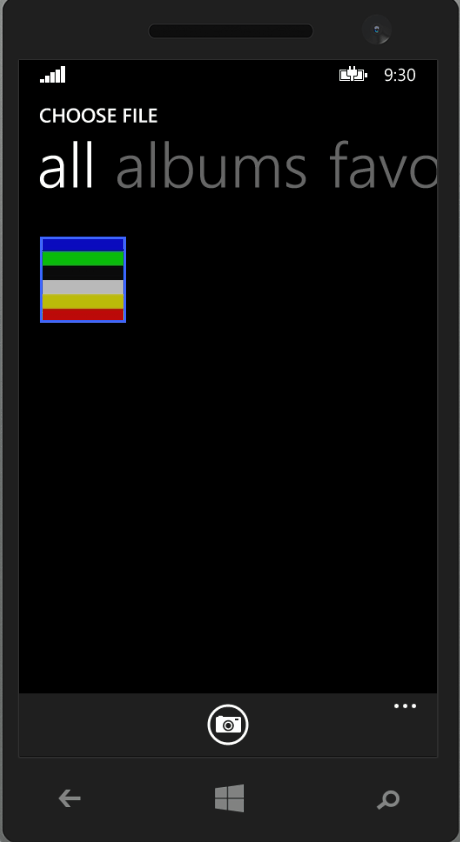
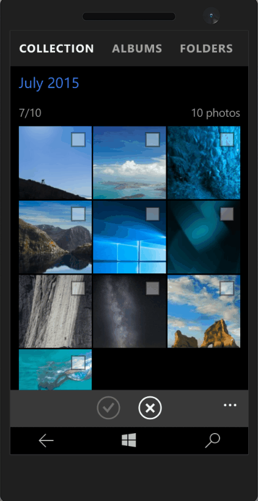
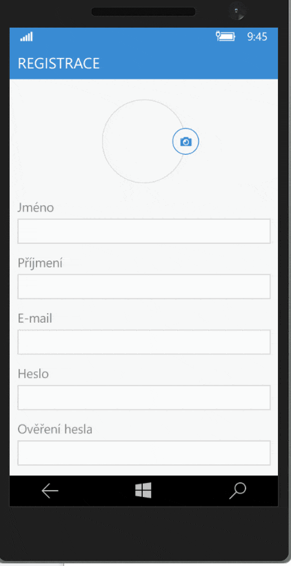

+++
Categories = [ "Windows Phone", "Windows Store", "UWP" ]
Description = "When developing Windows Phone apps you may encounter a use case when you have to allow the user to either pick a photo from the photos gallery in the photo or a take a new photo using the phone's camera. One example of this may be the registration process when the user may choose a profile picture. In Windows Phone 8.1, this task is quite simple, just use the FileOpenPicker. It allows you to pick a photo from the gallery or take a new photo. Just take a look at this animation showing how the users takes a new photo using the phone's camera."
Tags = ["Windows Phone", "Windows Store", "UWP"]
Keywords = ["Windows Phone", "Windows Store", "UWP", "XAML"]
author = "Igor Kulman"
date = "2016-03-14T09:29:12+01:00"
title = "Choosing an image from gallery or camera a bit better in Universal Windows apps"
url = "/choosing-an-image-from-gallery-or-camera-in-uwp"
share_img = "/images/wpa81.gif"

+++

When developing Windows Phone apps you may encounter a use case when you have to allow the user to either pick a photo from the photos gallery in the photo or a take a new photo using the phone's camera. One example of this may be the registration process when the user may choose a profile picture.

In Windows Phone 8.1, this task is quite simple, just use the `FileOpenPicker`. It allows you to pick a photo from the gallery or take a new photo. Just take a look at this animation showing how the users takes a new photo using the phone's camera.

<!--more-->

The code for this is relatively simple, although the `AndContinue` pattern can be a pain


var openPicker = new FileOpenPicker
{
    ViewMode = PickerViewMode.Thumbnail,
    SuggestedStartLocation = PickerLocationId.PicturesLibrary
};
openPicker.FileTypeFilter.Add(".jpg");
openPicker.PickSingleFileAndContinue();


In Windows 10 Mobile, the `FileOpenPicker` has been changed to be more customizable. This make the process of  taking a new photo using the phone's camera totally hidden. Not a chance a common user will discover it, just take a look at this animation.

So how to make this experience a bit better for the user? My solution is instead of launching the `FileOpenPicker` showing a `Flyout` with two options; Choose from gallery and Take photo. The Choose from gallery option just launches the `FileOpenPicker`


var openPicker = new FileOpenPicker
{
    ViewMode = PickerViewMode.Thumbnail,
    SuggestedStartLocation = PickerLocationId.PicturesLibrary
};
openPicker.FileTypeFilter.Add(".jpg");
var file = await openPicker.PickSingleFileAsync();

if (file != null)
{
    await ProcessFile(file);
}


and the Take photo option uses CameraCaptureUI to directly take a photo


var ccu = new CameraCaptureUI();
var file = await ccu.CaptureFileAsync(CameraCaptureUIMode.Photo);

if (file != null)
{
    await ProcessFile(file);
} 


The result might look like this. Do not forget to add an option to delete the photo if one is already chosen.

