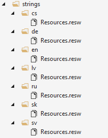

+++
Description = "I currently work on a Windows Phone 8.1 app for a client with an interesting approach to app localization. They have a Google Docs sheet with all the localization string for the app in all the supported languages and a tool that converts this localization strings in to per-language versioned JSON files. The generated JSON files are kept in a git repository. The Android, iOS and now my Windows Phone app should have the git repository added as a submodule. When a new version of the JSON files with the localization appear in the submodule, the app should use them. Seems reasonable and efficient, so how to approach this on Windows Phone?"
Tags = [ "Windows Phone", "Windows Store"]
author = "Igor Kulman"
date = "2016-02-09T09:29:12+01:00"
title = "How to handle localization strings provided by the client in a Windows Phone app"
url = "/how-to-handle-localization-strings-provided-by-client"

+++

I currently work on a Windows Phone 8.1 app for a client with an interesting approach to app localization. They have a Google Docs sheet with all the localization string for the app in all the supported languages and a tool that converts this localization strings in to per-language versioned JSON files. The generated JSON files are kept in a git repository. The Android, iOS and now my Windows Phone app should have the git repository added as a submodule. When a new version of the JSON files with the localization appear in the submodule, the app should use them. 

**Deciding the localization approach**

In the old days of Windows Phone 7 and Windows Phone 8 I would simply write an utility that reads the newest version of the JSON localization files and generate a RESX file for each language. RESX is XML format that is simple to generate. If you had a localized string with a key say Game, you would put it everywhere when the localization of the word game was needed. Simple 

In Windows Phone 8.1 (and 10) you should use RESW files for localization. This is the new x:Uid approach that, in my honest opinion, really sucks. It forces you to duplicate string if you use I string in multiple places, there is no design time support, you never know what UI element are localized and what you forgot to localize. Simply put, it is a mess. This approach is not usable at all with the string client provides. 

<!--more-->

There is no way to make any script generate a RESW file with duplicated string matching the multiple usages of each string. If you have a localized string with a key Game and 2 TextBlocks and 1 Buttons that use it, you need to put it into the RESW file 3 times, once for each UI element. SO instead of a Game key, you would have a GameTextBlock.Text key, an AnotherGameTextBlock.Text and a GameButton.Content key, all with the same value and applied in design time. Madness. 

**Using RESX files on Windows Phone 8.1**

One approach to solve this problem is to use the good old RESX files with your Windows Phone 8.1 project. Typically by creating a Portable Class Library (PCL) with the RESX files, doing a bit of configuration for the supported languages and linking this PCL project to your Windows Phone 8.1 project. You can find a few articles about this approach online and also a few gotchas and their solutions. It sounds like a good idea at first, but it is too problematic for my tastes. 

I tried this approach but ended frustrated with too many problems too solve, like Visual Studio hanging when deploying to a device when using RESX files. So I decided to go with a custom solution.

**Generating Windows Phone 8-like localization strings**

Finally I decided to generate a class that would look and behave similar to the old Windows Phone 8-like localization strings class. The idea is quite simple, no need to a PCL or any RESX files. 

The first step is to create a directory and empty RESW files for each supported language in the Windows Phone 8.1 project



Then write a script that generates all the RESW files from the newest JSON localization files

```csharp
//directories representing the versions (e.g. 1.0, 1.0)
var dirs = Directory.GetDirectories(@"..\..\..\SecretProject-localization\export");

//the newest version
var version = dirs.Select(l => new Version(l.Split(Path.DirectorySeparatorChar).Last())).Max();

//all the localization keys
var keys = new HashSet<string>();

//each JSON file represents string for one language
var files = Directory.GetFiles(@"..\..\..\SecretProject-localization\export\"+ version).Where(l=>l.EndsWith(".json"));
foreach (var file in files)
{
    //RESW XML header
    var sb = new StringBuilder();
    sb.AppendLine(
        "<?xml version=\"1.0\" encoding=\"utf-8\"?><root>  <xsd:schema id=\"root\" xmlns=\"\" xmlns:xsd=\"http://www.w3.org/2001/XMLSchema\" xmlns:msdata=\"urn:schemas-microsoft-com:xml-msdata\">    <xsd:import namespace=\"http://www.w3.org/XML/1998/namespace\" />    <xsd:element name=\"root\" msdata:IsDataSet=\"true\">      <xsd:complexType>        <xsd:choice maxOccurs=\"unbounded\">          <xsd:element name=\"metadata\">            <xsd:complexType>              <xsd:sequence>                <xsd:element name=\"value\" type=\"xsd:string\" minOccurs=\"0\" />              </xsd:sequence>              <xsd:attribute name=\"name\" use=\"required\" type=\"xsd:string\" />              <xsd:attribute name=\"type\" type=\"xsd:string\" />              <xsd:attribute name=\"mimetype\" type=\"xsd:string\" />              <xsd:attribute ref=\"xml:space\" />            </xsd:complexType>          </xsd:element>          <xsd:element name=\"assembly\">            <xsd:complexType>              <xsd:attribute name=\"alias\" type=\"xsd:string\" />              <xsd:attribute name=\"name\" type=\"xsd:string\" />            </xsd:complexType>          </xsd:element>          <xsd:element name=\"data\">            <xsd:complexType>              <xsd:sequence>                <xsd:element name=\"value\" type=\"xsd:string\" minOccurs=\"0\" msdata:Ordinal=\"1\" />                <xsd:element name=\"comment\" type=\"xsd:string\" minOccurs=\"0\" msdata:Ordinal=\"2\" />              </xsd:sequence>              <xsd:attribute name=\"name\" type=\"xsd:string\" use=\"required\" msdata:Ordinal=\"1\" />              <xsd:attribute name=\"type\" type=\"xsd:string\" msdata:Ordinal=\"3\" />              <xsd:attribute name=\"mimetype\" type=\"xsd:string\" msdata:Ordinal=\"4\" />              <xsd:attribute ref=\"xml:space\" />            </xsd:complexType>          </xsd:element>          <xsd:element name=\"resheader\">            <xsd:complexType>              <xsd:sequence>                <xsd:element name=\"value\" type=\"xsd:string\" minOccurs=\"0\" msdata:Ordinal=\"1\" />              </xsd:sequence>              <xsd:attribute name=\"name\" type=\"xsd:string\" use=\"required\" />            </xsd:complexType>          </xsd:element>        </xsd:choice>      </xsd:complexType>    </xsd:element>  </xsd:schema>  <resheader name=\"resmimetype\">    <value>text/microsoft-resx</value>  </resheader>  <resheader name=\"version\">    <value>2.0</value>  </resheader>  <resheader name=\"reader\">    <value>System.Resources.ResXResourceReader, System.Windows.Forms, Version=4.0.0.0, Culture=neutral, PublicKeyToken=b77a5c561934e089</value>  </resheader>  <resheader name=\"writer\">    <value>System.Resources.ResXResourceWriter, System.Windows.Forms, Version=4.0.0.0, Culture=neutral, PublicKeyToken=b77a5c561934e089</value>  </resheader>");

    
    //read and parse the JSON file
    var content = File.ReadAllText(file);
    var j = JObject.Parse(content);
    
    IDictionary<string, JToken> strings = (JObject)j["strings"];

    //get all the localization keys
    foreach (var key in strings.Keys.Distinct())
    {
        var safeKey = key.Replace(".", "_DOT_").Replace("-", "_DASH_");

        //add an XML entry to the RESW file
        sb.AppendLine($"<data name=\"{safeKey}\" xml:space=\"preserve\">");
        sb.AppendLine($"<value>{strings[key].ToString().Replace("&","&amp;")}</value>");
        sb.AppendLine("</data>");

        //save the key for later use
        keys.Add(safeKey);
    }

    //end the RESW file
    sb.AppendLine("</root>");

    var pathsParts = file.Split(Path.DirectorySeparatorChar);
    var filenameParts = pathsParts.Last().Split('.');

    //write the RESW content to a correct file on the disk
    var suffix = filenameParts[0];
    var filename = @"..\..\..\SecretProject\strings\"+suffix+@"\Resources.resw";
    File.WriteAllText(filename, sb.ToString());
}
```

Now with the RESW files populated with all the localization string it is time to put them to use. First I created a `LocalizedStrings` class very similar to the one in Windows Phone 8:

```csharp
public class LocalizedStrings
{
    public AppResources LocalizedResources { get; }

    public LocalizedStrings()
    {
        LocalizedResources = new AppResources();
    }
}
```

and added it to `App.xaml` as a dictionary resources called `S`

```csharp
<local:LocalizedStrings x:Key="S" />
```

The interesting ans still missing part is the `AppResources` class referenced in `LocalizedStrings`. It is a partial class, consisting of `ResourceLoader` instance to get the string at runtime and a Singleton to get the string from C# code

```csharp
public partial class AppResources
{
    private static readonly ResourceLoader _resourceLoader;       

        static AppResources()
        {
            _resourceLoader=new ResourceLoader();
        }

        internal AppResources()
        {
            
        }
}
```

The second part of this class is generated by the same script that generates the RESW files. For each key in the localization string, it generates a property like this in the `AppResources` class

```csharp
public string Game => _resourceLoader.GetString("Game");
```

The code to generate this is part of the script

```csharp
var sbx = new StringBuilder();
sbx.AppendLine("namespace SecretProject.Localization");
sbx.AppendLine("{");
sbx.AppendLine(" public partial class AppResources");
sbx.AppendLine("    {");

foreach (var key in keys)
{
    sbx.AppendLine($"        public string {key} => _resourceLoader.GetString(\"{key}\");");
}

sbx.AppendLine("        public string GetString(string key) => _resourceLoader.GetString(key);");

sbx.AppendLine("    }");
sbx.AppendLine("}");

File.WriteAllText(@"..\..\..\SecretProject\Localization\AppResources.strings.cs", sbx.ToString());
```

**The result**

When you put all this pieces together, you have a RESW files with all the localization strings and a localization class that can be generated on demand. I run the script and generate the files every time there is an update in the git submodule with the JSON localization files.

When I want to use any of these localization string in XAML, I simply use it like this

```xml
<TextBlock Text="{Binding LocalizedResources.Game, Source={StaticResource S}}" />
```

Using a binding allows me to use to use the same localization keys for many elements and I do not have to duplicate the keys like in the x:Uid scenario. 

If I need to used a localization string in C#, I have a strongly typed access to it

```csharp
var text = AppResources.Game;
```

instead of creating a `ResourceLoader` instance and calling `GetString` with a string parameter. 

Another approach would be having a public property with the `AppResources` instance in a `ViewModel` base class, it would make the binding shorter. 
