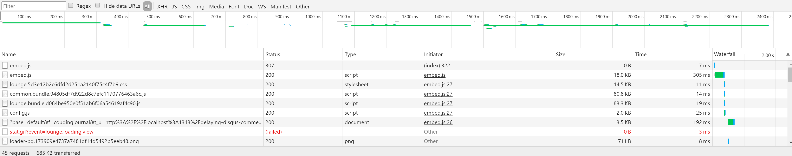

+++
Categories = [ "Web", "Hugo", "Disqus"]
Description = "My blog is a static website generated using Hugo and running on Netlify but I still want to allow readers to leave comments on my posts so I use Disqus like many other blogs. The advantage of Disqus is that you do not need to host the comments your self, and I cannot with a static website, you just embed a JavaScript file and everything is taken care of. There are a few alternatives to Disqus but none of them works very well so there is basically no other option if you want to have comments on a static website. The problem with Disqus is that this one JavaScript file you embed to your website makes about 50 requests when a page loads. And that is a lot!"
Tags =[ "Web", "Hugo", "Disqus"]
Keywords = [ "Web", "Hugo", "Disqus"]
author = "Igor Kulman"
date = "2017-05-30T09:29:12+01:00"
title = "Delaying Disqus comments to save (a ton of) requests"
url = "/delaying-disqus-comments-to-save-requests"
images = ["/images/disqus.png"]

+++

My blog is a static website generated using [Hugo](https://gohugo.io/) and running on [Netlify](https://www.netlify.com/) (you can read about my move from WordPress to Hugo in a [previous article](/going-static-from-wordpress-to-hugo)) but I still want to allow users to leave comments on my posts so I use [Disqus](https://disqus.com/) like many other blogs. 

The advantage of Disqus is that you do not need to host the comments yourself, and I really cannot with a static website, you just embed a JavaScript file and everything is taken care of for you. There are a few alternatives to Disqus but none of them works very well so there is basically no other option if you want to have comments on a static website. 

The problem with Disqus is that this one JavaScript file you embed to your website makes about 50 requests when a page loads. And that is a lot!

<!--more-->

Most of my blog posts do not have any comments so making about 50 unnecessary requests seems like a lot of waste. I noticed that many other websites do not load comments immediately but load them on demand. This way the wasteful requests are made only when really needed, when someone wants to read the comments or post a new one. 

The idea is simple, add a "Show comments" button at the end of the page and embed the Disqus JavaScript file when the user clicks that button. This can be done with a simple JavaScript function


$(function(){
  $('#show-comments').on('click', function(){
    var disqus_shortname = '{{.Site.DisqusShortname}}';

    (function() {
      var disqus = document.createElement('script'); 
      disqus.type = 'text/javascript'; 
      disqus.async = true;
      disqus.src = '//' + disqus_shortname + '.disqus.com/embed.js';
      (document.getElementsByTagName('head')[0] || document.getElementsByTagName('body')[0]).appendChild(disqus);
    })();

    $(this).hide(); // Hide the button
  });
});


The problem is that Disqus does not work that well and sometimes does not load the comments when there is an extra trailing slash in the URL so I recommend setting the post URL explicitly by adding another piece of JavaScript


var disqus_config = function () {
  this.page.url = '{{ trim .Permalink "/" }}';
};


Now you just need to add the actual "Show comments" button and you are done. To make the user experience better I decided to show the number of comments on that button. You need to embed a Disqus JavaScript file for that but it makes just one request, so it is reasonable





This JavaScript will find all elements with class `disqus-comment-count` on the website and fetch the comments count for their `data-disqus-url` attribute. The resulting "Show comments" button may then look like this



                  
  <button id="show-comments" class="btn btn-default" type="button">Show comments</button>
  



And that is it. If you want to see it in action, just click the button below near the end of this page. If you want to see it all integrated, just look at the source code of this page. 
