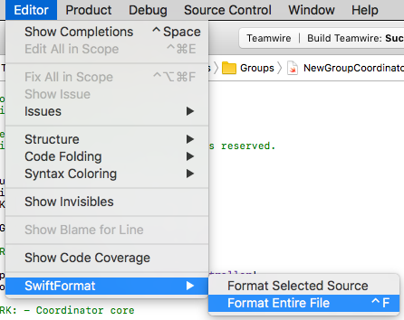

+++
Categories = [ "iOS", "Xcode", "Swift"]
Description = "When I started using XCode I was really surprised about the really poor implementation of its code formatting functionality. It kind of formats the alignment of the code but ignores unnecessary spaces and a lot of other things. Formatting the source code and keeping the style consistent is really important to me so I was looking for a solution."
Tags = ["iOS", "XCode", "Swift"]
Keywords =["iOS", "XCode", "Swift", "Formatting", "SwiftFormat"]
author = "Igor Kulman"
date = "2017-05-05T09:29:12+01:00"
title = "Formatting Swift code in XCode"
url = "/formatting-swift-code-in-xcode"
images = ["/images/swiftformat.png"]

+++

When I started using XCode I was really surprised about the really poor implementation of its code formatting functionality. It kind of formats the alignment of the code but ignores unnecessary spaces and a lot of other things. Formatting the source code and keeping the style consistent is really important to me so I was looking for a solution. I found some linters like [SwiftLint](https://github.com/realm/SwiftLint) but I was interested in a tool that will actually format the source code for me on demand. I found [SwiftFormat](https://github.com/nicklockwood/SwiftFormat).

### SwiftFormat

[SwiftFormat](https://github.com/nicklockwood/SwiftFormat) is a code library and command-line tool for reformatting swift code. It applies a set of rules to the formatting and space around the code, leaving the meaning intact. 

<!--more-->

You can install SwiftFormat using `brew install swiftformat` and use it from the terminal to format given directory. This means you can use it manually or add it as a build step in XCode or a git pre-commit hook. Using SwiftFormat from the terminal before from time to time or before every commit is fine, but I wanted to use  directly from XCode, preferably invoked by a keyboard shortcut. 

To do this you can use the XCode Source Editor Extension. There is a signed binary already included in the repository you can download, put into Applications and run. It tells you how to enable it in Settings, so you do it and restart XCode. A bit of a hassle but you do it just once and it is worth it.

In conclusion use SwiftFormat to make formatting of your Swift code consistent, especially if you work in a team.
