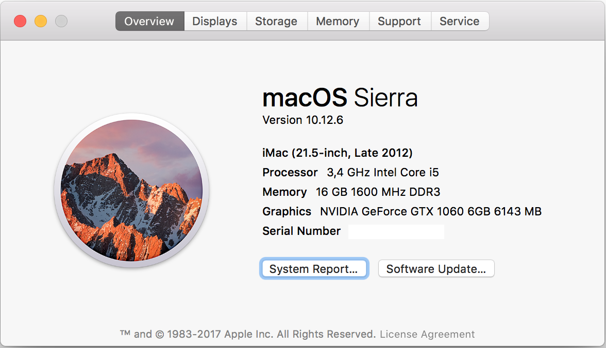

+++
Categories = [ "MacOS", "Hackintosh"]
Description = ""
author = "Igor Kulman"
date = "2017-03-29T09:29:12+01:00"
title = "My experience running a hackintosh"
url = "/my-experience-running-a-hackintosh"
Tags = ["MacOS", "Hackintosh"]
Keywords = ["MacOS", "Hackintosh", "Experience"]
share_img = "/images/hackintosh.png"

+++

A few months ago I decided to take part in an iOS project. The first problem I needed to solve was to be able to run macOS Sierra and XCode. I did not really want to buy an overpriced MacBook without function keys or and underpowered Mac Mini. Especially when I own a more than 3 years old desktop computer that is still usable for all my needs. A few iOS developers I know recommended I go the Hackintosh way.

## Hackintosh

Hackintosh is PC that runs macOS. This configuration is not supported by Apple but it is possible if you have the right hardware since Apple has been using a fairly standard PC hardware for the last couple of years. <s>For example you cannot us any new GeForce 10X0 (Pascal) because there are no Apple computers with those new graphic cards so there are no drivers yet</s> (NVIDIA has released [new drivers supporting all the Pascal graphic cards](https://www.tonymacx86.com/threads/nvidia-pascal-graphics-drivers-released-buyers-guide-updated.219153/)). But if you have an older GeForce like me or an integrated one, you will be fine. The [tonymacx86.com](https://www.tonymacx86.com/) website, basically the central hub of all the Hackintosh information, regularly publishes a buying guide that can be useful if you want to buy a new computer and install macOS on it.

If you do not wish to install macOS directly on your hardware you can run it in a virtual machine, but the performance will never be very good. Some people do it for Xamarin development when they just need to compile their project and run the simulator, so there are a few [tutorial on how to do it](https://aurir.wordpress.com/2016/11/20/how-to-setting-up-macos-x-sierra-on-virtualbox-for-xamarin-development-with-visual-studio/). There is also an interesting blog post series about a [virtual hackintosh](https://arktronic.com/weblog/2016-12-10/virtual-hackintosh-part-1-the-concepts/). I tried running macOS in WMWare on my Thinkpad T440s but the performance was not good.

<!--more-->

## Installing macOS Sierra

I needed a bigger SSD anyway so I bought a new 500 GB SSD and cloned my Windows installation to it using CloneZilla. That way I got a spare old 128 GB SSD that I decided to use to install macOS Sierra on my desktop computer with this quite old configuration

- Gigabyte Z77 DS3H
- i5 3570K (4 core)
- 16 GB RAM
- ASUS GTX 660
- 128 GB SSD (macOS), 500 GB SSD (Windows), 1TB HDD (data)

I [created a installation disk](https://www.tonymacx86.com/threads/unibeast-install-macos-sierra-on-any-supported-intel-based-pc.200564/) on a friend's iMac and I was surprised the installation only took about 20 minutes. I then injected the correct drivers for GPU (Nvidia), sound card and Ethernet and everything worked. You just need to know your hardware to be able to choose the correct drivers and you will be fine with the setup.

I installed macOS on a separate SSD, so I had no problem with the UEFI loader conflicting with Windows. The only problem is that my Windows 10 install is MBR not UEFI so Clover (the Hackintosh UEFI loader) cannot run it. I solved it by having the SSD with Windows as primary boot device so Windows boots automatically when I turn on the computer. When I want to boot macOS I just press F12 to get to the BIOS boot menu and choose the macOS drive to boot from manually.

## Performance

I performed some tests with the few benchmarks that have both a Windows and a macOS version and the results were quite similar. There was basically no performance degradation on the macOS. I compared my Geekbench 4 results to the Apple hardware and I was quite surprised. My more than 3 years old desktop computer had basically the same single core performance score as a i5 MacBook Pro (13-inch Late 2016) and about 20% better multicore performance as this MacBook Pro. 

I know it is not fair to compare desktop computers to laptops (desktop i5 has 4 cores, laptop i5 only 2) but I am still amazed that the current generation overpriced i5 MacBook Pro does not have a better performance that my more than 3 years old desktop. And I still have some room for overclocking. I think [Apple has really given up on machines for developers](https://news.ycombinator.com/item?id=13797042).

## Using macOS and software

I was surprised that basically everything worked out of the box. I had some problems getting my microphone to work but I finally solved it basically by accident when reading a [reddit thread](https://www.reddit.com/r/hackintosh/comments/4gp7mj/need_help_getting_alc887_microphone_working_el/). I even got iMessage working [following this quite long tutorial](https://www.tonymacx86.com/threads/an-idiots-guide-to-imessage.196827/). 

My Windows keyboard [needed some setup](using-macos-with-a-windows-keyboard). The back and forward buttons on my gaming mouse do not work, but I got around it using [BetterTouchTool](http://sunpech.com/2015/04/map-your-mouses-back-and-forward). If you have a WiFi card (I do not) it will probably not work. There are some alternatives you can use, like [this WiFi card with Bluetooth that even support hand-off](https://www.amazon.de/Bluetooth-PCI-Express-BCM94360CD-Hackintosh-Flughafen/dp/B00MBP25UK/ref=sr_1_1?ie=UTF8&qid=1487424169&sr=8-1&keywords=Hackintosh).

Software like XCode also runs fine, including iOS simulators. Overall macOS behaves just like it was installed on an Apple machine. The macOS updates also work without a problem, just check [tonymacx86.com](https://www.tonymacx86.com/) before applying them to be sure. 
