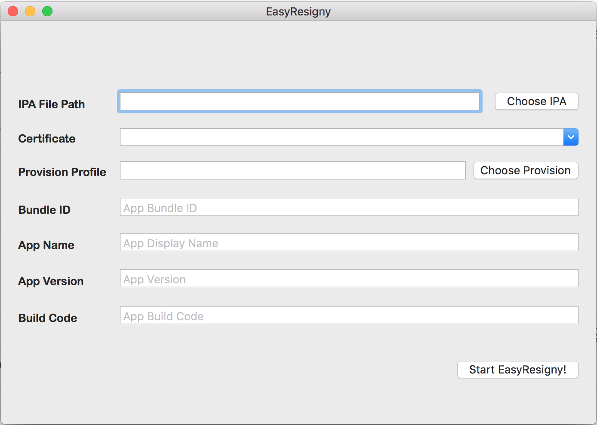

+++
Categories = [ "iOS"]
Description = "There are some times when you need to re-sign the IPA of your iOS app with a different certificate. For example, an external developer creates the IPA for you, but it is signed with their personal certificate and you need to re-sign it with yours to deploy it to the App Store. Or one of your clients does not want to have their employees install the iOS app from the App Store but wants to distribute it directly using their MDM tools. "
Tags = ["iOS"]
Keywords = ["iOS", "Keychain", "Provisioning", "Resigning", "IPA"]
author = "Igor Kulman"
date = "2017-05-23T09:29:12+01:00"
title = "Re-signing iOS apps"
url = "/resigning-ios-apps"
images = ["/images/easyresigny.png"]

+++

There are some times when you need to re-sign the IPA of your iOS app with a different certificate. For example, an external developer creates the IPA for you, but it is signed with their personal certificate and you need to re-sign it with yours to deploy it to the App Store. Or one of your clients does not want to have their employees install the iOS app from the App Store but wants to distribute it directly using their MDM tools. 

The second case is a bit more complicated, because it involves creating a new app identity for the app. When you change the app id if your app, your push notifications will stop working and you need to also generate a new APNS certificate with the new app id and deploy it to your server. Here is everything you need to do, step by step.

<!--more-->

### Creating a new app identity

If you want to change the app id when re-signing an iOS app you will first new to create a new app identity. There are a few thing you will need to do

* create a new app id in the Apple developer portal
* create a new APNS certificate for that app id in the Apple developer portal and deploy it to your server (if you use push notifications)
* create a new provisioning profile for that app id in the Apple developer portal
* have one of the certificates with a private key included in the newly created provisioning profile in your keychain

If you just want to re-sign the iOS app without changing the app id, you can skip all these steps and you just need the certificate in your keychain.

### Re-signing the IPA

You can find multiple [tutorials](https://gist.github.com/chaitanyagupta/9a2a13f0a3e6755192f7) and a [few tools](https://github.com/maciekish/iReSign) to help you with the re-signing process. After a lot of trial and error I ended up using [EasyResigny](https://github.com/niyaoyao/EasyResigny) because it was the only tool that generated an IPA that could be actually deployed to an iOS device. This tool makes the re-signing process really easy, you just

* select the IPA you want to re-sign
* select the certificate to re-sign the IPA with
* select the provisioning profile to use
* click Start EasyResigny!

And you are done!

**Update:** EasyResigny does not work well if your app includes extensions, like a share extension or a notification service extension. The only tool that can help with resigning an app with extension is [Fastlane](https://fastlane.tools/) and its [resign method](https://docs.fastlane.tools/actions/resign/) where you can provide specific provisioning profiles for each app id.
