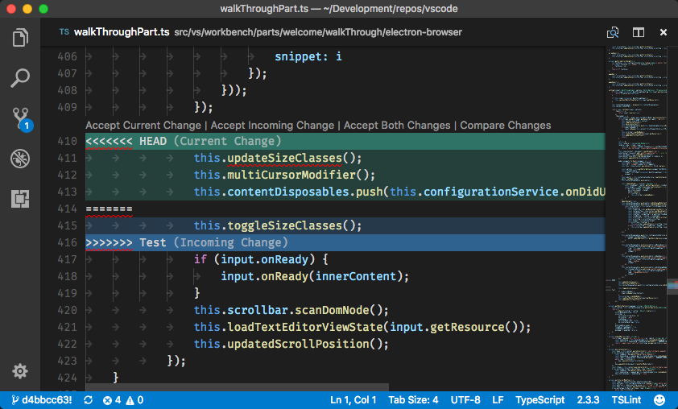

+++
Categories = ["Git", "macOS", "VSCode"]
Description = "Visual Studio Code is a neat editor with many good functionalities but I especially like the way it shows Git merge conflicts. Instead of a 2-way or a 3-way split it just shows one window with both changes, nicely highlighted with colors and actions. I like this feature so much I decided to set Visual Studio Code as my Git merge tool for both the command line and Git Tower."
Tags = ["Git", "macOS", "VSCode"]
Keywords = ["Git", "macOS", "VSCode", "Tower"]
author = "Igor Kulman"
date = "2017-11-15T09:29:12+01:00"
title = "Using Visual Studio Code as Git merge tool"
url = "/using-vscode-as-git-merge-tool"
share_img = "/images/merge-conflict.png"

+++

Visual Studio Code is a neat editor with many good functionalities but I especially like the way it shows Git merge conflicts. Instead of a 2-way or a 3-way split it just shows one window with both changes, nicely highlighted with colors and actions. 

I like this feature so much I decided to set Visual Studio Code as my Git merge tool for both the command line and Git Tower.

### Command line

Using Visual Studio Code as a merge tool for Git when using command line means editing your `.gitconfig`. You just need to define a new tool called `code` and set it as the default merge tool.


[merge]
        tool = vscode
[mergetool "vscode"]
        cmd = code --wait $MERGED


<!--more-->

### Merge tool for Git Tower

If you use Git Tower as you GUI client for Git, adding Using Visual Studio Code as a merge tool is a bit more tricky, but [there is documentation showing you how to do it](https://www.git-tower.com/help/mac/integration/custom-diff-tools). You need to create a `CompareTools.plist` file in `~/Library/Application Support/com.fournova.Tower2/CompareTools/`. This file contains definitions for all the custom diff and merge tools you want to use, not just Visual Studio Code. 

The definition for Visual Studio Code may look like this


<?xml version="1.0" encoding="UTF-8"?>
<!DOCTYPE plist PUBLIC "-//Apple//DTD PLIST 1.0//EN" 
    "http://www.apple.com/DTDs/PropertyList-1.0.dtd">
<plist version="1.0">
<array>    
    <dict>
        <key>ApplicationIdentifier</key>
        <string>com.microsoft.VSCode</string>
        <key>ApplicationName</key>
        <string>Visual Studio Code</string>
        <key>DisplayName</key>
        <string>Visual Studio Code</string>
        <key>LaunchScript</key>
        <string>code.sh</string>
        <key>Identifier</key>
        <string>code</string>
        <key>SupportsMergeTool</key>
        <true/>
        <key>SupportsDiffChangeset</key>
        <false/>
    </dict>
</array>
</plist>


It calls a bash script `code.sh` when invoked, that runs Visual Studio Code with the same parameters as in the Git merge tool definition in `.gitconfig`, it is just referenced a differently. 


 #!/bin/sh

code --wait $4


Do not forget to make the bash script runnable by calling `chmod +x bash.sh`.

When you restart Git Tower, you will now see Visual Studio Code among the merge tools options.

