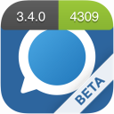

+++
Categories = ["Swift", "iOS", "Xcode"]
Description = "I am a big fan of automation in software development so when I started doing iOS development one of my goals was to automate everything on the iOS project. No more manual versioning, manual build distribution... let the computers do the work for me. Here is the setup I ended up with."
Tags = ["Swift", "iOS", "Xcode"]
Keywords = ["Swift", "iOS", "Xcode"]
author = "Igor Kulman"
date = "2018-09-26T08:29:12+01:00"
title = "Automating your iOS app development and distribution workflow"
url = "/automating-ios-development-and-distribution-workflow"
images = ["/automating-ios-development-and-distribution-workflow/automate.png"]

+++

I am a big fan of automation in software development so when I started doing iOS development one of my goals was to automate everything on the iOS project. 

No more manual versioning, manual build distribution... let the computers do the work for me. Here is the setup I ended up with. 

### Separate app ids for development and distribution

Let's say your app id is *com.company.app*. You can use that app id when developing the app, running it in the simulator or on your device and also when distribution the app using services like TestFlight or uploading it to the AppStore.

With just one app id you cannot have both the AppStore version and a development version installed on your device. This a problem when working on an app that you use daily for communication with your colleagues, but you are working on a feature that requires you to use a different server, or some MDM, etc.

There is also another problem you will encounter if you use push notifications. When you create a push notification certificate for production, push notifications for your app will work with AppStore builds, with ad-hoc builds in TestFlight and other services but you will not get any notifications when running the app on your device deployed from Xcode. At least not easily.

To counter that, I use separate app ids

* *com.company.app* with push notifications set to production for AppStore and ad-hoc distribution
* *com.company.app.dev* with push notifications set to sandbox for development

This of course requires your backend to support it by choosing the right push notifications certificate depending on the app id.

With this setup, I can

* use the AppStore version and the development version of the app on my device at the same time
* have push notifications working also in the development version of the app

### Automatic builds and tests with Gitlab

The iOS project I work on uses self-hosted [Gitlab](https://gitlab.com/) instance, so using Gitlab CI was the obvious choice. You just need a machine with macOS that is always online, install the [Gitlab runner](https://docs.gitlab.com/runner/), connect it to the Gitlab instance and you are done. Everything else is just a matter of configuration in a file in your repository. 

<!--more-->

My setup is really simple

* each push to Gitlab causes the app to build and run all the unit and UI tests
* each merge of a pull request causes the app to build, to create an ad-hoc IPA and to deploy it to a build distribution system

In terms of the Gitlab's `.gitlab-ci.yml`, omitting some pre-build stuff like restoring Carthage cache, setting environment variables, etc. it may be just two phases, one running unit tests on all branches and the other doing build and deploy on the develop branch.

```yaml
stages:
  - unit_tests
  - deploy

unit_tests:
  dependencies: []
  stage: unit_tests
  artifacts:
    paths:
      - fastlane/logs
  script:
    - fastlane tests
  tags:
    - ios_11-0

deploy:
  dependencies: []
  stage: deploy
  script:
    - fastlane set_badge
    - fastlane build
    - fastlane deploy 
  only:
    - develop
  tags:  
- ios_11-0
```

I use [Fastlane](https://fastlane.tools/), it is a great tool I really recommend. 

Running the tests is really simple

```ruby
desc "Run all unit tests"
lane :tests do
  run_tests(devices: ["iPhone 8"],
            workspace: "sources/Teamwire.xcworkspace",
            scheme: "TWCrypto")

  run_tests(devices: ["iPhone 8"],
            workspace: "sources/Teamwire.xcworkspace",
            scheme: "Core")
  
  run_tests(devices: ["iPhone 8"],
            workspace: "sources/Teamwire.xcworkspace",
            skip_testing: "TeamwireUITests",
            scheme: "Teamwire")
end
```

Before building the app I make Fastlane first log into the Apple account (`cert`) and download or regenerate the provisioning profiles (`sigh`) that are needed for the build

```ruby
desc "Builds the app, generates IPA"
lane :build do
  cert
  
  identifier = CredentialsManager::AppfileConfig.try_fetch_value(:app_identifier)
  notification_extension_identifier = identifier + ".NotificationServiceExtension"
  share_extension_identifier = identifier + ".ShareExtension"

  sigh(adhoc: true, app_identifier: identifier)
  sigh(adhoc: true, app_identifier: notification_extension_identifier)
  sigh(adhoc: true, app_identifier: share_extension_identifier)  
  
  gym(scheme: "Teamwire", clean: true, workspace: "sources/Teamwire.xcworkspace", output_directory: "build", output_name: "Teamwire.ipa",
              export_options: {
              	method: "ad-hoc",
              	iCloudContainerEnvironment: "Production",
              	uploadSymbols: true,                  
               }, include_bitcode: false)
end
```

### Automatic build distribution

As I already mentioned, every time a pull request is merged in Gitlab, the CI creates an ad-hoc IPA and deploys it. 

```ruby
desc "Deploys built app to AppCenter"
lane :deploy do
  # Deploy to AppCenter
  appcenter_upload(
    api_token: ENV["APPCENTER_API_TOKEN"],
    owner_name: "igorkulman",
    owner_type: "user",
    app_name: "Teamwire-Beta",
    file: "build/Teamwire.ipa",
    notify_testers: false,
    destinations: "*",
    dsym: "build/Teamwire.app.dSYM.zip"
  )
end
```

This step deploys the actual IPA to [AppCenter](https://appcenter.ms/). AppCenter can be used as a build distribution service for free without any serious limitations. You can make it send emails to your testers every time a new build is uploaded or you can just send out the builds manually when needed.

Not only the app IPA but also debug symbols are uploaded to AppCenter for symbolication. When testers send me logs from the app and they include a crash log, I just upload the crash log to AppCenter and it gets automatically symbolicated in a few minutes. I do not have to do it manually and I can link the symbolicated crash log to an issue in Gitlab that I typically create for every reported crash. 

The automatic builds are ad-hoc builds and use the AppStore app id not the development app id to be as close to the AppStore version as possible.

I also use a [Fastlane plugin to add a "BETA" word and build number to the app badge before build](https://github.com/HazAT/badge) so testers can easily distinguish if they use the AppStore or the development version. 

```ruby
desc "Sets app badge"
lane :set_badge do
  version = get_version_number(
    xcodeproj: "YouApp/YouApp.xcodeproj",
    target: "YouApp")
  build = number_of_commits.to_s

  add_badge(                
    shield: version+"-"+build+"-green",    
    glob: "/**/YouApp/YouApp/Assets.xcassets/AppIcon.appiconset/*.{png,PNG}",
  )
end
```

resulting in



### Automatic screenshots generation

It is a good practice to make your AppStore screenshots show the current version of the app and change them as the app UI changes. Making new screenshots manually is a real pain, especially if your app is localized into multiple languages or you do not use the screenshots directly but embed them into images with some marketing texts. Luckily you can [automate the process with Fastlane](https://docs.fastlane.tools/getting-started/ios/screenshots/).

The idea is simple, you add helper class to you UI tests project and then create a new UI test method that goes over all the screens you want to make a screenshot of calling the helper class at the right moment. 

```swift
func testScreenshots() {
  app.switchToProfile()
    snapshot("05-Profile")

    app.switchToContacts()
    snapshot("04-Contacts")

    app.switchToInbox()
    snapshot("01-Inbox")
        
    let tablesQuery = app.tables
    tablesQuery.cells.element(boundBy: 0).tap()
    snapshot("06-Alert-Chat-detail")
        
    app.navigationBars.buttons.element(boundBy: 0).tap()

    app.tables.cells.element(boundBy: 2).tap()
    snapshot("02-Chat-detail")

    let addButton = app.buttons["addAttachmentButton"]
    expect(addButton.exists).to(beTrue())
    addButton.tap()
    snapshot("03-Attachments")
}
```

You can configure Fastlane to run this UI test method for different languages and device, generating everything in one go in your `Snapfile`

```ruby
 devices([
   "iPhone 7 Plus",
   "iPad Pro (12.9-inch)"
 ])

 languages([
   "en-US",
   "de-DE"
 ])

# The name of the scheme which contains the UI Tests
scheme("TeamwireUITests")

# Where should the resulting screenshots be stored?
 output_directory("./fastlane/screenshots")

# remove the '#' to clear all previously generated screenshots before creating new ones
clear_previous_screenshots(true)
```

And add a Fastline lane to have it execute when you run `fastlane screenshots`

```ruby
platform :ios do
  desc "Generate new localized screenshots"
  lane :screenshots do
    capture_screenshots(scheme: "TeamwireUITests")
    frame_screenshots(silver: true)
  end
end
```

### Cooperation with the testers

The whole setup really shines when I deal with the testers. I never create builds for them to test manually. The testers can always download the latest build from AppCenter by themselves or I ca use the AppCenter web UI to send them a specific build.

When I fix a bug, I just add a comment "fixed in build XYZ" to the Gitlab issue. Fixing a bug means merging a pull request for that bug, so a new build is automatically created and uploaded to AppCenter for the testers to try out.

When a new build is being tested, the testers can easily tell which bugs are already fixed in that build and should be verified.
