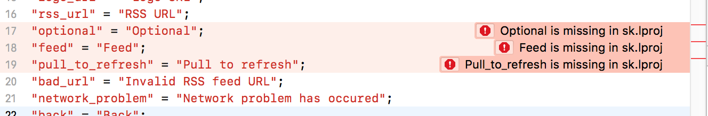

+++
Categories = ["Swift", "iOS", "Xcode"]
Description = "When you work on an iOS app localized into multiple languages one of the biggest challenges is making sure that everything is translated, no string is missing in any language. Xcode does not provide any tool to make this easier for you, but there are some 3rd party tools that you can integrate into your workflow."
Tags = ["Swift", "iOS", "Xcode"]
Keywords = ["Swift", "iOS", "Xcode"]
author = "Igor Kulman"
date = "2018-10-10T08:29:12+01:00"
title = "Checking for missing translations in iOS projects"
url = "/checking-for-missing-translations-in-ios"
share_img = "/images/verify-string-files-error.png"

+++

When you work on an iOS app localized into multiple languages one of the biggest challenges is making sure that everything is translated, no string is missing in any language. Xcode does not provide any tool to make this easier for you, but there are some 3rd party tools that you can integrate into your workflow.

### verify-string-files

I have recently found a quite old project called [verify-string-files](https://github.com/iKenndac/verify-string-files). It is a command line tool take takes you base localization file and compares it to all the translations, informing you about missing strings. Altough the last commit to this project was way back in 2014 it still works reliably, there have not been any changes to the way iOS does localization. 

The best thing about this tool is that you can integrate it to your build process.

### Build process integration

The tool is available only as source code, so you have to build it first. I put the built binary to a [`support`](https://github.com/igorkulman/iOSSampleApp/tree/master/support) folder of my projects. 

Then I have a [`Build-Phases`](https://github.com/igorkulman/iOSSampleApp/tree/master/Build-Phases) folder with all the script used in the build process. I think it is a much better solution than embedding the script right into the Xcode project.

To integrate `verify-string-files` you just need a really simple script, providing the path to the base localization file


${PROJECT_DIR}/support/verify-string-files -master ${SRCROOT}/iOSSampleApp/Resources/Base.lproj/Localizable.strings


In Xcode, just add a new `Run scrip phase` and call `$SRCROOT/Build-Phases/check-strings` where `check-strings` is the script name. Just do not forget to `chmod +x` the actual file. 

This will result in build errors when there are missing string, shown directly in the base localization file

<!--more-->

If you just want it to produce warning instead of errors, you just add `-warning-level warning` as a parameter


${PROJECT_DIR}/support/verify-string-files -master ${SRCROOT}/iOSSampleApp/Resources/Base.lproj/Localizable.strings -warning-level warning


or you can make it even better but making the tool produce errors in production builds but warning in debug builds


if [ "${CONFIGURATION}" = "Release" ]; then
${PROJECT_DIR}/support/verify-string-files -master ${SRCROOT}/iOSSampleApp/Resources/Base.lproj/Localizable.strings
else
${PROJECT_DIR}/support/verify-string-files -master ${SRCROOT}/iOSSampleApp/Resources/Base.lproj/Localizable.strings -warning-level warning
fi


### iOSLocalizationEditor

If you want to use an external GUI tool, check out my [open-source iOSLocalizationEditor](https://github.com/igorkulman/iOSLocalizationEditor) that shows you all your localizations for every language side by side.

{}
