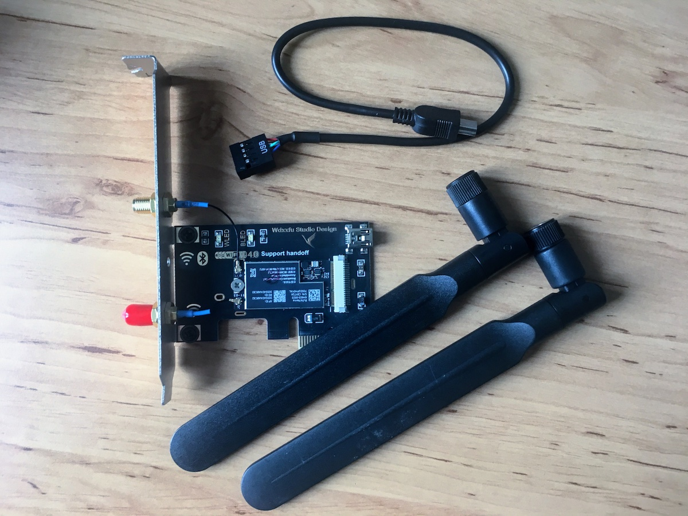

+++
Description = "When I started with my hackintosh I did not have Wi-Fi or Bluetooth support in it. I used Ethernet to connect to my home network and it worked fine, I had no need for Wi-Fi. Later I wanted to use more Apple-specific features, so I started looking for how to make them work with my hackintosh."
Tags = ["macOS", "Hackintosh"]
author = "Igor Kulman"
date = "2019-06-12T05:29:12+01:00"
title = "Adding Wi-Fi and Bluetooth to hackintosh to enable Apple-specific features"
url = "/adding-wifi-and-bluetooth-for-apple-features-to-hackintosh"
images = ["/adding-wifi-and-bluetooth-for-apple-features-to-hackintosh/card.jpg"]

+++

When I [started with my hackintosh](/my-experience-running-a-hackintosh/) I did not have Wi-Fi or Bluetooth support in it. I used Ethernet to connect to my home network and it worked fine, I had no need for Wi-Fi. 

Later I wanted to use more "Apple-specific" features, so I started looking for how to make them work with my hackintosh.

## Bluetooth

Adding Bluetooth support to a hackintosh is quite easy, you just need to buy any of these USB adapters:

* [IOGear Bluetooth 4.0 Adapter](https://www.amazon.de/dp/B007MKMJGO)
* [GMYLE Bluetooth 4.0 Adapter](https://www.amazon.de/IOGEAR-GBU521-BLUETOOTH-MICRO-ADAPTER/dp/B007GFX0PY)

All of them are natively supported in macOS, no extra drivers are needed. 

### GMYLE Bluetooth 4.0 Adapter

I bought the **GMYLE Bluetooth 4.0 Adapter**, found it on German Amazon.

Thanks to adding Bluetooth support I got:

* Ability to use **Bluetooth keyboards, speakers, headphones**
* **SMS messages showing on macOS**
* **incoming phone calls showing on macOS**

The SMS relying feature was really nice, especially when needing to copy security codes sent by SMS by services that do not support 2FA via TOTP.

Justa s a side note, **iMessage** worked right from the start, Bluetooth is not needed for it.

## Wi-Fi

### Wi-Fi required for some Apple-specific features

The one thing that I was missing was **AirDrop**. I started taking screenshots regularly on my iPhone during development and testing and there was no easy way to move them to the hackintosh without **AirDrop**. 

To make **AirDrop** and additional features like **Handoff** work you need not only Bluetooth but also an internal Wi-Fi card. 

<!--more-->

### Adding internal Wi-Fi to a hackintosh

Apple uses a few Wi-Fi + Bluetooth modules, like **BCM943602CS** or **BCM94360**, in their computers and the same modules can be directly bought. You can the buy a PCIe card to connect those modules to your motherboard.

There are a few companies that sell the PCIe card and a Wi-Fi + Bluetooth module as a complete product, sometimes you just need to search Amazon or AliExpress for "hackintosh".

### ABWB 802,11 AC WI-FI + Bluetooth 4.0 PCI-Express (PCI-E) BCM943602CS Combo Card

I bought [ABWB 802,11 AC WI-FI + Bluetooth 4.0 PCI-Express (PCI-E) BCM943602CS Combo Card](https://www.amazon.de/Bluetooth-PCI-Express-BCM943602CS-Hackintosh-Flughafen/dp/B00MBP25UK), found it on German Amazon. 

On AliExpress you can find the [FV-T919 PCIe card](https://www.aliexpress.com/item/Fenvi-FV-T919-802-11AC-Desktop-Wifi-Card-802-11-A-B-G-N-AC-BCM94360CD/32778371977.html).

#### Installation

This product contains the mentioned **BCM943602CS** module. You need to connect it to a PCIe slot on your motherboard (works with x1 and x4) to get Wi-Fi to work. 

To get the Bluetooth to work you need to connect the provided microUSB cable from the card to a USB header on the motherboard. 

Alternatively you can use a classic microUSB cable to connect it to a working USB port on the motherboard, but I have not tried that.

#### Features

Using this PCIe card I got

* everything that already work with just the Bluetooth adapter (that I now no longer need)
* **Wi-Fi** - I can now connect to my Wi-Fi network, but I still prefer Ethernet
* **AirDrop** - sending files between my hackintosh and iPhone
* **Handoff** - if I open a website in Safari on iPhone the hackintosh offers to continue look at it in desktop Firefox 
* **Watch unlock** - my hackintosh unlocks automatically when I come close to it wearing my Apple Watch, no need to type the password
* **Apple Pay in Safari** - I can use Apple Pay in Safari on the hackintosh and confirm the payment on my Apple Watch

## Conclusion

If you use a hackintosh then adding Wi+Fi and Bluetooth support can enable you to use all the Apple-specific features. You just need to spend some time looking for the right hardware.