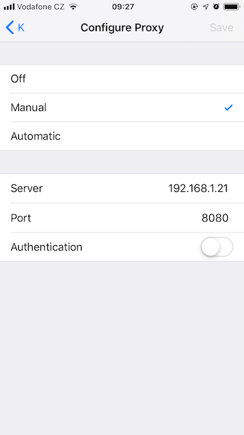
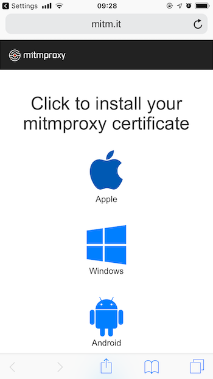
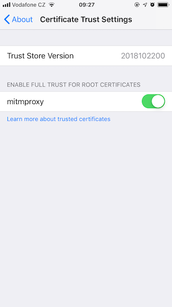
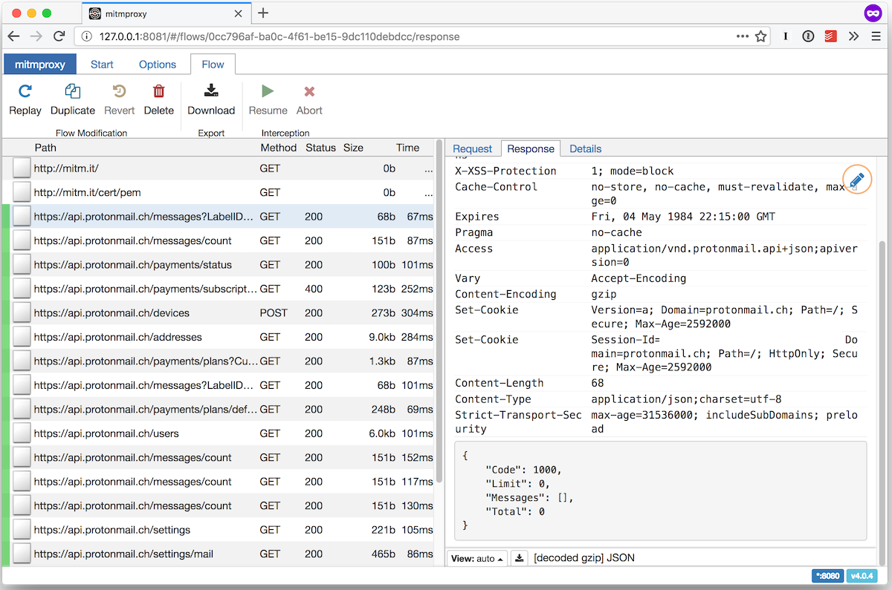

+++
Categories = ["macOS", "iOS", "mitmproxy"]
Description = "When working on an iOS app you may sometimes need to inspect or debug the network traffic between the app and the server to see what exactly is going on. Or you may be just curious to see what data other apps send about you to their servers. The way to achieve this is to run a proxy on your computer and route all the traffic from your iOS device through that proxy. "
Tags = ["macOS", "iOS", "mitmproxy"]
Keywords = ["macOS", "iOS", "mitmproxy"]
author = "Igor Kulman"
date = "2019-01-30T05:29:12+01:00"
title = "Debugging iOS network traffic"
url = "/debugging-ios-network-traffic"
share_img = "/debugging-ios-network-traffic/logo.png"

+++

When working on an iOS app you may sometimes need to inspect or debug the network traffic between the app and the server to see what exactly is going on. Or you may be just curious to see what data other apps send about you to their servers. The way to achieve this is to run a proxy on your computer and route all the traffic from your iOS device through that proxy. 

## mitmproxy

[Mitmproxy](https://mitmproxy.org/) is a free and open source interactive HTTPS proxy. The UX is not as great as in paid app like [Charles](https://www.charlesproxy.com/), but it is still good enough.

### Installing and running

You install mitmproxy from homebrew


brew install mitmproxy


and run the command line interface with a simple `mitmproxy` proxy command. The command line interface takes some time to get used to. If you want something simpler, run the `mitmweb` command to get a web interface.

## Setting up the iOS device

### Proxy

When you have `mitmproxy` or `mitmweb` running you now need to set your iOS device to use that proxy. On your iOS device, go to **Settings | Wi-Fi** and to the properties of your Wi-Fi network. Switch the HTTP Proxy to manual and set the it to the IP address of your computer running mitmproxy and port `8080`.

<!--more-->

The fastest way to find out the IP address  of your computer is running `ifconfig | grep inet`.

This is sufficient to debug HTTP traffic, but if you want to debug HTTPS traffic, you also need to install the certificate.

### Certificate

Open Safari on your iOS device, navigate to `mitm.it` and install the certificate for the Apple devices. 

Then go to **Settings | General | About | Certificate Trust Settings** and give the installed certificate full trust.

## Debugging network requests

You can now start doing network requests on your iOS device by opening websites in Safari, using various apps and see them in mitmproxy. 

Apps that take security more seriously will stop working, because they do certificate pinning and there is no good way to debug their network requests (try refreshing the feed in Twitter for example).

