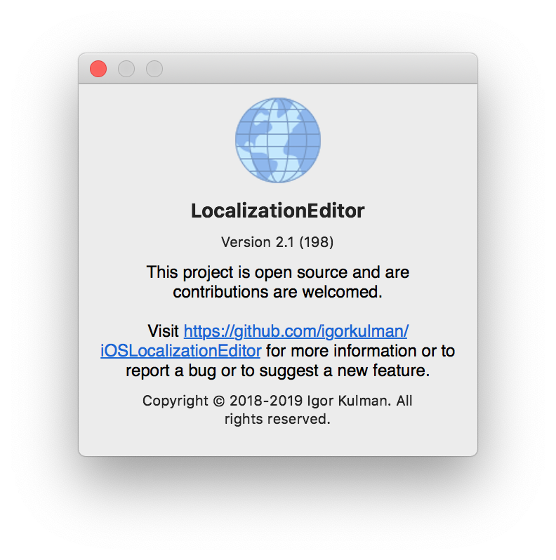

+++
Description = "When you create a macOS app and keep the default menu, you automatically get an About dialog. This dialog shows basic info about the app. If you want to add more information to this dialog there is no obvious way to do it. You need to start reading the Apple documentation to finally discover that it is actually quite simple."
Tags = ["macOS", "Xcode", "About Dialog", "App Info"]
author = "Igor Kulman"
date = "2019-05-29T05:29:12+01:00"
title = "Editing macOS app About dialog"
url = "/editing-macos-app-about-dialog"
images = ["/editing-macos-app-about-dialog/dialog.png"]

+++

When you create a macOS app and keep the default menu, you automatically get an About dialog. This dialog shows basic info about the app.

If you want to add more information to this dialog there is no obvious way to do it. You need to start reading the Apple documentation to finally discover that it is actually quite simple.

<!--more-->

All you have to do is to add a `Credits.rtf` to you project. You can do it directly from Xcode using `File | New | File | Rich Text File`.

The content of this file will be automatically shown in the About dialog

