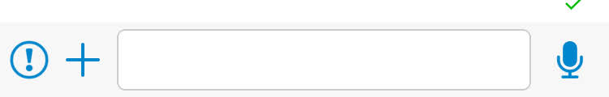
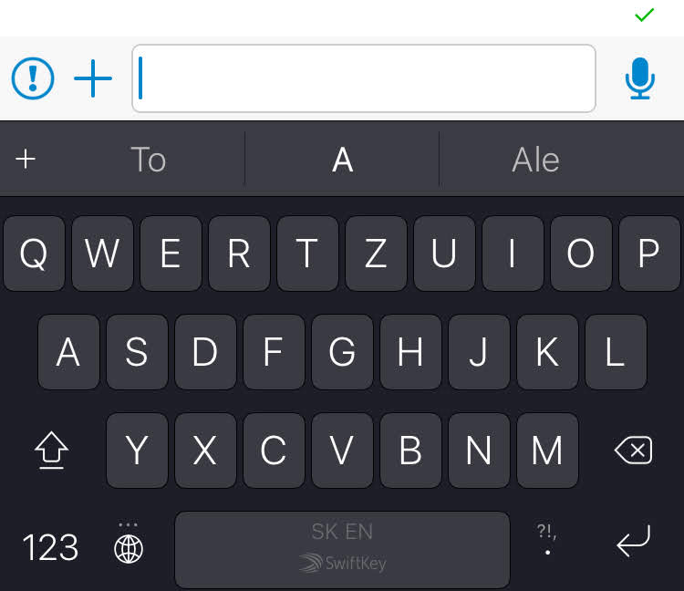

+++
Description = "A few weeks ago I encountered a strange problem when working on an iOS application that seemed really strange at first sight."
Tags = ["Swift", "iOS", "Xcode"]
author = "Igor Kulman"
date = "2019-01-09T05:29:12+01:00"
title = "Why is there a \"lag\" in iOS gesture detection near the edges of the screen?"
url = "/why-ios-gestures-lag-at-the-screen-edges"
images = ["/why-ios-gestures-lag-at-the-screen-edges/quick-recording-middle.png"]

+++

A few weeks ago I encountered a strange problem when working on an iOS application that seemed really strange at first sight.

### The task

The task was simple. In the chat detail screen I had to add a voice recording button next to the message input. When the user started holding the button (`.touchDown`) the voice recording should have started, releasing the button (`.touchUpInside`) should have finish the recording and sliding to side (`.touchDragOutside`) should have canceled the voice recording.

The message input was located in the bottom right corner of the screen when keyboard was not shown



and moved up with the keyboard



### The problem

When the keyboard was visible the quick recording button worked as expected, but when the quick recording button was at the bottom of the screen there was a "lag", a delay of about 1 second, between touching the button and the `.touchDown` even firing. 

<!--more-->

Overriding `touchesBegan(_ touches: Set<UITouch>, with event: UIEvent?)` in the quick recording button class showed that this method also experienced the "lag", so it was not related to the way I used the `.touchDown` event.

Why was the gesture detection on the button "lagging" when then button was positioned at the bottom of the screen but not when it was located further up the screen?

### The reason

Turns out, the "lag" is caused by iOS waiting if the user is actually performing a system gesture (like swipe from the bottom of the screen) instead of tapping the button. In other words, the iOS gestures take precedence over gestures defined in your application.

You can override `var preferredScreenEdgesDeferringSystemGestures: UIRectEdge` in the view controller to tell iOS that the gestures in your application take precedence in some of the corners. When I set it to `[.bottom, .right]` there was no lag. I do not know why `[.bottom]` was not enough, I guess there is some other iOS gesture for swiping from the right edge of the screen and the button was located in the bottom right corner.

Always just setting `[.bottom, .right]` had some negative effects, I had to swipe twice to perform the iOS swipe from bottom gesture. Also my view hierarchy is a bit complicated in that application (the message input is in a "message composer" view controller that is embedded into the "chat detail" view controller that is in a split view) and overriding `var preferredScreenEdgesDeferringSystemGestures: UIRectEdge`  only worked on the topmost view controller, so quite "far" away from the actual quick recording button.

### My complete solution

The key seemed to be to set `var preferredScreenEdgesDeferringSystemGestures: UIRectEdge` to `[.bottom, .right]` only when the user was going to press quick the recording button, like in `func point(inside point: CGPoint, with event: UIEvent?) -> Bool` and then setting it back to `[]` when the user released the button.

This worked because  `func point(inside point: CGPoint, with event: UIEvent?) -> Bool` got called without any "lag" twice immediately when the user started holding the quick recording button. The first execution of this method adjusted `var preferredScreenEdgesDeferringSystemGestures: UIRectEdge` and the `.touchDown` event got then fired almost immediately with no noticeable "lag". I then reset `var preferredScreenEdgesDeferringSystemGestures: UIRectEdge` when the user stopped holding the button. 

I decided to use notifications not to introduce any tight coupling between the button and the root view controller. I defined a new notification

```swift
extension Notification.Name {
    static let shouldIgnoreSystemGestures = Notification.Name("shouldIgnoreSystemGestures")
}
```

The `func point(inside point: CGPoint, with event: UIEvent?) -> Bool`  method on the quick recording button posted the notification to set `var preferredScreenEdgesDeferringSystemGestures: UIRectEdge` as mentioned


```swift
override func point(inside point: CGPoint, with event: UIEvent?) -> Bool {
    let margin: CGFloat = 5
    let area = bounds.insetBy(dx: -margin, dy: -margin)
    let res = area.contains(point)
    NotificationCenter.default.post(name: .shouldIgnoreSystemGestures, object: res)
	return res
}
```

And the `.touchUpInside` and `.touchDragOutside` posted the notification to set it back

```swift
addTarget(self, action: #selector(QuickRecordingButton.revertSystemGesture(sender:)), for: .touchUpInside)
addTarget(self, action: #selector(QuickRecordingButton.revertSystemGesture(sender:)), for: .touchDragOutside)

@objc func revertSystemGesture(sender _: UIButton) {
	NotificationCenter.default.post(name: .shouldIgnoreSystemGestures, object: false)
}
```

The topmost view controller reacted t the notification

```swift
NotificationCenter.default.addObserver(self, selector: #selector(DashboardViewController.checkShouldIgnoreSystemGestures(_:)), name: .shouldIgnoreSystemGestures, object: nil)


@objc func checkShouldIgnoreSystemGestures(_ notification: Notification) {
	guard let value = notification.object as? Bool else {
	    return
	}
	shouldIgnoreSystemGestures = value
}
```

by setting a private property backing the `var preferredScreenEdgesDeferringSystemGestures: UIRectEdge`

```swift
private var shouldIgnoreSystemGestures = false {
	didSet {
	    setNeedsUpdateOfScreenEdgesDeferringSystemGestures()
	}
}

override var preferredScreenEdgesDeferringSystemGestures: UIRectEdge {
	return shouldIgnoreSystemGestures ? [.bottom, .right] : []
}
```