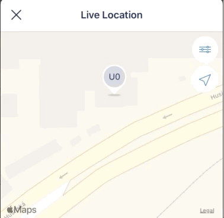
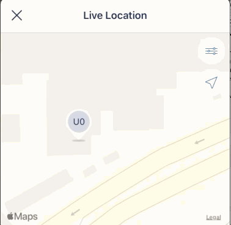

+++
Categories = ["iOS", "Xcode", "MapKit"]
Description = ""
Tags = ["iOS", "Xcode", "MapKit"]
Keywords = ["iOS", "Xcode", "MapKit"]
author = "Igor Kulman"
date = "2020-05-13T05:29:12+01:00"
title = "Animating annotations position change in MKMapView"
url = "/animating-annotation-position-change-on-ios"
images = ["/animating-annotation-position-change-on-ios/MapSmooth.gif"]
series = "Using MKMapView and MapKit on iOS"

+++

Annotations are mainly used to displays static "pins" in `MKMapView` but sometimes you might need to make them move and animate their position changes so it looks better to the users. 

There are a few things you need to do to achieve this.

### Coordinate property specifics

The `MKAnnotation` protocol has a `coordinate` property that is used by the `MKMapView` to position the annotation to its corresponding location on the map. 

If you just update the property you will quickly see that nothing happens, the annotation does not move on the map.

`MKMapView` uses `KVO` to know when the `coordinate` property changes so in Swift you need to mark the `coordinate` property in your `MKAnnotation` as `@objc dynamic` to make it work


final class LocationViewModel: NSObject, MKAnnotation {
    @objc dynamic coordinate: CLLocationCoordinate2D

    ...
}


With this change you will notice that the annotation now moves on the map, but it is not smooth, it basically jumps from the old position to the new one.

<!--more-->

### Animating the coordinate update

To make the position change smooth you need just use `UIVIew.animate` when updating the `coordinate` property


UIView.animate(0.3) {
    coordinate = updatedPosition
}


With this change you can see annotation moving smoothly to the new position
 

### Pulse effect

If you want to make it clear to the user that the annotation changed its position because its data was updated, you can show a pulse animation like in the animated GIFs in this post. 

It is quite easy just use the [Pulsator](https://github.com/shu223/Pulsator/) library.