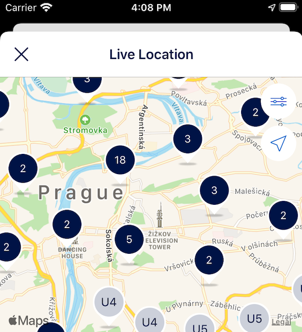

+++
Description = ""
Tags = ["iOS", "Xcode", "MapKit", "MKMapView", "Clustering"]
author = "Igor Kulman"
date = "2020-05-06T05:29:12+01:00"
title = "Clustering annotations in MKMapView"
url = "/clustering-annotations-in-mkpampview"
images = ["/clustering-annotations-in-mkpampview/MapCluster.png"]
series = "Using MKMapView and MapKit on iOS"

+++

If you need to display many annotations in your `MKMapView` it is recommended to cluster them for better performance.

### Map clustering

This means instead of showing all the visible annotations you group annotations that are close together into one single annotation cluster representing them instead.

This cluster annotation usually shows the number of annotations it represents. As you then zoom in to get finer detail the clusters break up and show the actual annotations.



Clustering is supported in `MKMapView` on iOS 11 and newer, no need to use any custom library. If you need to support older versions of iOS, there are libraries like [Cluster](https://github.com/efremidze/Cluster) that you can use.

### Custom cluster view implementation

Let's say you use a [custom annotation view](/using-custom-annotation-views-in-mkmapview) to show your annotations and you want to add support for clustering. You first create a custom  `MKAnnotationView` in the same way

```swift
final class LocationDataMapClusterView: MKAnnotationView {

    // MARK: Initialization
    private let countLabel = UILabel()

    override var annotation: MKAnnotation? {
    	didSet {
			 guard let annotation = annotation as? MKClusterAnnotation else {
            	assertionFailure("Using LocationDataMapClusterView with wrong annotation type")
            	return
        	}

    		countLabel.text = annotation.memberAnnotations.count < 100 ? "\(annotation.memberAnnotations.count)" : "99+"
    	}
    }

    override init(annotation: MKAnnotation?, reuseIdentifier: String?) {
        super.init(annotation: annotation, reuseIdentifier: reuseIdentifier)

		displayPriority = .defaultHigh
        collisionMode = .circle

        frame = CGRect(x: 0, y: 0, width: 40, height: 50)
        centerOffset = CGPoint(x: 0, y: -frame.size.height / 2)


        setupUI()
    }

    @available(*, unavailable)
    required init?(coder aDecoder: NSCoder) {
        fatalError("init(coder:) has not been implemented")
    }

    // MARK: Setup
    private func setupUI() {
        ...
    }
}
```

The idea is the same as when [custom annotation view](/using-custom-annotation-views-in-mkmapview), but there is a difference. You need to define `displayPriority` to tell the map that your cluster annotation has a higher priority that normal annotation.

<!--more-->

### Registering the custom cluster view with MKMapView

The next step is to tell `MKMapView` to user your custom class.

```swift
mapView.register(LocationDataMapClusterView.self, forAnnotationViewWithReuseIdentifier: MKMapViewDefaultClusterAnnotationViewReuseIdentifier)
```

You can use `MKMapViewDefaultClusterAnnotationViewReuseIdentifier` as the reuse identifier if you do not plan to use more different custom cluster views.

### Defining a clustering identifier

The last step you need to do is to define a clustering identifier for your custom annotation views. You can do it in the `mapView(_:viewFor:)` method of the `MKMapViewDelegate`

```swift
func mapView(_ mapView: MKMapView, viewFor annotation: MKAnnotation) -> MKAnnotationView? {
    switch annotation {
    case is LocationViewModel:
        let view = mapView.dequeueReusableAnnotationView(withIdentifier: MKMapViewDefaultAnnotationViewReuseIdentifier, for: annotation)
        view.clusteringIdentifier = String(describing: LocationDataMapAnnotationView.self)
        return view
    case is MKClusterAnnotation:
        return mapView.dequeueReusableAnnotationView(withIdentifier: MKMapViewDefaultClusterAnnotationViewReuseIdentifier, for: annotation)
    default:
        return nil
    }
}
```

Or in the `init` method of your custom annotation view if you do not need to implement `mapView(_:viewFor:)` in your case.