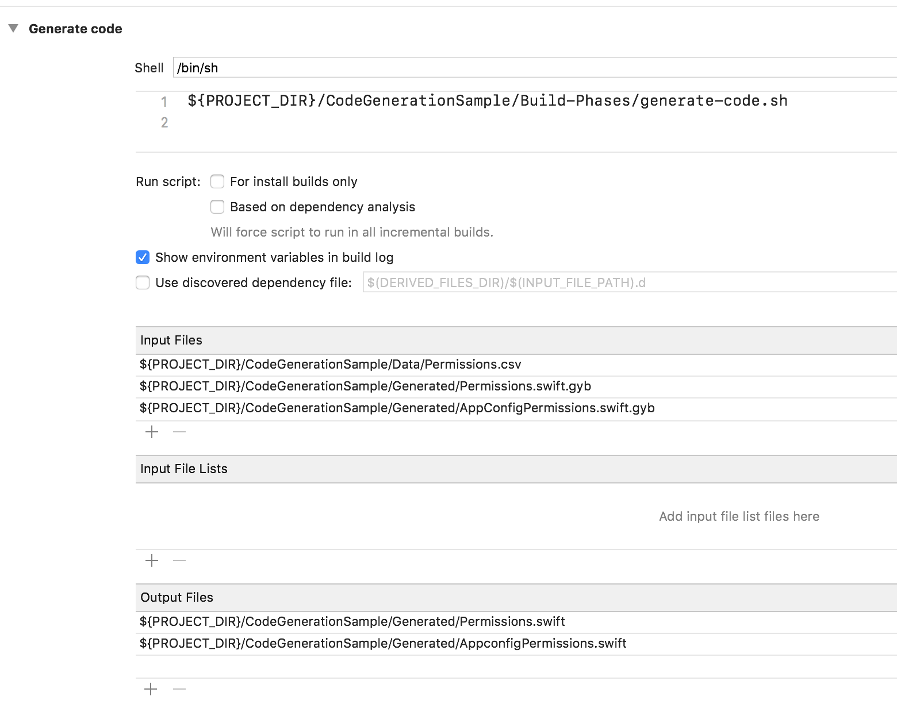

+++
Categories = ["iOS", "Xcode"]
Description = ""
Tags = ["iOS", "Xcode"]
Keywords = ["iOS", "Xcode"]
author = "Igor Kulman"
date = "2020-10-07T05:29:12+01:00"
title = "Generating boilerplate Swift code with GYB"
url = "/generating-boilerplate-swift-code"

+++

How many times how you copied and pasted some code in your current codebase because there was no good way to abstract it? Maybe because it was some repeating code required by a framework or mapping of some data transfer structures.

Writing such boilerplate code is an error-prone waste of time, especially when there is a much better way: generating that code. 

There are a few tools to help you do that, one of the most flexible of them being GYB.

### What is GYB?

GYB is a lightweight templating system that allows you to use Python to generate text files. Those text files can be Swift source code files or anything else you need.  

GYB is used in the Swift standard library code base so it works well for generating Swift source code and it is a proven technology that works.

You can download GYB to your project from the Swift repository on Github


wget https://github.com/apple/swift/raw/master/utils/gyb
wget https://github.com/apple/swift/raw/master/utils/gyb.py
chmod +x gyb


I put it directly to the project directory and include it in the source control for simpler build and CI/CD setup.

### Creating GYB templates

GYB templates for generating Swift source file look like Swift source files with some Python snippets for code generation.

This is probably best shown oin an actual example. Let's say you have a list of permissions that the app needs to support. Those permissions are then a part of a protocol and of a struct.

<!--more-->

You can create a template that generates the protocol from a CSV with the permissions


%{
  import csv
  permissions = []

  source_file = open('Data/permissions.csv', 'rb')
  for line in csv.DictReader(source_file, delimiter = ','):
      permissions.append(line["Name"])
}%

public enum Permission {
    case Allow
    case Deny
    case Undefined
}

public protocol Permissions {
    % for permission in permissions:
    var ${permission}: Permission { get }
    % end
}


This GYB template really looks like a Swift source file just with one difference. Instead of manually adding properties for all the permission you just use a `for` loop to have those properties generated.

You can use `% code: ... % end` to manage control flow, like using the `for` loop in this example, or `%{ code }` to evaluate Python code, like printing the permission names read from the CSV file.

You can then also generate different implementation of this protocol, for example parsing those permissions from the backend or from an MDM.

If you then need to add support for a new permission in the future, you just add it to the CSV file and the Swift code gets regenerated. No need to add the permissions manually to the protocol or to its different implementations.

### Generating code

With the GYB templates created you now need to make Xcode the Swift source files from those templates. Ideally only when the templates change, not on every build.

I use a script that relies on a naming convention. The template is always called `SomeFile.swift.gyb` and it generated `SomeFile.swift`. This script is added as a build phase of the Xcode project

The script traverses all the files given as `Input files` in the Xcode build phase settings. If a file is a GYB template, it gets process into a Swift code file.

Properly defining `Input files` and `Output files` is important because Xcode will run this build phase only when any of them changes or is missing. 

This build phase also needs to be added before the `Compile sources` build phase so the files are generated before Xcode tries to build the project.

### Sample project

As you might have noticed, setting up GYB generation in Xcode is not exactly trivial so I have create a sample project on Github to help you see everything properly set up and working.
{}