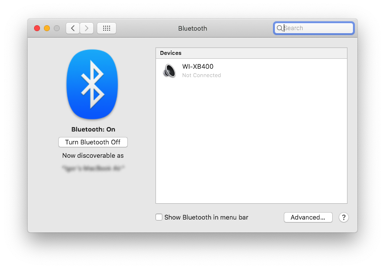
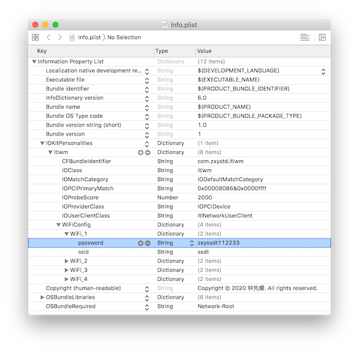
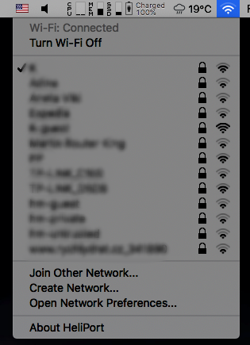

+++
Categories = ["macOS", "hackintosh"]
Description = ""
Tags = ["macOS", "hackintosh"]
Keywords = ["macOS", "hackintosh"]
author = "Igor Kulman"
date = "2020-07-22T05:29:12+01:00"
title = "Using Intel Wi-Fi and Bluetooth on a hackintosh"
url = "/making-intel-wifi-bt-work-on-macos"

+++

If you use a hackintosh you have to choose your hardware carefully to make sure it is supported by macOS. You can get [Wi-Fi + Bluetooth card used by Apple as I did in my desktop](/adding-wifi-and-bluetooth-for-apple-features-to-hackintosh/), but sometimes you do not have much choice. 

When I turned by old `Thinkpad T440s` to a hackintosh I bought a Wi-Fi dongle because the `Intel AC7260` Wi-Fi + Bluetooth card is not supported by macOS, no Intel card are. 

Later I discovered and open-source project that aims to make Intel Wi+Fi and Bluetooth working on macOS and I was able to make the `Intel AC7260` work, no dongles needed.

### Bluetooth driver

To get Intel Bluetooth working you need the [IntelBluetoothFirmware](https://github.com/OpenIntelWireless/IntelBluetoothFirmware). It is a macOS kernel extension that that uses firmware binaries from Linux to make Bluetooth work.

Make sure your specific Intel card is supported and download the latest release and use the two kexts; `IntelBluetoothFirmware.kext` and `IntelBluetoothInjector.kext`. If you use `Clover` just copy them to `EFI/Clover/Kexts/Other`.

Make sure you do not use any of `AirportBrcmFixup`, `BT4LEContinuityFixup`, `BrcmBluetoothInjector`, `BrcmPatchRAM3` so you do not create a conflict.

After reboot Bluetooth will appear in System Preferences and you will be able to find and pair your Bluetooth devices.

### Wi-Fi driver

To get Intel Wi-Fi working you need [itlwm](https://github.com/OpenIntelWireless/itlwm). Similar to `IntelBluetoothFirmware` it is a macOS kernel extension using firmware from Linux. 

It is still in development so making it work is more tricky. There are no releases yet, you need to build it yourself.

<!--more-->

#### Building the driver

The easiest way to build the project on Catalina with Xcode 11.5 is to clone the repository and run


xcodebuild -project itlwm.xcodeproj -target fwgen -configuration Release -sdk macosx10.15
xcodebuild -project itlwm.xcodeproj -target itlwm -configuration Release -sdk macosx10.15


This will create a `itlwm.kext` in the `./build/Release` directory.

#### Networks management

When loaded, `itlwm.kext` makes your Intel Wi-Fi card available as an Ethernet card, not as an Wi-Fi card. This means you will not get the classic macOS user interface for connecting to Wi-Fi networks. 

You need to either configure your Wi-Fi networks manually or use the custom Wi-Fi management app.

To configure the Wi-Fi networks manually open `itlwm.kext` and find `Info.plist`. If you open `Info.plist` you will see a section called `IOKitPersonalities:itlwm:WiFiConfig` with 4 Wi-Fi networks configured. Just change it to your networks configuration, providing your networks names and passwords and save the changes.

You can load `itlwm.kext` immediately


sudo cp -R itlwm.kext /tmp
sudo chown -R root:wheel /tmp/itlwm.kext
sudo kextload /tmp/itlwm.kext


This is the recommended way for now until a stable release. 

I load it via the bootloader so I do not have do it manually every time and I never had a problem with it. Just make sure you do not use any of `AirportBrcmFixup`, `BT4LEContinuityFixup`, `BrcmBluetoothInjector`, `BrcmPatchRAM3`.

I also have a [custom script](https://github.com/OpenIntelWireless/itlwm/issues/158#issuecomment-653849705) that updates the source code, sets my Wi-Fi networks and only used the firmware for my hardware to reduce size.

### Wi-Fi management app

If you do not want to manage your Wi-Fi networks editing the `Info.plist` file in `itlwm.kext` there is a project called [HeliPort](https://github.com/OpenIntelWireless/HeliPort).

This project aims to replicate the standard macOS Wi-Fi management UI. It is still in development but the core functionality works. 

You get an app in the menu bar that shows the status of your Wi-Fi connection, you can see all the available networks and connect to them.

