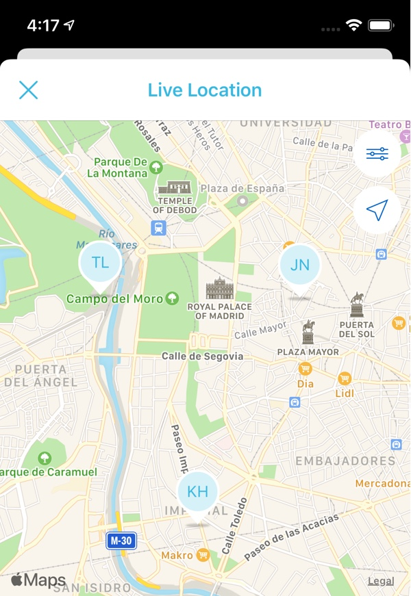

+++
Description = ""
Tags = ["iOS", "Xcode", "MapKit", "MKMapView", "Custom Views"]
author = "Igor Kulman"
date = "2020-04-29T05:29:12+01:00"
title = "Using custom annotation views in MKMapView"
url = "/using-custom-annotation-views-in-mkmapview"
images = ["/using-custom-annotation-views-in-mkmapview/LiveLocationMap.jpg"]
series = "Using MKMapView and MapKit on iOS"

+++

If you want to display completely custom views as "pins" on the map in your iOS application, you should use annotations. All your data needs to be represented as objects conforming to the `MKAnnotation` protocol, with `title`, `subtitle` and `coordinate` as the required properties.

### Custom view implementation

Visually you represent an `MKAnnotation` with a `MKAnnotationView`. You can create a custom class that subclasses `MKAnnotationView` and implement your custom UI in that class.

Here is an sample `MKAnnotationView` with fixed size that displays just one custom view

```swift
final class LocationAnnotationView: MKAnnotationView, Reusable {

    // MARK: Initialization

    override init(annotation: MKAnnotation?, reuseIdentifier: String?) {
        super.init(annotation: annotation, reuseIdentifier: reuseIdentifier)

        frame = CGRect(x: 0, y: 0, width: 40, height: 50)
        centerOffset = CGPoint(x: 0, y: -frame.size.height / 2)

        canShowCallout = true
        setupUI()
    }

    @available(*, unavailable)
    required init?(coder aDecoder: NSCoder) {
        fatalError("init(coder:) has not been implemented")
    }

    // MARK: Setup

    private func setupUI() {
        backgroundColor = .clear

        let view = MapPinView()
        addSubview(view)

        view.frame = bounds
    }
}
```

The `MKAnnotationView` is by default aligned to its corresponding position on map with the bottom left corner. If your `MKAnnotationView` looks like a pin for example, you need to align it to the position on the map with the bottom center point. To do that you use the `centerOffset` property as shown.

### Registering the custom view with MKMapView

The next step is to tell `MKMapView` to user your custom class.

#### Using single custom MKAnnotationView

If you want to display only one type of annotation in your `MKMapView`, just register your custom class with the `MKMapViewDefaultAnnotationViewReuseIdentifier` reuse identifier

```swift
mapView.register(LocationAnnotationView.self, forAnnotationViewWithReuseIdentifier: MKMapViewDefaultAnnotationViewReuseIdentifier)
```

This is enough to make `MKMapView` to completely handle creating and recycling instances of your custom `MKAnnotationView`s for you. No need to implement any `MKMapView` delegate methods for providing annotation views.



<!--more-->

#### Using multiple custom MKAnnotationViews

If you want to use multiple types of annotations in your `MKMapView`, you need to register them all with different reuse identifiers.

```swift
mapView.register(LocationAnnotationView.self, forAnnotationViewWithReuseIdentifier: LocationAnnotationView.reuseIdentifier)
mapView.register(LiveLocationDataMapAnnotationView.self, forAnnotationViewWithReuseIdentifier: LiveLocationDataMapAnnotationView.reuseIdentifier)
```

I [use the Reusable library that automatically provides reuse identifiers](/simpler-and-safer-custom-tableview-cells/) but you can use any reusable identifier string you like

Next you need to implement the `mapView(_:viewFor:)` method of the `MKMapViewDelegate` and decide which of those custom `MKAnnotationView`s is used for which `MKAnnotation`

```swift
func mapView(_ mapView: MKMapView, viewFor annotation: MKAnnotation) -> MKAnnotationView? {
    switch annotation {
    case is LocationViewModel:
        return mapView.dequeueReusableAnnotationView(withIdentifier: LocationAnnotationView.reuseIdentifier, for: annotation)
    case is LiveLocationDataViewModel:
        return mapView.dequeueReusableAnnotationView(withIdentifier: LiveLocationDataMapAnnotationView.reuseIdentifier, for: annotation)
    default:
        return nil
    }
}
```

Just do not forget to set the `MKMapView` delegate to `nil` in your view controller `deinit` method as it [might cause some strange crashes](https://stackoverflow.com/questions/7269303/mkmapview-crashes-app-when-view-controller-popped).
