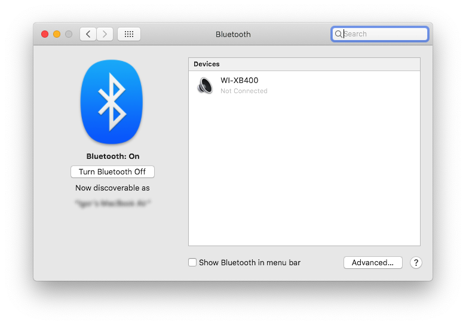
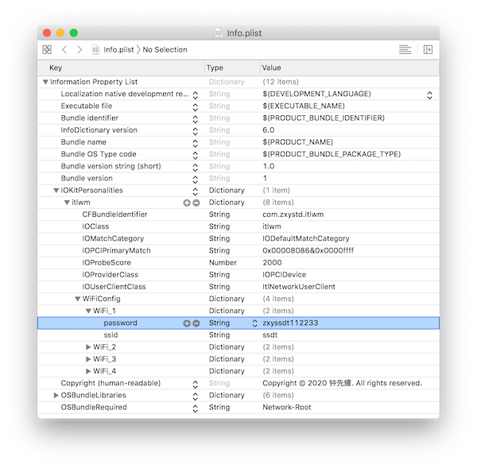
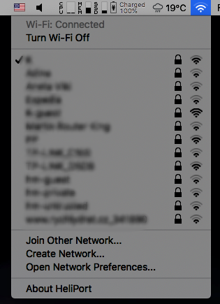

+++
Categories = ["macOS", "hackintosh"]
Description = ""
Tags = ["macOS", "hackintosh"]
Keywords = ["macOS", "hackintosh"]
author = "Igor Kulman"
date = "2020-07-29T05:29:12+01:00"
title = "Using Intel Wi-Fi and Bluetooth on a hackintosh"
url = "/using-intel-wifi-bt-on-macos"
images = ["/using-intel-wifi-bt-on-macos/HeliPort.png"]

+++

If you use a hackintosh you have to choose your hardware carefully to make sure it is supported by macOS. You can get [Wi-Fi + Bluetooth card used by Apple as I did in my desktop](/adding-wifi-and-bluetooth-for-apple-features-to-hackintosh/), but sometimes you do not have much choice. 

When I turned by old `Thinkpad T440s` into a hackintosh I bought a Wi-Fi dongle because the `Intel AC7260` Wi-Fi + Bluetooth card is not supported by macOS, no Intel cards are. 

Later I discovered and [open-source project that aims to make Intel Wi-Fi and Bluetooth work on macOS](https://github.com/OpenIntelWireless) and I was able to make the `Intel AC7260` card work, no dongles needed.

### Bluetooth driver

To get Intel Bluetooth working you need [IntelBluetoothFirmware](https://github.com/OpenIntelWireless/IntelBluetoothFirmware). It is a macOS kernel extension that that uses firmware binaries from Linux to make Bluetooth work.

Make sure your specific Intel card is supported, download the [latest release](https://github.com/OpenIntelWireless/IntelBluetoothFirmware/releases) and use the two kexts; `IntelBluetoothFirmware.kext` and `IntelBluetoothInjector.kext`. If you use `Clover` just copy them to `EFI/Clover/Kexts/Other`.

Make sure you do not use any of `AirportBrcmFixup`, `BT4LEContinuityFixup`, `BrcmBluetoothInjector`, `BrcmPatchRAM3` so you do not create a conflict.

After reboot Bluetooth will appear in System Preferences and you will be able to find and pair your Bluetooth devices.

### Wi-Fi driver

To get Intel Wi-Fi working you need [itlwm](https://github.com/OpenIntelWireless/itlwm). Similar to `IntelBluetoothFirmware` it is a macOS kernel extension using firmware from Linux. 

Make sure your specific Intel card is supported and download the [latest release](https://github.com/OpenIntelWireless/itlwm/releases). The release includes two kexts; `itlwm.kext` and `itlwmx.kext`. The `itlwmx.kext` is for use with the Intel X cards, like `Intel X200`, the `itlwm.kext` is for all the older cards like mine.

#### Networks management

When loaded, `itlwm.kext` makes your Intel Wi-Fi card available as an Ethernet card, not as a Wi-Fi card. This means you will not get the classic macOS user interface for connecting to Wi-Fi networks. 

You need to either configure your Wi-Fi networks either manually or use a custom Wi-Fi management app.

To configure the Wi-Fi networks manually open `itlwm.kext` and find `Info.plist`. If you open `Info.plist` you will see a section called `IOKitPersonalities:itlwm:WiFiConfig` with 4 Wi-Fi networks configured. Just change it to your networks configuration, providing your networks names and passwords and save the changes.

<!--more-->

You can load `itlwm.kext` immediately


sudo cp -R itlwm.kext /tmp
sudo chown -R root:wheel /tmp/itlwm.kext
sudo kextload /tmp/itlwm.kext


Or on every boot, if you use `Clover` just copy the correct kext to `EFI/Clover/Kexts/Other`.

Make sure you do not use any of `AirportBrcmFixup`, `BT4LEContinuityFixup`, `BrcmBluetoothInjector`, `BrcmPatchRAM3` so you do not create a conflict.

### Wi-Fi management app

If you do not want to manage your Wi-Fi networks editing the `Info.plist` file in `itlwm.kext` or `itlwmx.kext` there is a project called [HeliPort](https://github.com/OpenIntelWireless/HeliPort).

This project aims to replicate the standard macOS Wi-Fi management UI. 

Just download the [latest release](https://github.com/OpenIntelWireless/HeliPort/releases), copy it to Applications and launch it.