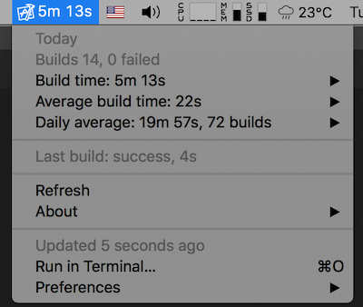

+++
Description = ""
Tags = ["iOS", "Xcode"]
author = "Igor Kulman"
date = "2020-08-19T05:29:12+01:00"
title = "How much time a day do you waste waiting for Xcode builds?"
url = "/xcode-build-times"
images = ["/xcode-build-times/buildtimes.png"]

+++

Have you ever wondered how much time a day you spend waiting for Xcode to do your builds? 

Working on a project that is almost entirely written in Swift I wonder that every day with a feeling that it is a non-trivial amount of time just wasted.

With [Xcode build times](https://github.com/matopeto/xcode-build-times) you can actually measure it and know for sure.

### Xcode build times

Xcode build times is a script that tracks all your daily builds and their duration. 

You just set it up in Xcode to be called on build start, success and fail as stated in the project README. 

It script is intended to be used as a plugin for [BitBar](https://github.com/matryer/bitbar). BitBar is a open source tool that allows you to show any script output in the macOS menu bar. 

Just install BitBar and set the plugins directory to the directory with the Xcode build times script, as stated in the project README.

<!--more-->