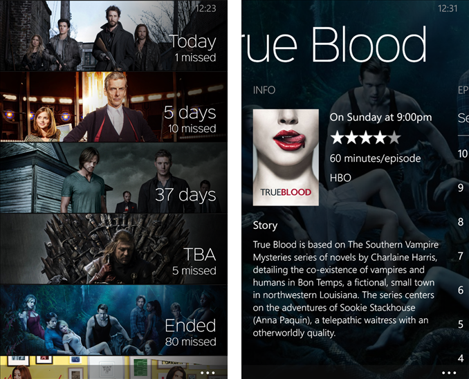
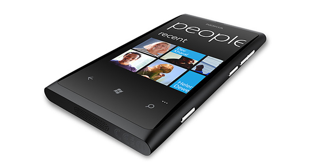
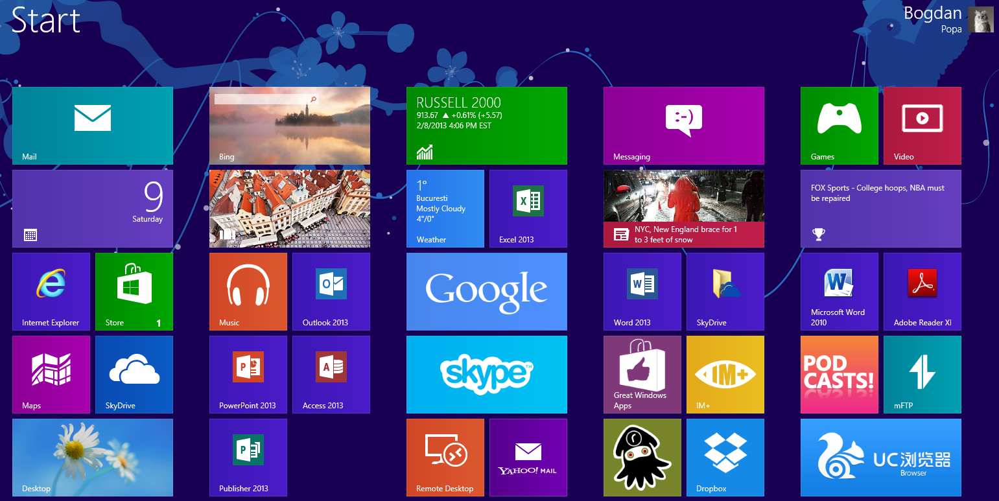
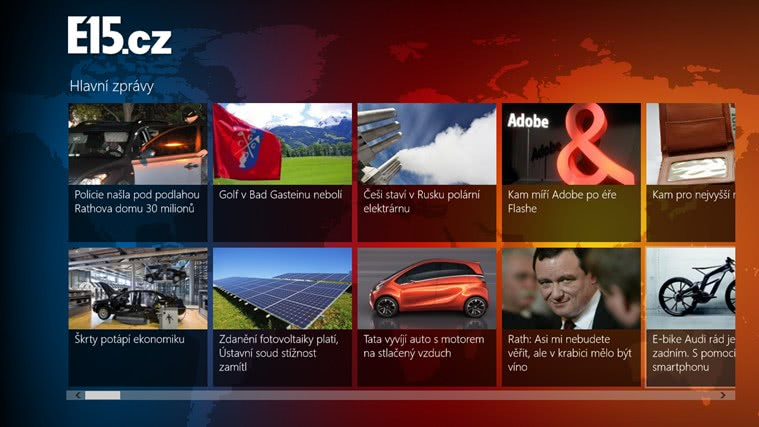
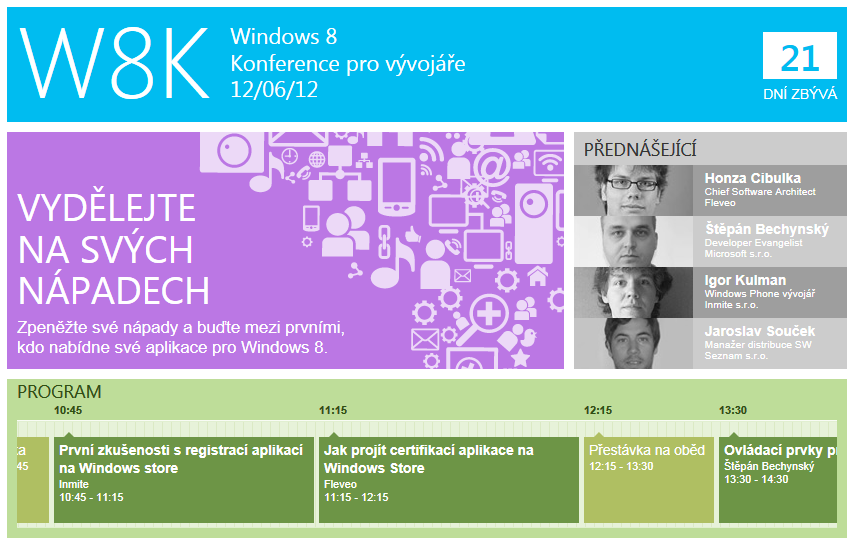
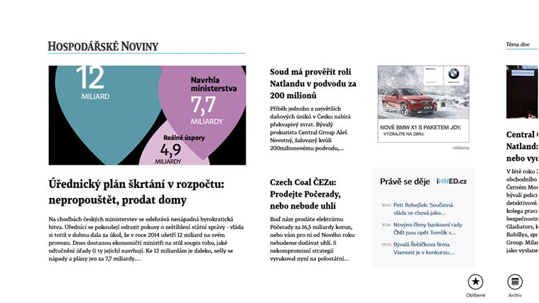

+++
Categories = ["Windows Phone", "Windows Store", "Windows 8"]
Description = ""
Tags = ["Windows Phone", "Windows Store", "Windows 8"]
Keywords = ["Windows Phone", "Windows Store", "Windows 8"]
author = "Igor Kulman"
date = "2021-09-01T05:29:12+01:00"
title = "My negative experience dealing with Microsoft in the old Windows Phone times"
url = "/dealing-with-microsoft-in-wp-times"

+++

This summer marks exactly **a decade since I started doing mobile apps development**. My first mobile app was called **MyTVShows** and was released to the Windows Phone Store in summer of 2011. 

The app solved a practical problem for me, keeping track of new episodes. I later rewrote the app as **TvTime** which was one of my most successful Windows Phone apps.

My times of doing Windows Phone development are long over as the platform has been dead for many years but this reminded me of all the struggles I had to deal with when interacting with the local Microsoft branch.

**Disclaimer**: Microsoft is a huge company so my experience is hopefully not the general experience of everyone from those times, people on all the local branches are different.

## Windows Phone app competitions

Shortly after publishing my first Windows Phone apps I got approached by a developer evangelist from the Slovak branch of Microsoft. Seeing my existing apps he offered me a **Nokia Lumia 800 in exchange for publishing 3 new apps in the Slovak Windows Phone Store** and I agreed. 

In spring of 2012 first preview of Windows 8 was released and I got access to to it from that developer evangelist. I created a **TV Schedule app for Windows 8** which was the absolutely **first Slovak app for Windows 8**. He also connected me with Slovak publishing company to create a small weather app for them. The relationship was going well.

Meanwhile in the Czech Republic the local Microsoft branch started a **competition giving every developer a Nokia Lumia 800 for publishing 3 apps to the Windows Phone Store**. The problem was the quality of those apps did not matter at all. The goal was to increases the number of the apps as much as possible, probably reaching some arbitrary number set by Redmond.

The Czech **Windows Phone Store was flooded by crappy apps created only because of this competition**, not having any real value for the user. I remember an app with one input and one button doing some kind of number conversion. 

Microsoft just wanted to bump the app numbers count by any means necessary to be able to compare the Windows Phone Store to other mobile app stores.

<!--more-->

## The advent of Windows 8

I worked at a mobile development company in the Czech Republic at the time so the Czech Microsoft approached us via a developer evangelist to **create a Windows 8 app for the official launch of Windows 8**.

We agreed to create a news application for one of the existing clients and this app one one of the five Czech Windows 8 apps at launch.

In dealing with this developer evangelist, I discovered that **an evangelist is often just another name for a sales man**. He **could not deal with any technical problem**, he **could only forward a correctly formulated question somewhere further down the corporate chain** and then forward the answer back to me.

I also found that local branches have no "power". I encountered some problem having the Windows 8 app pass the Windows Store review.

Windows Store kept rejecting the without any explanation. **The local Microsoft branch was totally helpless**, they did not know what to do just offered some promises that never lead to anything useful.

Just a few days before the deadline for the launch they were finally able to get the **reason for the rejection: the content was not in English**. Which makes absolutely no sense in a Czech news app.

I quickly **added a way for all the news articles to be translated to into English when a server flag as enabled**, submitted again and then disabled the flag after the app passed the review.

### Czech Windows 8 development conference

In May 2012 Czech Microsoft organized a **conference about Windows 8 development**. I was invited as a **speaker on the topic of Windows Store** having some recent dealings with it. 

My talk was **about the problems with review process that I experienced with the Czech news app**. I added a touch of humor describing the process.

Microsoft did not like the criticism, even thought I just talked about my actual experience. The **relationships with the Czech Microsoft got quite bad** because of that.

Around that same time I started this blog writing posts about Windows 8 from a developers point of view, talking about all the missing and broken things I encountered and possible workaround. Microsoft did not like this either.

In defense of Windows 8 Microsoft made an **argument that the platform was new and not yet mature so it was OK it did not support all the things developers expected** from say iOS or even from Win32, saying then when iOS was releases it did not support those things either.

**Microsoft just could not understand that in 2013 their Windows 8 competing with iOS of 2013, not iOS of 2008.**

## Windows 8 projects

In Slovakia the **developer evangelist** I had a good relation with **was replaced** by a different one. He was a total bullshitter. 

He called me multiple times, promised several Windows 8 projects. He **never deliver of any of his promises**. When I actually needed something from him he just **completely ignored me**. Not just me but also my clients that I built the apps for.

During this period, Slovak and Czech Microsoft launched a **Windows Store app competition** with a category called **"applications for quantity"**. For real. 

In this category they rewarded developers with the **largest number** of published apps, of course, **regardless of quality**. 

The infestation of Windows Store with poorly built apps continued. I did not care much about Windows 8 and the Windows Store but I still liked Windows Phone and really disliked how Microsoft was handling this.

The developer evangelist finally arranged two projects for me. Both project came with a completely **incompetent graphic designer** he insisted on. Probably a friend.

The graphic designer was definitely an iOS user because the designs for Windows 8 were full of gradients and reflections, created for just one resolution. He probably **never saw any Windows 8 apps**, knew nothing about the "Metro" style.

In the Czech Republic the **developer evangelist** I dealt with before was **also replaced**, also by a total bullshiter. We agreed to create big Windows 8 news app for a customer who already had a popular iPad app. 

This developer evangelist **promised us a promotion in the Windows Store, promotion of the application at hardware vendors, creation and publication of a case-study and publication and promotion of an article about creating an application on MSDN and other portals**. 

Of course, **none of this ever happened**. I wrote about a five page text about developing the applications, the challenges encountered and solutions used that never got published anywhere.

## Microsoft working actively against me

In 2013 I got a call from another developer. The Slovak developer evangelist gave him a project, creating a small weather app for a Slovak publishing company. Sounds familiar? He created the app, **went to publish it and found out the app already exists because I created it a year ago**.

So the developer asked by what was going on. I did not know. I had no idea why I was not asked to updated the app but the whole project was just given to somebody else.

I contacted the Slovak developer evangelist but he totally ignored me. **To this day I have no idea what happened there**.

When finishing one for the Slovak projects I needed to implement a way for the user to buy daily issues of a magazine. I made a recommendation to the client not to use in-app purchases as **Microsoft was boasting at the time that apps in Windows Store could implement any payment mechanism they wanted**.

The **in-app purchases had a ton of problems at that time and they did not even support creating more than I think 100 separate items** so absolutely useless for a magazine with daily new issues. 

The client decided to consult with Slovak Microsoft. The result was **I was taken off the project, probably at the developer evangelists insistence**. He never responded to my emails so I can just guess but it would be consistent with other behavior.