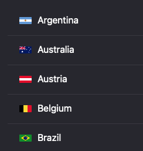
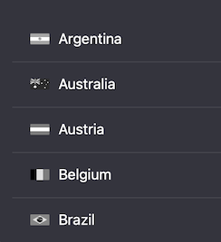

+++
Categories = ["Swift", "Xcode", "Cocoa"]
Description = ""
Tags = ["Swift", "Xcode", "Cocoa"]
Keywords = ["Swift", "Xcode", "Cocoa"]
author = "Igor Kulman"
date = "2021-02-17T05:29:12+01:00"
title = "Graying out images in Cocoa"
url = "/graying-out-images"
share_img = "/graying-out-images/flags.png"

+++

I have been working on a macOS application recently where I encountered an interesting task to grey out flags for countries that are disabled. 

I first tried overlaying a semi-transparent gray view (fun fact, you cannot directly set a background for a view in Cocoa, you need to use the layer) over the flag image but it did not look very good.

Luckily there is a way to convert a `NSImage` to grayscale directly in Cocoa.

You first need to create a bitmap representation your `NSImage`


let bitmap = NSBitmapImageRep(cgImage: cgImage)


convert it to grayscale


let greyScale = bitmap.converting(to: .genericGray, renderingIntent: .default)


and then construct an `NSImage` from the result.


let greyImage = NSImage(size: greyScale.size)
greyImage.addRepresentation(greyScale)


Putting it all together as an NSImage extension might look like this

<!--more-->


extension NSImage {
    func grayOut() -> NSImage? {
        guard let image = cgImage else {
            return nil
        }

        let bitmap = NSBitmapImageRep(cgImage: image)

        guard let greyScale = bitmap.converting(to: .genericGray, renderingIntent: .default) else {
            return nil
        }

        let greyImage = NSImage(size: greyScale.size)
        greyImage.addRepresentation(greyScale)
        return greyImage
    }
}


Applying this method to the flags from the beginning of this post will get you this result

