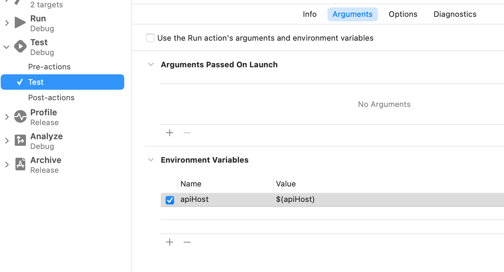

+++
Categories = ["Swift", "Xcode"]
Description = ""
Tags = ["Swift", "Xcode"]
Keywords = ["Swift", "Xcode"]
author = "Igor Kulman"
date = "2021-03-17T05:29:12+01:00"
title = "Reading environment variables from iOS and macOS unit tests"
url = "/reading-environment-variables-from-unit-tests"
images = ["/reading-environment-variables-from-unit-tests/scheme.png"]

+++

In some environments like the CI/CD you might need to read environments variables from your iOS or macOS unit tests. 

A typical example might be reading secrets or configuration that is CI/CD specific and you do not want to store it in source control.

In Swift you can read environment variables using the `ProcessInfo.processInfo.environment` dictionary, for example

```swift
let host = ProcessInfo.processInfo.environment["apiHost"] ?? "default fallback host"
```

The problem is this code does not just work, there is one other step you need to do first.

You need to edit your Test scheme and add every environment variable you want to read to the `Environment Variables` section. 



You can rename the variables but for simplicity and readability you should probably keep the same names.

<!--more-->