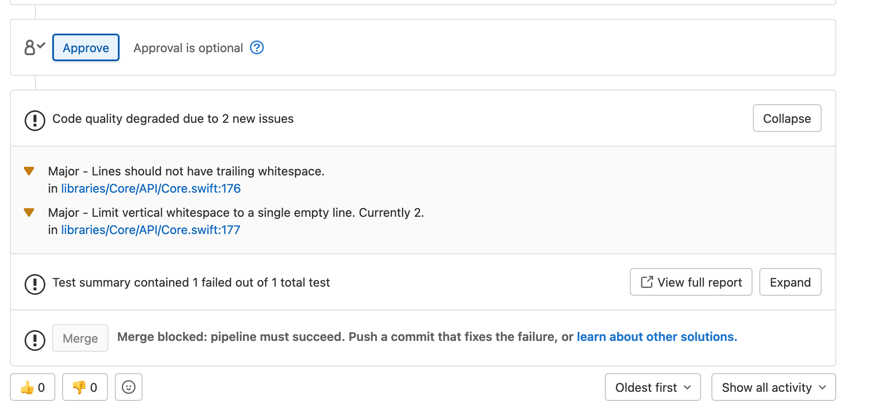

+++
Description = ""
Tags = ["Swift", "iOS"]
author = "Igor Kulman"
date = "2022-06-15T05:29:12+01:00"
title = "Using SwiftLint to generate code quality report for Gitlab"
url = "/using-swiftlint-for-gitlab-code-quality"
images = ["/using-swiftlint-for-gitlab-code-quality/quality.png"]

+++

[Gitlab](https://about.gitlab.com/) allows you to easily measure and report [code quality](https://docs.gitlab.com/ee/user/project/merge_requests/code_quality.html) of your merge requests to see your linting or other code issues right in every merge request you make in a nice and concise way. 



I have been using [SwiftLint](https://github.com/realm/SwiftLint) for a very long time now in my iOS projects so I decided to integrate it to the Gitlab code quality flow.

This is quite easy because SwifLint can generate a [Code Climate](https://codeclimate.com/) format that Gitlab understands. No need for any custom format conversion or data transformation.

To set it up in Gitlab you need to modify your `.gitlab-ci.yml` file. First include the code quality template

```yaml
include:
  - template: Code-Quality.gitlab-ci.yml
```  

and then add a new job called `code_quality`, it needs to have this exact name to match the included template

```yaml
code_quality:
  dependencies: []
  stage: linting
  artifacts:
    paths:
      - codequality_report.json
    reports:
      codequality: codequality_report.json
  script:
    - swiftlint --reporter codeclimate > codequality_report.json 
  tags:
    - iOS-arm
```    

This works for a simple project. In my projects I usually use an iOS application project and a few smaller framework projects that the iOS application uses, so instead of `swiftlint --reporter codeclimate > codequality_report.json` I call a custom shell script

<!--more-->

```bash
#!/bin/bash

for target in sources/**/.swiftlint.yml
do
    name=($(basename "$(dirname "$target")"))
    path="sources/$name"
    
    echo $path
    cd $path
    swiftlint --reporter codeclimate > codequality_report.json

    pattern="\"path\" : \""
    replacement="\"path\" : \"sources\/$name\/"
    sed -i'' -e "s/$pattern/$replacement/g" codequality_report.json
    cd -
done

jq -s '[.[][]]' sources/**/codequality_report.json > codequality_report.json
```

This script finds all the projects in the `sources` folder that contain a SwiftLint rule definition, generates a code climate report for each them and then merges those reports into one single report.