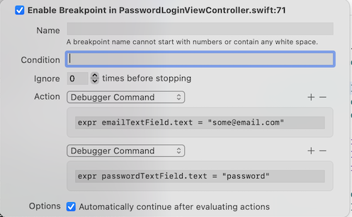
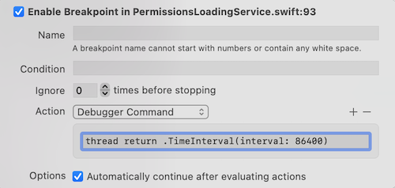

+++
Categories = ["Swift", "iOS", "Xcode"]
Description = ""
Tags = ["Swift", "iOS", "Xcode"]
Keywords = ["Swift", "iOS", "XCode"]
author = "Igor Kulman"
date = "2023-07-12T05:29:12+01:00"
title = "A few Xcode debugging tips"
url = "/a-few-xcode-debugging-tips"

+++

The Xcode debugger is quite a powerful tools but I have only seen a few iOS developer using to for more than printing out variable values with the `po` debugger command or setting values with the `expr` debugger command.

Let me show you a few commands I use for development with very specific use cases.

### Print current `UIViewController` to get oriented

When I get to work on a new code base the best way for me to get oriented in the iOS application is to know what `UIViewController` is currently being displayed on screen.

You can easily print the name of the current `UIViewController` without any code changes, just by creating a symbolic breakpoint for `-[UIViewController viewDidLoad]` that logs `%B` and executed the `po $arg1` debugger command. 

![-[UIViewController viewDidLoad] breakpoint](didLoadBreakpoint.png)

Do not forget to set the breakpoint to `Automatically continue after evaluating actions` so it does not actually stop the execution, just prints the name of the breakpoint and the current `UIViewController`.

Additionally you can use the `Move breakpoint to: User` option to make it available in all your projects.

### Autofill forms with breakpoints

Filling in forms is a tedious task especially when you have to do it repeatedly, like filling in email and password when testing the login flow. 

You can add some code that fills it for your but a much better way is to set a breakpoint and let it execute a debugger command to fill the form for you without doing any changes to your actual code.

To do that you can use the `expr` debugger command that executes an expression, for example `expr emailTextField.text = "some@email.com"`

I usually add this breakpoint add the end of the `viewDidLoad` method in a `UIViewController`.

### Change method return value

When debugging my code I sometimes want to see what happens of a specific method or a property getter returns a different value. 

I could stop the debugging, comment out the real code, add a return with that specific value, rebuild .. but that would be a waste of time when a breakpoint can do the same thing without stopping and rebuilding the application.

To do that you need to just use the `thread return` debugger command.

