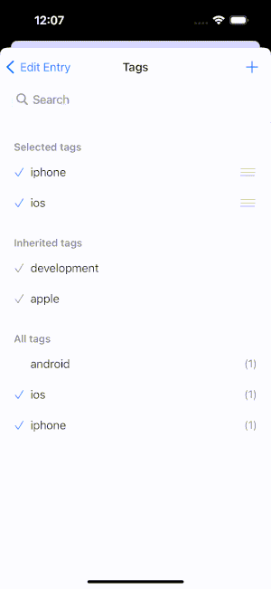
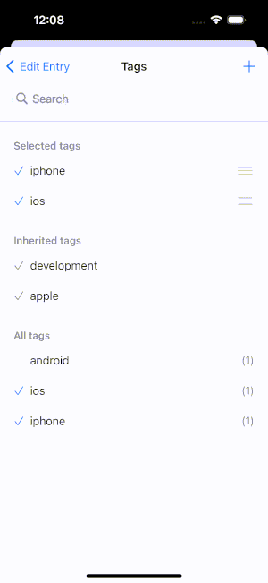

+++
Description = ""
Tags = ["iOS", "Swift", "UITableView", "UX"]
author = "Igor Kulman"
date = "2024-01-31T05:29:12+01:00"
title = "Using reordering and selection at the same time in UITableView"
url = "/tableviews-with-reorder-and-selection"

+++

When you use an `UITableView` you usually either use it with selection in normal mode or you switch it to edit mode to do reordering and deleting of the items.

In a recent project I had to use an `UITableView` with items that would be selectable and could be reordered at the some time.



To make things a bit more complicated only one section of the `UITableView` had to have the possibility to reorder items and only inside this section, the user should not have been able to drag an item to another sections while reordering.



To implement those requirement you first have to tell the `UITableView` which cells can be reordered

```swift
func tableView(_ tableView: UITableView, canMoveRowAt indexPath: IndexPath) -> Bool {
    // some condition depending on indexPath.section
}
```

This by itself is not enough because we will not use the  `UITableView` in edit mode, you need to explicitly show the reorder handle for those cells

```swift
func tableView(_ tableView: UITableView, willDisplay cell: UITableViewCell, forRowAt indexPath: IndexPath) {
    cell.showsReorderControl = self.tableView(tableView, canMoveRowAt: indexPath)
}
```

Now you can process the result of user reordering the cells

```swift
func tableView(_ tableView: UITableView, moveRowAt sourceIndexPath: IndexPath, to destinationIndexPath: IndexPath) {
    // update the model, etc
}
```

The final step is to make sure the user can reorder the cells only in one specific section and cannot drag any cell to another section

```swift
func tableView(_ tableView: UITableView, targetIndexPathForMoveFromRowAt sourceIndexPath: IndexPath, toProposedIndexPath proposedDestinationIndexPath: IndexPath) -> IndexPath {
    guard sourceIndexPath.section != proposedDestinationIndexPath.section else {
        // moving inside the same section is always ok
        return proposedDestinationIndexPath
    }

    // use the last item of the same section when trying to move to the next one
    if sourceIndexPath.section < proposedDestinationIndexPath.section {
        return IndexPath(
            row: tableView.numberOfRows(inSection: sourceIndexPath.section) - 1,
            section: sourceIndexPath.section
        )
    }

    // use the first item of the same section when trying to move to the previous one
    return IndexPath(row: 0, section: sourceIndexPath.section)
}
```

This implementation also guides the user moving the cell either to the top or bottom of the allowed section when trying to drag the cel outside of the section.
