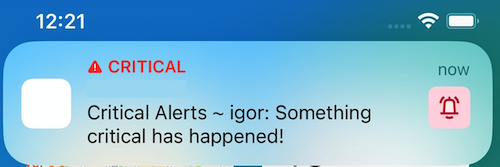
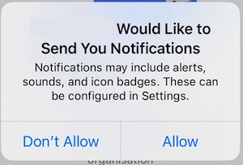
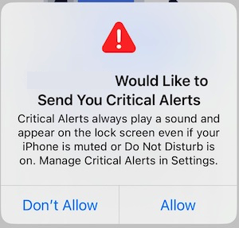
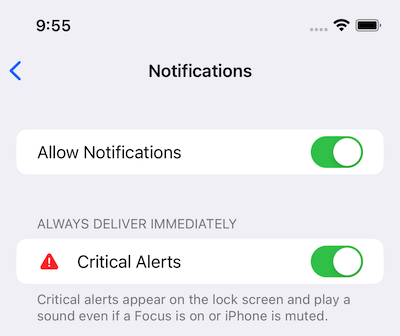

+++
Categories = ["Swift", "iOS"]
Description = ""
Tags = ["Swift", "iOS"]
Keywords = ["Swift", "iOS"]
author = "Igor Kulman"
date = "2023-04-29T05:29:12+01:00"
title = "Using Critical Alerts in iOS applications"
url = "/using-critical-alerts-on-ios"
share_img = "/using-critical-alerts-on-ios/critical.jpg"

+++

Critical Alerts are an iOS features that is not exactly new, it was introduced with iOS 12 back in 2018, but I have never worked for it before and I have not even used any iOS application that implements it.

I think the main reason for this is that this feature cannot be just used by any iOS application, it requires special entitlements that you have to get by asking Apple and you should have a good reason for it to get them.

Last month I had to implement Critical Alerts in a project so I finally got a chance to try out how it all works.

## Critical Alerts

Critical Alerts are special alert notifications that are shown to the user even if the device is muted or in Do not Disturb mode. 

This makes Critical Alerts quite intrusive so I guess it is a good thing not every app can just use them right away but it requires permissions from Apple.

The resulting alert notifications are clearly marked as critical on the device



## Getting the special entitlements

As mentioned before, the first step is [getting the special entitlements from Apple using the developer portal](https://developer.apple.com/contact/request/notifications-critical-alerts-entitlement/). 

After Apple approves your request you will get the special entitlements and you can used them in your provisioning profile. That means you have to regenerate your provisioning profiles for development and AppStore, or create a set of new ones.

In your project you need to add the `com.apple.developer.usernotifications.critical-alerts`　key to your entitlements file

```xml
<key>com.apple.developer.usernotifications.critical-alerts</key>
<true/>
```

## Asking the user for permissions

To use the Critical Alerts in your iOS applications you first need to ask the user for permission. 

This is done by adding an additional `.criticalAlert` option when asking for notification permissions

```swift
UNUserNotificationCenter.current().requestAuthorization(
    options: [.alert, .sound, .badge, .criticalAlert]
) { granted, error in
...
}
```

The way this is presented to the user is quite clever. The user first gets a dialog asking for the common notifications permissions



and then an additional dialog askinf for the Critical Alerts permissions.



This way the user can allow just the common notifications without being bothered by the intrusive Critical Alerts.

Critical Alerts then show separately in the application's notifications settings and can be disabled at any later time.



## Notification payload

To send Critical Alerts notifications to your iOS application you need to adjust the notification payload. 

The only change needed is to convert the `sound` property to a dictionary

```json
{  
   "aps":{  
       "alert":"Critical Alerts notification",
       "sound": {  
         "critical": 1,
         "name": "default",
         "volume": 1.0
        }
     }
}
```

marking the sound as critical.

## Notification Service Extension

If you use an `Notification Service Extension` in your iOS application you can change any incoming alert notification to a Critical Alerts notification by mutating the `sound` property of the `UNMutableNotificationContent`.

```swift
content.sound = 
    customAlertSoundFileName.flatMap { UNNotificationSound.criticalSoundNamed(UNNotificationSoundName($0), withAudioVolume: 1) } 
    ?? UNNotificationSound.defaultCriticalSound(withAudioVolume: 1)
```

You can use your own custom notification sound or the default one and you can specify the volume in both cases.