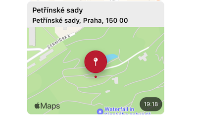
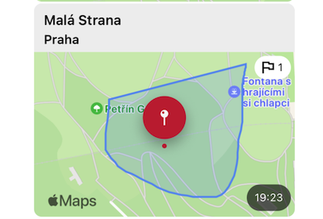

+++
Description = ""
Tags = ["Swift", "iOS"]
author = "Igor Kulman"
date = "2024-08-21T05:29:12+01:00"
title = "Drawing custom areas into map snapshots in iOS"
url = "/custom-areas-in-snapshots"
images = ["/custom-areas-in-snapshots/locationAttachmentArea.png"]

+++


In a project I work on the messages in chat can contain a location attachment. Those location attachments are represented as map snapshots showing the attached location and are generated in the iOS application from the coordinates.



The map snapshots are created using the `MKMapSnapshotter` class using quite simple code showing a snapshot of the map 250 meters around the location in the attachment

```swift
let region = MKCoordinateRegion(center: coordinate, latitudinalMeters: 250, longitudinalMeters: 250)
mapSnapshotOptions.region = region
mapSnapshotOptions.scale = UIScreen.main.scale
mapSnapshotOptions.size = CGSize(width: width, height: height)
mapSnapshotOptions.showsBuildings = true

let snapShotter = MKMapSnapshotter(options: mapSnapshotOptions)
snapShotter.start { snapshot, error in
    if let error = error {
        completion(nil)
        return
    }

    guard let snapshot = snapshot else {
        completion(nil)
        return
    }

    completion(snapshot.image)
}
```                

When sharing a location the user can also draw one or more overlays to designate something important around the location, so I needed to add those ares also to the map preview for better experience.



The `MKMapSnapshotter.Snapshot` returned from the `MKMapSnapshotter` has a very convenient method to convert coordinates on the map to points in the snapshot image.

With this method it is possible to use the image in an `UIGraphicsContext` and draw the overlays into the snapshot image

```swift
let image = snapshot.image
UIGraphicsBeginImageContextWithOptions(mapSnapshotOptions.size, true, 0)
image.draw(at: .zero)

let context = UIGraphicsGetCurrentContext()!
overlays.forEach {
    let color = $0.isUserDrawnArea ? UIColor.userAreaColor : UIColor.receivedAreaColor

    context.beginPath()
    context.move(to: snapshot.point(for: $0.coordinates[0]))
    for i in 1 ..< $0.coordinates.count {
        context.addLine(to: snapshot.point(for: $0.coordinates[i]))
    }
    context.closePath()
       
    context.setFillColor(color.withAlphaComponent(0.2).cgColor)
    context.setStrokeColor(alpha.cgColor)
    context.setLineWidth(2)
    context.drawPath(using: .fillStroke)
}

let finalImage = UIGraphicsGetImageFromCurrentImageContext()
UIGraphicsEndImageContext()
completion(finalImage)
```

I use different color depending on the overlays type and the overlays needs to have at least 2 coordinates.