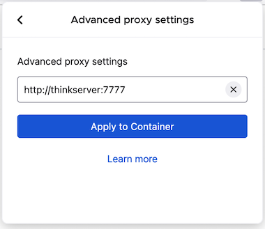

+++
Categories = ["Swift", "iOS"]
Description = ""
Tags = ["Swift", "iOS"]
Keywords = ["Swift", "iOS"]
author = "Igor Kulman"
date = "2024-04-04T05:29:12+01:00"
title = "Use OpenVPN as a proxy to more comfortably access internal Gitlab"
url = "/use-openvn-as-proxy"

+++

I currently work on a project that uses a self hosted Gitlab instance for git and this Gitlab instance can be only accessed after connecting to the company's OpenVPN.

I did not want to be connected to OpenVPN all the time from my machine, especially this being a side project that I do not work on every day.

Every time I needed to push or pull code or create or review a PR I connected to OpenVPN, did what I need to do, disconnected.

This was quite a pain so I looked for a better and more comfortable solution and found one.

My solution can be described in 3 steps

1. Expose the OpenVPN connection as a proxy
2. Configure Git to use this proxy but only for this specific repository
3. Configure Firefox to use this proxy but only for Gitlab and other websites run by that company

## Expose OpenVPN as a proxy

The simplest way to achieve this is a [docker container](https://github.com/jonohill/docker-openvpn-proxy).

In the [docker compose file](https://github.com/jonohill/docker-openvpn-proxy/blob/master/docker-compose.yml) I just changed the username and password for my specific OpenVPN configuration file and the container was up and running in a few minutes.

```docker
version: "3"
services:
    ovpn_proxy:
        image: jonoh/openvpn-proxy
        cap_add:
            - NET_ADMIN
        devices:
            - /dev/net/tun
        dns:
            - 1.1.1.1
            - 1.0.0.1
        volumes:
            - ./config.ovpn:/config/config.ovpn
        environment:
            - LOCAL_NETWORK=192.168.1.1/24            
            - OPENVPN_USERNAME=username
            - OPENVPN_PASSWORD=password
        ports:
            - 77:80
            - 7777:8080
        restart: always
```

I run the container on my [old Thinkpad that I use as my home server](https://github.com/igorkulman/thinkserver) but you can run it anywhere you want, even directly on your machine.

## Configure Git to use the proxy

I use git with that company's Gitlab server via ssh so I needed to create a new configuration for this specific host in the `.ssh/config` file

```
Host git.example.com
    Hostname git.example.com
    ServerAliveInterval 55
    ForwardAgent yes
    ProxyCommand /opt/homebrew/bin/corkscrew thinkserver 7777 %h %p
```

I use corkscrew to tunnel the ssh connection via the http proxy, on macOS it can be easily installed from Homebrew

```bash
brew install corkscrew
```

As a bonus this also works when I am not at home thanks to Tailscale and using a hostname instead of an IP because my home server is also reachable from other networks as long as my machine is also connected to Tailscale.

## Configure Firefox to use the proxy but only when needed

I use Firefox as my browser of choice mainly thanks to the [Firefox Multi-Account Containers extension](https://addons.mozilla.org/en-US/firefox/addon/multi-account-containers/) that allows me to define separate containers for various things and use them in one Firefox window side by side.

I have a special container created for all the things related to the project and set the self hosted Gitlab instance and a few other things to always open in that container.



I configured this and only this container to use the proxy and I was done.

## Conclusion

Using a docker container and a few proxy settings I was able to move from manually connecting and disconnecting OpenVPN to a seamless experience using the OpenVPN connection transparently in the background only when really needed.