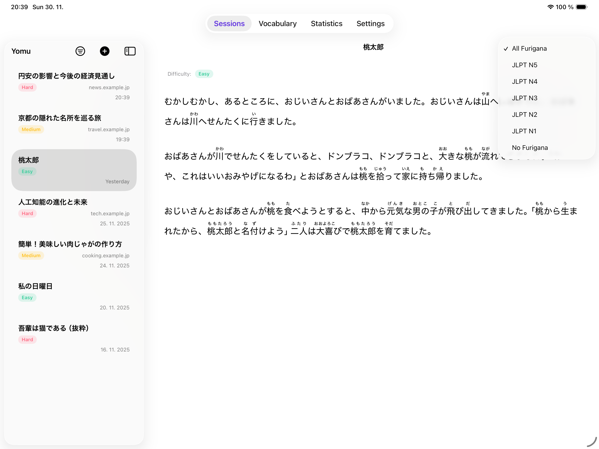
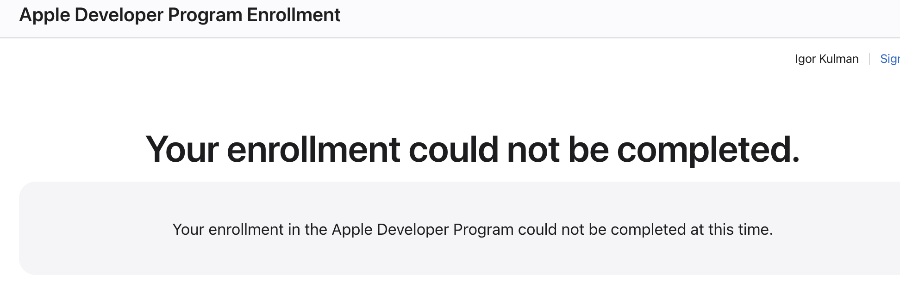
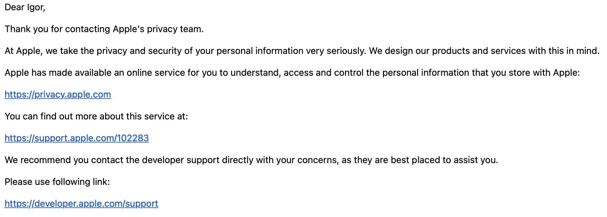

+++
Categories = ["Programming", "Career", "Apple"]
Description = "Trying to join the Apple Developer Program as an indie and being blocked by an unexplained automated decision."
Tags = ["Programming", "Career", "Apple", "App Store", "Indie"]
Keywords = ["Programming", "Career", "Apple", "App Store", "Indie"]
author = "Igor Kulman"
date = "2025-12-03T05:29:12+01:00"
title = "Apple will not let me join the Developer Program — and will not say why"
url = "/apple-developer-program"
images = ["/apple-developer-program/denial.png"]

+++

I’ve been building apps for a long time. More than a decade ago I shipped several apps on the Windows Phone Store — and back then, publishing as an indie was empowering. Even though [dealing with Microsoft was often frustrating](/dealing-with-microsoft-in-wp-times), at least I could publish my apps under my own name.

Ever since switching fully to iOS professionally, I’ve been waiting for a good personal project idea. Something small but meaningful. Something I could polish and ship under my own name again.

A few weeks ago, while preparing for the JLPT N4 exam, I finally found one.

## The app idea that finally clicked

Most Japanese learning materials show full furigana over every kanji. That makes sense for beginners, but at intermediate level it becomes a crutch. I kept reading the furigana instead of the kanji, so I wasn’t actually improving.

One day in class my teacher suggested covering the furigana with a strip of paper. Suddenly the reading was harder — but also more engaging. That’s when it clicked:

**What if an app could automatically hide furigana for kanji you should already know, and show it only where you actually need help?**

I built that idea into a real app called [Yomu](https://yomuapp.kulman.sk).

Yomu adapts furigana to your JLPT level. If you’re at JLPT N4, it hides furigana for all JLPT N5 and N4 kanji and keeps it only for harder characters. On top of that, you can share text to the app from anywhere, scan printed Japanese through the camera, look things up in a fast offline dictionary, save vocabulary and export it to apps like Anki, and even get a quick difficulty analysis of the text you are reading.

The app is **real, finished, tested, documented, and ready for submission**.

All I needed was to join the Apple Developer Program.

**That’s where everything went wrong.**

## Apple simply refused to let me join the Developer Program

When you want to publish an app on the App Store, the process is supposed to be simple: you sign in with your Apple ID, fill in your details, pay €99, and you’re in.

Except **step 2 silently rejects me**.

No explanation. No hint what to fix.

So I contacted Apple Support by phone.

And I was told, literally, that I cannot join, they will not tell me why, and there is **nothing I can do**.

That’s the official answer.

Not “Fix this document”. Not “Verify your identity”. Not “Try again later”. Not “Contact another department”.

Just:

**“You cannot enroll. We cannot tell you the reason. There is no action you can take.”**

That was it. End of conversation. No escalation path, no human review, no appeal, no second opinion. Nothing.

## An extremely demotivating position for an indie developer

At this point I have a finished app, a website, documentation, an idea users actually want, the ability to build and maintain it, and a decade of professional experience.

**And yet, as a private individual, I am effectively banned from publishing apps with no reason and no recourse.**

**Not temporarily, not conditionally, not with corrections, not with additional verification.**

Just permanently rejected by an internal automated system that Apple refuses to explain.

It’s a strange feeling — wanting to build something useful and meaningful, having everything ready, and being told:

**“You cannot. We will not tell you why. Goodbye.”**

## Even a GDPR request did not help

After exhausting all normal support routes, I filed a formal GDPR request asking Apple for access to the data used in the automated decision that blocks my enrollment.

Under Article 22 they must allow a human review. Apple responded with a template email that ignored the request entirely and redirected me back to the same developer support that had already told me there is no recourse.

**That is it.**

## Update: I eventually managed to enroll — but the core problem remains

After publishing this post, several people reached out to me privately with similar experiences and suggestions.

After additional attempts, I was eventually able to enroll in the Apple Developer Program by creating a completely new Apple ID and retrying the payment process multiple times. This required a new email address, a new phone number, and several days of trial and error, without any indication from Apple whether this approach would work at all.

Importantly, my original Apple ID remained fully functional throughout this process — App Store purchases, iCloud, and other Apple services continued to work normally. The only thing blocked was enrollment in the Developer Program.

Some people suggested that this could be related to internal fraud or compliance systems, such as AML checks. I have no way to verify this, and Apple did not confirm or deny anything. My GDPR request resulted only in a generic response redirecting me back to developer support.

While I am glad I was eventually able to proceed, the core issue remains unchanged: when Apple refuses developer enrollment, there is no explanation, no appeal process, and no actionable feedback. Whether the rejection is caused by automation, policy, or error, developers are left guessing — and in my case, solving the problem required workarounds rather than guidance.
