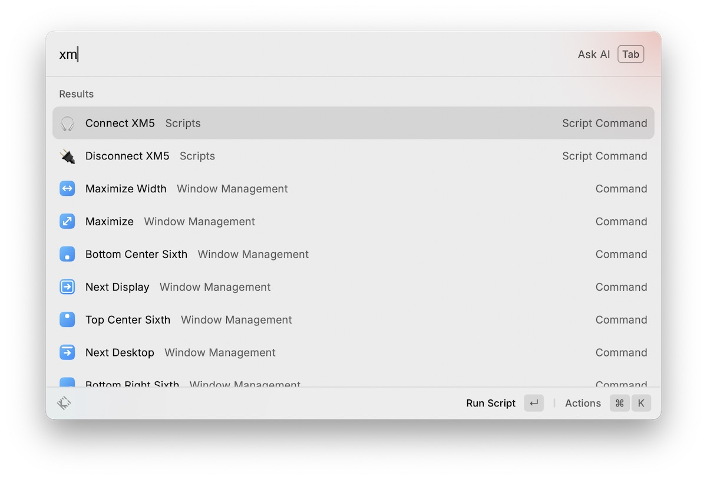

+++
Categories = ["macOS", "Raycast"]
Description = ""
Tags = ["macOS", "Raycast"]
Keywords = ["macOS", "Raycast"]
author = "Igor Kulman"
date = "2025-07-16T05:29:12+01:00"
title = "Reliable Bluetooth headphone switching on macOS using Raycast and scripts"
url = "/bluetooth-headphone-switching-macos"
images = ["/bluetooth-headphone-switching-macos/xmscripts.jpg"]

+++

Switching Bluetooth headphones between devices on macOS can be surprisingly unreliable, especially with popular models like the Sony WH-1000XM5. While these headphones support multi-point connections, the experience is often inconsistent: macOS may hijack playback unexpectedly, or media buttons might control the wrong device. I wanted a seamless, reliable way to switch my headphones between my MacBook and iPhone, using tools I already rely on.

## Existing solutions and their limitations

I initially tried ToothFairy, a popular app for one-click Bluetooth switching. While it works for many, it wasn't reliable in my setup—sometimes failing to connect, sometimes showing the wrong status. Since I already use Raycast for quick actions, I decided to create my own solution using custom scripts.

## What I wanted to achieve

My goals were:

- A reliable way to connect or disconnect the XM5 headphones on macOS
- Automatic switching of audio output and input once connected
- Seamless integration with Raycast for quick access via hotkey or search

## Requirements

You’ll need to install two command-line tools:

```bash
brew install blueutil
brew install switchaudio-osx
```

- `blueutil` – for connecting/disconnecting Bluetooth devices
- `SwitchAudioSource` – for changing macOS input/output devices

You will also need to find the MAC address of your headphones and the exact names of the input and output devices as recognized by macOS. You can use the following commands:

To list all paired Bluetooth devices and find the MAC address of your headphones:

```bash
blueutil --paired
```

To list all available output and input audio devices and get the exact device name:

```bash
SwitchAudioSource -a -t output
SwitchAudioSource -a -t input
```

Both the MAC address and the device name are needed for the script to work correctly.

## Making the connection process reliable

Just connecting the headphones is often not enough—macOS does not always automatically set them as the input or output device after connecting. This means you might find your headphones connected via Bluetooth, but audio still coming from your MacBook speakers or microphone. To address this, the script not only connects the headphones but also explicitly sets them as the default audio input and output.

At first, I wrote a single script to toggle the connection based on Bluetooth state. But this proved confusing: sometimes the headphones were powered off but still shown as connected by macOS, leading to accidental disconnects. Splitting the logic into two explicit scripts—one for connecting, one for disconnecting—made the behavior predictable and easier to control.

## Creating the scripts

Save these scripts under `~/.raycast/scripts/`, make them executable, and use the appropriate Raycast headers to expose them as Script Commands.

### connect-xm5.sh

This script always attempts to connect the headphones, then sets them as the default audio input and output:

```bash
#!/bin/bash
# @raycast.schemaVersion 1
# @raycast.title Connect XM5
# @raycast.mode compact
# @raycast.icon 🎧

DEVICE_MAC="XXX"  # Replace with your headphones' MAC address
DEVICE_NAME="WH-1000XM5"
TIMEOUT=5

wait_for_device() {
  for ((i=0; i<TIMEOUT; i++)); do
    blueutil --connected | grep -iq "$DEVICE_MAC" && return 0
    sleep 1
  done
  return 1
}

wait_for_audio() {
  for ((i=0; i<TIMEOUT; i++)); do
    SwitchAudioSource -a -t output | grep -Fxq "$DEVICE_NAME" && return 0
    sleep 1
  done
  return 1
}

blueutil --connect "$DEVICE_MAC"
if wait_for_device; then
  echo "🔗 Connected"
  if wait_for_audio; then
    SwitchAudioSource -s "$DEVICE_NAME" -t output && echo "🔊 Output set"
    SwitchAudioSource -s "$DEVICE_NAME" -t input && echo "🎙️ Input set"
  else
    echo "⚠️ Audio device not ready"
  fi
else
  echo "❌ Failed to connect"
fi
```

### disconnect-xm5.sh

This script always attempts to disconnect the headphones cleanly:

```bash
#!/bin/bash
# @raycast.schemaVersion 1
# @raycast.title Disconnect XM5
# @raycast.mode compact
# @raycast.icon 🔌

DEVICE_MAC="XXX"  # Replace with your headphones' MAC address
TIMEOUT=5

wait_for_disconnection() {
  for ((i=0; i<TIMEOUT; i++)); do
    ! blueutil --connected | grep -iq "$DEVICE_MAC" && return 0
    sleep 1
  done
  return 1
}

blueutil --disconnect "$DEVICE_MAC"
if wait_for_disconnection; then
  echo "🔌 Disconnected"
else
  echo "❌ Failed to disconnect"
fi
```

## Integrating with Raycast

Once the scripts are saved and made executable, Raycast will automatically detect them as Script Commands. You can run them via Raycast search or assign hotkeys for even faster access.



## Conclusion

With this setup, I now have a reliable and fast way to switch my XM5 headphones between devices, using tools I already rely on. No flakiness, no guessing whether they're connected or not, and no need to click around in the Bluetooth menu.

If you have a different Bluetooth device, just update the MAC address and device name in the scripts. This approach should work for most Bluetooth headphones on macOS.
