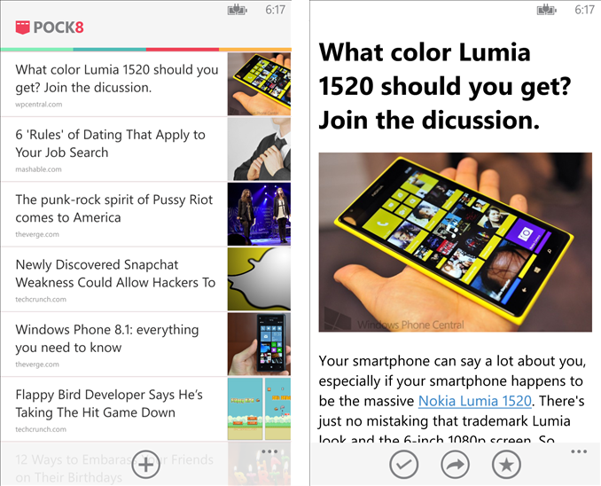
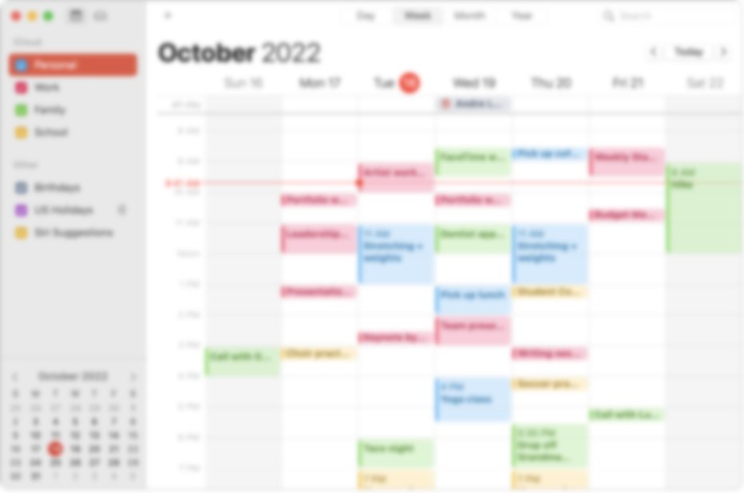
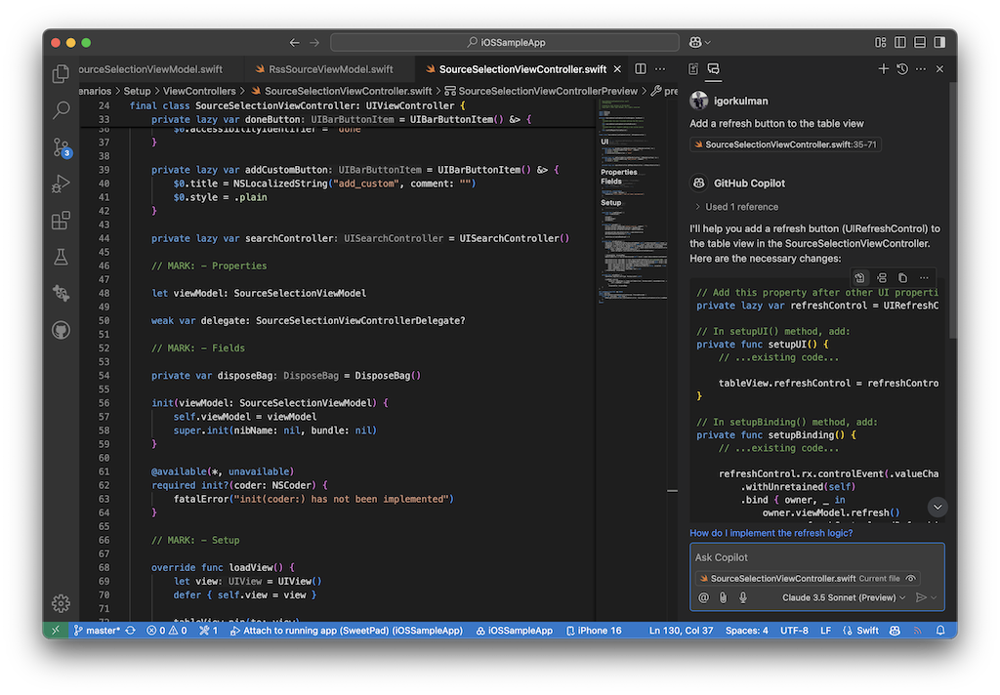

+++
Categories = ["Programming", "Career"]
Description = "A personal reflection on how programming joy fades in the modern software industry."
Tags = ["Programming", "Career"]
Keywords = ["Programming", "Career"]
author = "Igor Kulman"
date = "2025-10-22T05:29:12+01:00"
title = "I used to like software development... but not anymore"
url = "/i-used-to-like-software-development-but-not-anymore"

+++

I used to really like programming. Making apps, solving problems, seeing something I wrote come alive on a phone. I could spend hours coding and still want more.

**That feeling is mostly gone now**.

Somewhere between the meetings, the processes, and the layers of "modern development" I stopped enjoying it.

## The early days

I started programming professionally in 2012, doing Windows Phone 7 apps. It was a strange but exciting time. Every company wanted an app. Not just iOS or Android — in Czechia, Windows Phone actually had a bigger share than iPhones for a while.

It felt like everyone was building something. New apps all the time. I worked on a completely new project every few weeks — a radio player, a news reader, marketing event apps. It was fun. Things were simple.

Apps back then did one thing. You opened them, used them, and that was it. No tracking, no push notifications, no analytics, no login screens. Just an app that worked. You built it, shipped it, maybe fixed a bug or two, and you were done.

**I liked that. I liked that a lot.**

I was the only Windows Phone developer in a small agency. No sprints, no standups, no retrospectives. Someone told me what they needed, and I built it. Simple. Seeing my own code running on a phone in my hand felt amazing.

**Hard to describe that feeling now.**

I also built my own apps. Windows Phone was missing clients for a lot of popular services, so I made them. [My Pocket client](/pock8-beautiful-pocket-client-for-windows-phone) even became kind of popular. I handled everything myself — coding, support, updates, answering emails. It was small but personal. It felt like running a tiny company, just me and the users. It was the best time I ever had in software development.

That was also when a few of us Windows Phone developers from Czechia found each other online. We knew each other from Twitter and started meeting up. We called ourselves a "hate group" half as a joke. We would make fun of each other’s apps, trash-talk iOS or Android, laugh about Microsoft. It was honest and fun.

Same platform trash-talk was happening daily at the agency where I worked. It was part of the culture. We were all in it together.

**Today you say one slightly negative thing about a framework and someone calls you toxic**.

Back then, we just laughed.

Of course, it did not last. Microsoft completely mishandled Windows Phone, [I already wrote about that](/dealing-with-microsoft-in-wp-times), and slowly killed it. Watching it die was painful, but even then I still liked programming. The platform was dying, but writing code still made sense to me.

I think that was the last time I felt genuinely proud of something I built.

## The decline

When Windows Phone finally died, I moved to iOS. Swift was new, the platform felt different, and I could build something from scratch again. I worked remotely before everyone else did. Back then, remote work meant trust. You did your job, and no one checked on you.

There was one weekly meeting and that was it. The rest of the time, I just worked. I remember starting at 8:30 with black tea and milk, and losing track of time. It was quiet, focused, peaceful.

Then things started to change. More management, more planning, more "alignment". And then COVID came. Everyone started working remotely, including people who hated it or were bad at it, so companies added layers of control.

Suddenly, I was spending most of my time in meetings. Daily standups, retrospectives, syncs, planning meetings for other planning meetings.

Once we even had a **meeting to decide the time of another meeting**. It started with a long discussion about paella. I wish I was joking.

No Jira ticket for that one.

That was when I realized the difference between programming and software development.

**Programming means solving problems with code.**

**Software development means protecting companies from programmers.**

One creates, the other coordinates.

I do not blame any company for it. The whole industry changed. Everything got more structured, more predictable, less human. There are so many layers now. In code, in communication, in responsibility. Everything is safe, measurable, aligned.

Nothing is joyful.

## What remains

Sometimes I still get the old feeling back. Usually when I work on an open-source project I actually use myself. I fix a problem, it works, someone thanks me, and that is it. It reminds me why I started. Those moments are rare now, but they keep me going.

At one point I even thought about quitting development altogether. Maybe do infosec or something else. But I realized it was not programming I wanted to escape from.

It was what software development turned into.

When [Copilot](/vscode-ios-setup), Gemini, and Claude came out, I felt that spark again for a bit.

It was like suddenly having superpowers. I could skip the boring parts, experiment faster, build whatever I wanted. For a short while, it felt like magic again.

But that did not last either.

The tools are useful but frustrating, and reviewing bad AI-generated pull requests all day kills any excitement I might have had.

Now I just use them to finish faster.

Not to enjoy it.

Maybe the industry changed.

Maybe I did.

Either way,

**what used to feel like art now feels like work.**

I still like programming.

**I just do not like what software development has become.**
