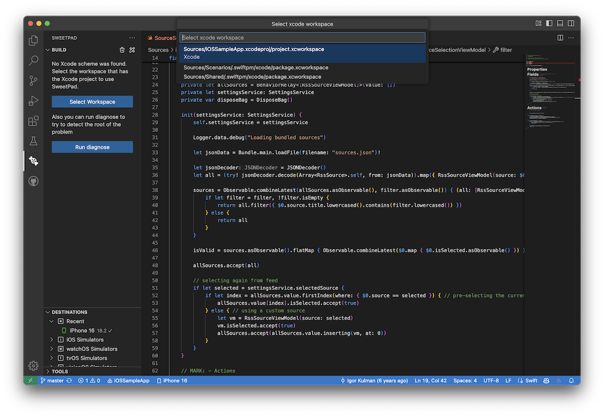
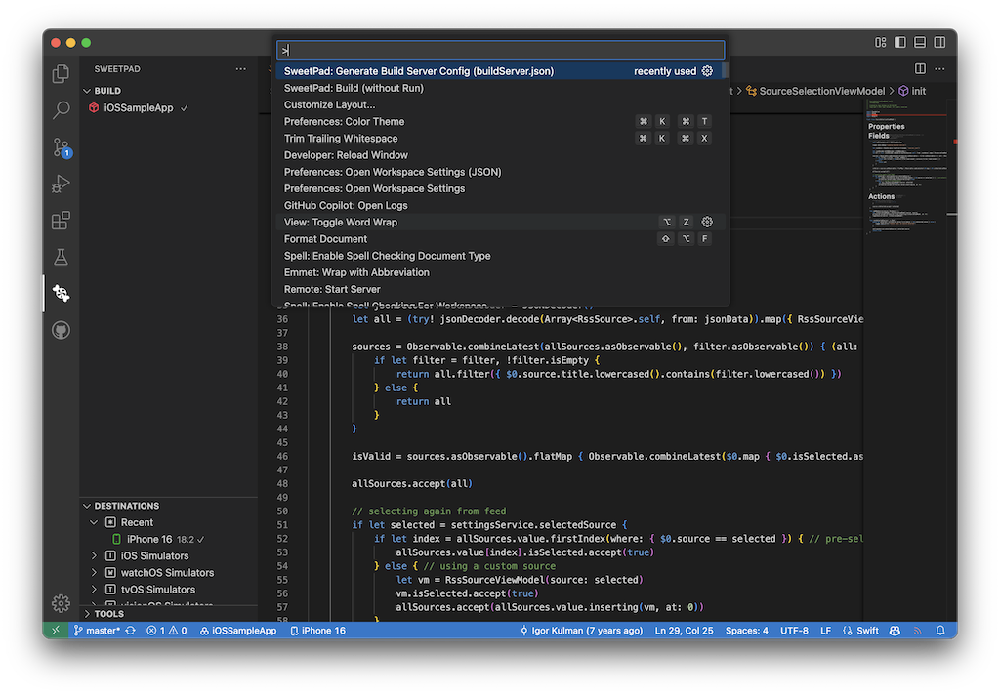
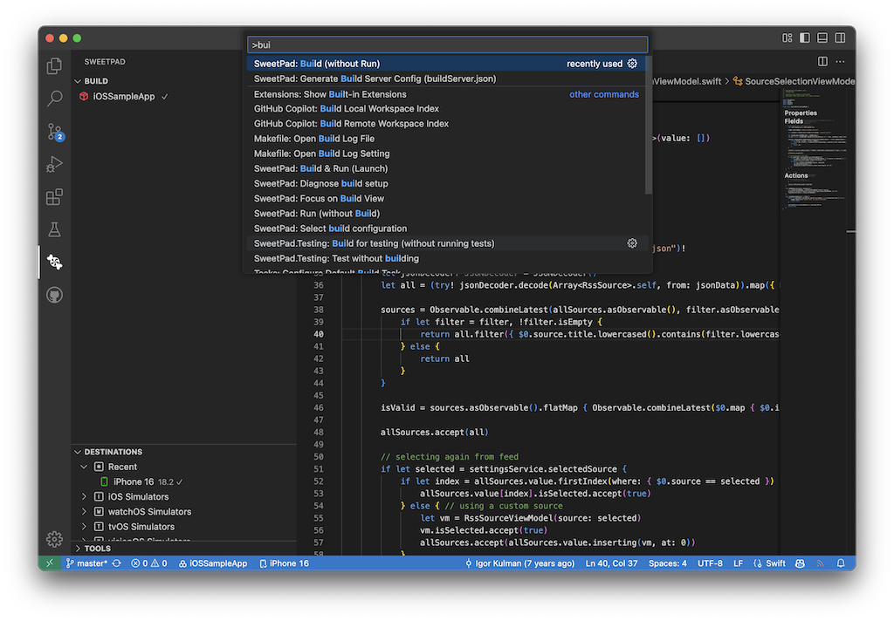
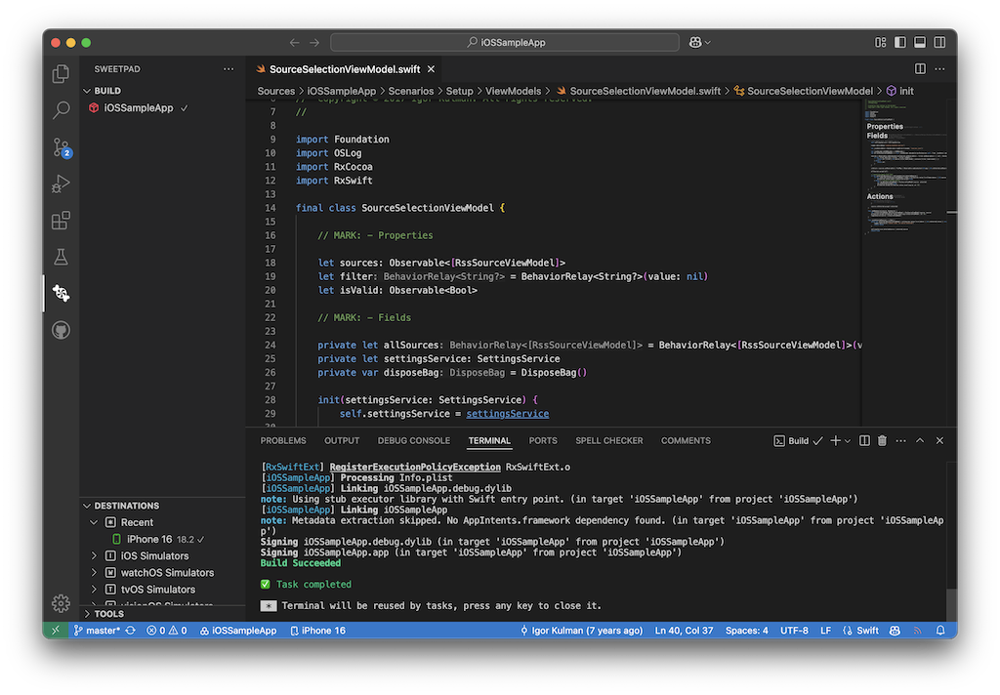
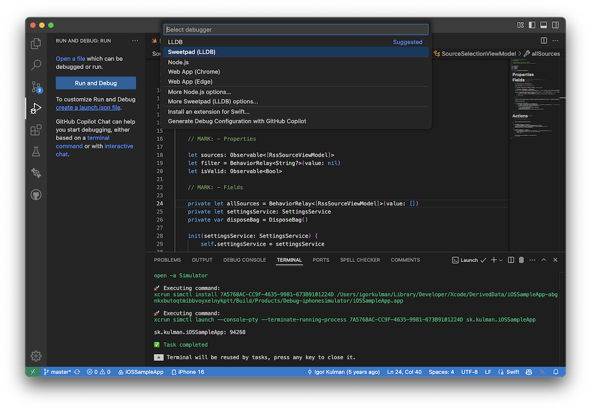
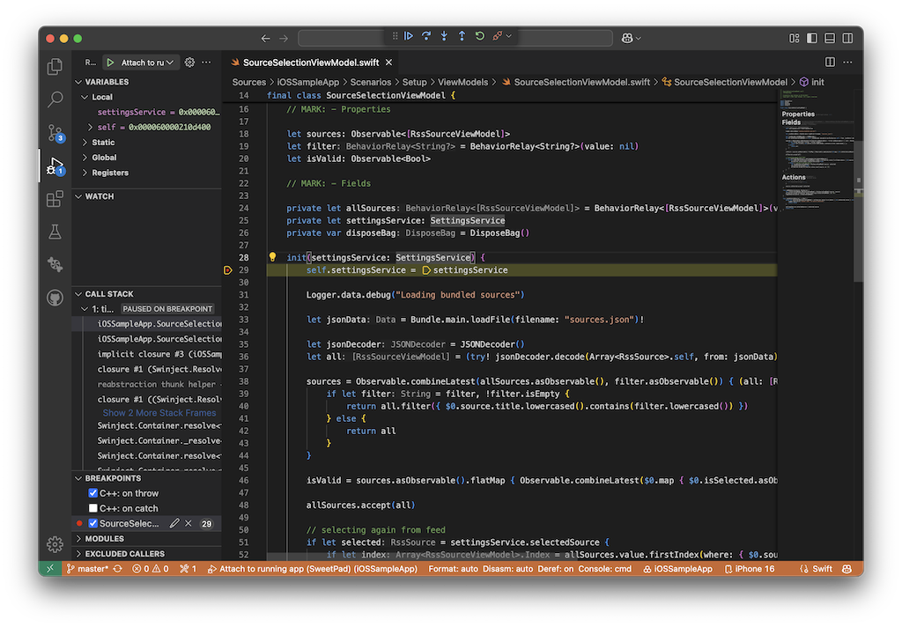
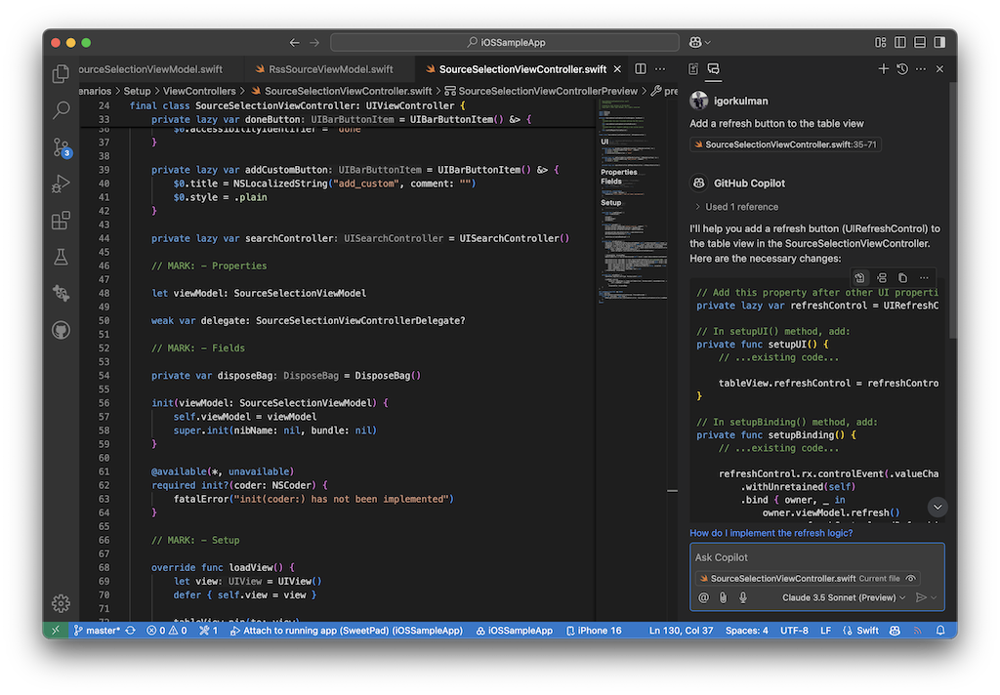

+++
Description = ""
Tags = ["iOS", "Swift", "VSCode", "Development Environment"]
author = "Igor Kulman"
date = "2025-02-26T05:29:12+01:00"
title = "Visual Studio Code setup for iOS development with Copilot"
url = "/vscode-ios-setup"
images = ["/vscode-ios-setup/copilot.png"]

+++

There is now an official GitHub Copilot extension for Xcode, but it essentially acts as a fancy autocomplete. Given how unreliable Xcode's autocomplete can be, this is still an improvement. However, to fully leverage GitHub Copilot’s capabilities, you will ll need a more extensible IDE—such as Visual Studio Code.

## Visual Studio Code tooling

The tooling in Visual Studio Code has come a long way in terms of supporting iOS development, and these days, you can configure it to offer a very good experience, including navigating the code, building and running the app, and even debugging with breakpoints.

The first thing you need to install is the [server protocol implementation to integrate Xcode with sourcekit-lsp](https://github.com/SolaWing/xcode-build-server) from Homebrew:

```bash
brew install xcode-build-server
```

If you are not familiar with the term LSP, you just need to know that the Language Server Protocol (LSP) is an open protocol for use between IDEs and servers that provide programming language-specific features like code completion, syntax highlighting, marking of warnings and errors, and refactoring routines. The goal of the protocol is to allow programming language support to be implemented and distributed independently of any given IDE.

Next, install the [official Swift extension for Visual Studio Code](https://marketplace.visualstudio.com/items?itemName=swiftlang.swift-vscode).

This should be enough to allow you to comfortably use Swift in Visual Studio Code for server-side or command-line applications. However, to add support for iOS development, you need one more thing.

To add support for iOS development, install [Sweetpad](https://sweetpad.hyzyla.dev/), which is another Visual Studio Code extension.

Sweetpad has [great documentation](https://sweetpad.hyzyla.dev/docs/intro/) to help you get started. I highly recommend checking it out.

Once you have the necessary extensions installed, it’s time to set up an actual iOS project in Visual Studio Code.

## iOS project setup

I will be using my [iOSSampleApp](https://github.com/igorkulman/iOSSampleApp/) to show the setup.

In Visual Studio Code, open the Sweetpad pane. In a simple project, it automatically detects your project or workspace, but in a more complicated one, you need to select it manually.



The configuration gets saved to the `.vscode/settings.json` file, and you need to reload Visual Studio Code to make Sweetpad show you a list of your project’s targets.

```json
{
    "sweetpad.build.xcodeWorkspacePath": "Sources/iOSSampleApp.xcodeproj/project.xcworkspace"
}
```

Next, make Sweetpad generate the build server configuration for you. You can access the command from the command palette (`Cmd + Shift + P`).



This generates a `buildServer.json` file.

```json
{
	"name": "xcode build server",
	"version": "0.2",
	"bspVersion": "2.0",
	"languages": [
		"c",
		"cpp",
		"objective-c",
		"objective-cpp",
		"swift"
	],
	"argv": [
		"/opt/homebrew/bin/xcode-build-server"
	],
	"workspace": "/Users/igorkulman/Projects/open-source/iOSSampleApp/Sources/iOSSampleApp.xcodeproj/project.xcworkspace",
	"build_root": "/Users/igorkulman/Library/Developer/Xcode/DerivedData/iOSSampleApp-abgnkxbutoqtmibbvoyxelnykptt",
	"scheme": "iOSSampleApp",
	"kind": "xcode"
}
```

Now you can try building the app with the **Build without Run** command to make sure everything works.



This will also get rid of any previously shown errors that were caused by dependencies not being recognized before the build.



You can now press `F5` to run the app, but a better way is to properly set up the debugger.

Open the Debug pane, click **Create a launch.json file**, and select `Sweetpad (LLDB)`.



This will create a default configuration for you that should work without any additional changes, so just save it. The created file is `.vscode/launch.json`.

```json
{
    "version": "0.2.0",
    "configurations": [
        {
            "type": "sweetpad-lldb",
            "request": "attach",
            "name": "Attach to running app (SweetPad)",
            "preLaunchTask": "sweetpad: launch"
        }
    ]
}
```

This is everything you need to set up your project. All the configuration is stored in the three JSON files that were created in the process. This configuration is project-specific.

Running `F5` will now run the app with the debugger attached, so you can use breakpoints, watch variables, etc.



## Using GitHub Copilot

With the project fully set up, you can now take advantage of GitHub Copilot to streamline your development workflow.

You will get autocomplete suggestions, and you can open the Copilot chat window to ask questions about the codebase or have Copilot implement things for you.



After you ask Copilot to do something, it will reply with proposed code changes that you can directly apply to your codebase with a single click.

I recommend watching any of the [GitHub videos about Copilot](https://www.youtube.com/watch?v=vdBxfFVXnc0) if you are not familiar with its usage in Visual Studio Code.
