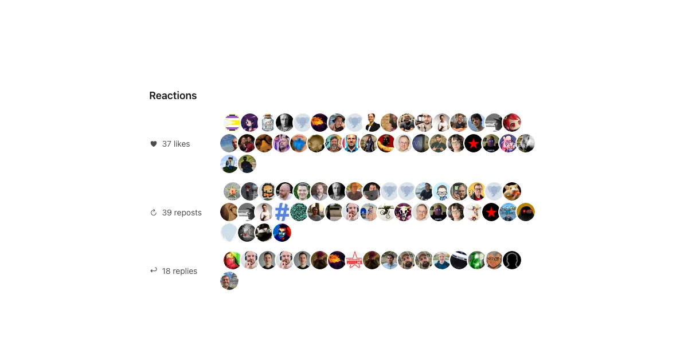

+++
title = "Adding IndieWeb support to my static Hugo blog"
description = "How I added microformats, Webmentions, and Mastodon backfeed to a static Hugo blog without adding a backend."
author = "Igor Kulman"
date = "2026-07-29T07:00:00+02:00"
tags = ["Hugo", "IndieWeb", "Webmention", "Mastodon", "Blog"]
Keywords = ["Hugo", "IndieWeb", "Webmention", "microformats", "Mastodon", "Bridgy"]
url = "/adding-indieweb-to-hugo-blog"
images = ["/adding-indieweb-to-hugo-blog/reactions.webp"]
+++

I recently read Andros Fenollosa's article [I joined the IndieWeb, here's what I learned](https://en.andros.dev/blog/0b8e451e/i-joined-the-indieweb-heres-what-i-learned/) and immediately went down the same rabbit hole.

I had seen the term IndieWeb before, but I always assumed it meant a vague preference for personal websites over social networks. Something nostalgic, maybe a little idealistic, but not necessarily technical.

It turns out there is a very practical side to it: small standards that let independent websites describe their content, receive links and reactions from other sites, and connect to social networks without giving up ownership of the original content.

That sounded exactly like something I wanted for this blog.

## I was already halfway there

The first surprise was how much I had already done without explicitly thinking of it as IndieWeb.

This blog has its own domain. The content is Markdown stored in Git. [Hugo](https://gohugo.io/) generates plain HTML and Netlify hosts it. Every article has an explicit permanent URL. There is an RSS feed, canonical links, and `rel="me"` links to my GitHub and Mastodon profiles.

The most important IndieWeb decision probably happened back in 2015, when [I moved this blog from WordPress to Hugo](/going-static-from-wordpress-to-hugo). The publishing interface is still my editor and Git, and the site does not need a database or an administration backend.

That meant I did not need to rebuild anything. I only needed to make the HTML more descriptive and add a way to receive interactions.

## Adding microformats to Hugo

The first step was [microformats2](https://microformats.org/wiki/microformats2), a set of class names added to normal HTML. They do not change how the page looks, but they let parsers understand what the page contains.

I added an `h-card` to the profile on the homepage, an `h-feed` around the article list, and an `h-entry` to every article. The individual properties describe the title, content, publication date, author, URL, and tags:

```html
<article class="h-entry">
  <h1 class="p-name">Article title</h1>
  <time class="dt-published" datetime="2026-07-29T07:00:00+02:00">
    July 29, 2026
  </time>
  <section class="e-content">
    ...
  </section>
</article>
```

My Hugo theme is vendored directly in the repository and I have already modified it many times. I could have copied the templates into the project-level `layouts` directory as overrides, but that would mean copying whole files. Updating the existing theme templates was simpler and consistent with how this blog is maintained.

I modified the list and article templates to emit:

- `h-card`, `p-name`, `p-note`, `u-photo`, and `u-url` for the homepage profile
- `h-feed` and lightweight `h-entry` items for article lists
- `h-entry`, `e-content`, `dt-published`, `p-author`, `u-url`, `u-uid`, and `p-category` for articles

There was one amusing problem. The theme uses Tailwind CSS classes such as `h-24` and `h-full` for element heights. A microformats parser sees classes beginning with `h-` as nested microformat roots, so my avatar stopped being parsed as the `u-photo` of the surrounding `h-card`.

CSS and microformats had accidentally chosen the same prefix for completely different things.

I replaced those two height utilities and validated the result with the [Pin13 microformats parser](https://pin13.net/mf2/). The parser then correctly found the profile, photo, feed, article titles, dates, URLs, author, content, and categories.

## Receiving Webmentions

The next part was [Webmention](https://www.w3.org/TR/webmention/), the protocol that lets one page notify another page that it links to it.

A Webmention request contains only a source and a target URL. The receiver fetches the source, verifies that the link really exists, and then decides what kind of interaction it represents. Combined with microformats, that interaction can be a normal mention, a reply, a like, or a repost.

A static Hugo site cannot receive HTTP requests by itself, so I registered `blog.kulman.sk` with [Webmention.io](https://webmention.io/). It receives and stores Webmentions on behalf of static sites and exposes them through an API.

The blog now advertises the hosted endpoints in its `<head>`:

```html
<link rel="webmention"
      href="https://webmention.io/blog.kulman.sk/webmention">
<link rel="pingback"
      href="https://webmention.io/blog.kulman.sk/xmlrpc">
```

I tested the setup with [Webmention Rocks](https://webmention.rocks/). It discovered the endpoint, sent a Webmention, and Webmention.io returned HTTP 201 with a status URL. The test mention appeared in the dashboard and could be deleted afterwards.

At that point everything worked, but there was nothing useful to display.

## Getting reactions back from Mastodon

What I actually wanted was backfeed: when I share an article on Mastodon, bring the replies, favorites, and boosts back to the original article.

For that I used [Bridgy](https://brid.gy/), specifically Bridgy classic rather than Bridgy Fed. The distinction is important.

Bridgy Fed would make the website its own Fediverse account. I already have `@igorkulman@hachyderm.io`, so I wanted to connect the blog to that existing account instead. Bridgy classic is designed for exactly this: connect an existing social account to a website, then translate social interactions into Webmentions.

My Mastodon profile already linked to `blog.kulman.sk`, and the blog linked back with `rel="me"`. I signed into Bridgy with Mastodon, enabled backfeeding, and asked it to crawl the site and poll the account.

The latest article worked immediately. Bridgy found the toot that linked to the article, found its favorites and boosts, converted them to microformats, and sent them to Webmention.io.

Older articles did not appear automatically. Bridgy only checks a limited number of recent social posts, and I post on Mastodon much more often than I publish articles. Even an article from two months earlier was already outside the automatic window.

The solution was manual but simple. For each older article I wanted to import, I pasted the Mastodon toot URL into Bridgy's **Resend for post** field and clicked **Discover**. Bridgy inspected the toot, found the linked article, and sent the available replies, likes, and reposts to that article's Webmention endpoint.

After doing this for a few posts, Webmention.io suddenly contained real data instead of a single test entry.

## Rendering the reactions

Once there was something worth displaying, I added a small reactions section near the end of each article.



The rendering is dynamic rather than part of the Hugo build. When an article loads, a small JavaScript file requests its current Webmentions. If there are none, the entire section remains hidden. New Mastodon reactions can therefore appear without rebuilding or redeploying the blog.

In production the request goes through a same-origin Netlify proxy. When running `hugo server` locally, the script calls Webmention.io directly but still queries the production article URL, so I can test the real data locally.

The script groups reactions into likes, reposts, replies, and ordinary mentions. It shows a count and a row of avatars for each group. Like and repost avatars link to the user's profile because those interactions do not have a useful standalone toot. Replies are different: Webmention.io provides the URL of the actual reply, so reply avatars link directly to that specific toot.

All returned data is treated as untrusted. The script creates elements through DOM APIs, validates that links use HTTP or HTTPS, and never inserts the HTML supplied by a remote Webmention. If the API is unavailable, the article still works normally and the reactions section simply stays hidden.

## What I deliberately skipped

The IndieWeb has more building blocks, but I do not need all of them.

I did not add [Micropub](https://micropub.net/) because my editor and Git are already a good publishing interface. I did not add [IndieAuth](https://indieauth.com/) because the blog has no administration UI. I did not add [WebSub](https://www.w3.org/TR/websub/) because publishing is infrequent and real-time feed delivery would add complexity without solving a problem I have.

I also kept RSS. An HTML `h-feed` is elegant, but RSS works with practically every feed reader and costs me nothing to maintain because Hugo generates it.

This is probably the part of the IndieWeb philosophy I like most: use the pieces that solve an actual problem and ignore the rest.

The blog is still a static Hugo site. Articles are still Markdown files committed to Git. There is no new database and no application server to maintain.

But now the HTML describes itself, other sites can mention it, and conversations that happen around my Mastodon copies can find their way back to the original articles.

That feels like a meaningful improvement for a surprisingly small amount of plumbing.
