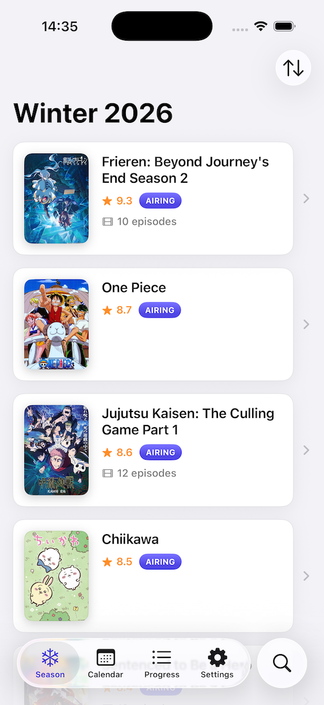
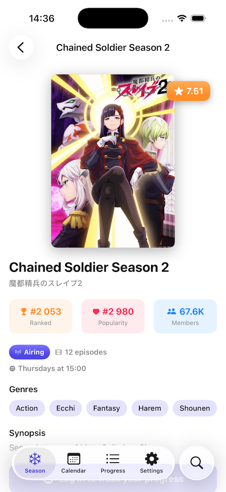
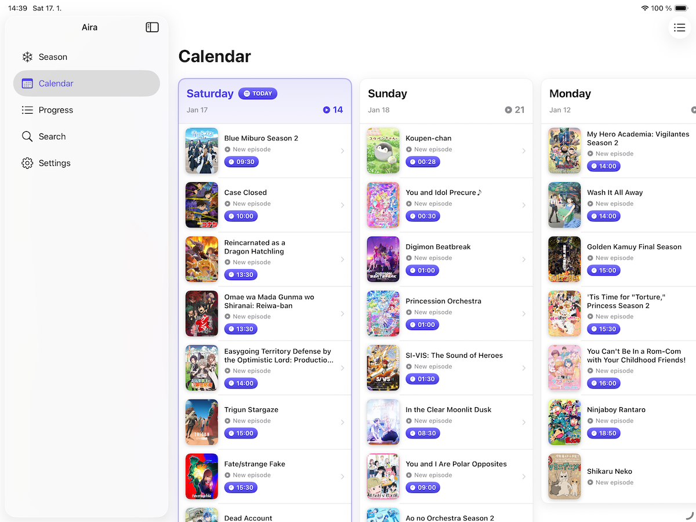

+++
title = "Building Aira: a calm anime tracker for myself"
description = "A personal reflection on building Aira, a simple anime tracker for seasonal watchers."
author = "Igor Kulman"
date = "2026-02-25T09:00:00+01:00"
tags = ["iOS", "Indie", "Product", "Anime"]
url = "/building-aira"
images = ["/building-aira/calendar.png"]
+++

For years, tracking anime was just part of my routine. I used [MyAnimeList](https://myanimelist.net/) because it worked well enough, and I never thought much about it. It was just something I did after every episode.

But over time, the way I watched anime changed. The tools I used did not change with me.

**I started to feel a disconnect.**

## From backlog to seasons

When I first got into anime, there was always a backlog. There were classics to catch up on, highly rated shows I had not seen yet, and long lists of “someday.”

That phase ended. Now, I have seen most of the older shows I cared about. These days, I mostly watch **seasonal anime** — week by week, episode by episode.

That changes everything. I am no longer asking myself, *“What should I watch next?”* I am asking, *“What airs today?”*

Surprisingly, that simple question is not well supported by the tools out there.

## Limitations of existing apps

The official MyAnimeList iOS app is ad-heavy, busy, and tries to do everything at once. It never felt calm or focused. I tried third-party clients, but most of them either try to replicate the whole website, are packed with features I do not need, or are simply buggy in daily use.

None of them focused on what I actually cared about: **a clear view of the current season and simple episode tracking**.

## What I really wanted

After years of using these tools, I realized I did not need much. I just wanted:

- A clean overview of the current season
- A simple calendar showing what airs when
- A way to mark episodes as watched
- No social features
- No gamification
- No pressure

Just something calm that fits into a weekly routine.

I also wanted it to work **without requiring an account**. Some people just want to see what is airing, without logging into anything. That should be fine.

So I decided to build it for myself.

## Building Aira

*Season overview and focused episode tracking.*

It does very little, by design.

*A calm overview of what airs during the week.*

Some intentional decisions:

- No backend
- Works offline
- No tracking or analytics
- No subscriptions
- No ads

You can optionally connect a MyAnimeList account to sync your progress, but the app works perfectly fine without it.

For the first version, I kept the app completely free. I wanted to make sure the core experience was solid and reliable before even thinking about monetization.

## Choosing calm over features

It would have been easy to keep adding things: recommendations, ratings, social features, automation, background syncing.

But every feature adds noise, complexity, and new ways for things to break.

I wanted something that does less, but does it predictably.

An app that does not demand attention, does not try to keep you engaged, and does not turn watching anime into another system to manage.

## What comes next

I do not have a detailed roadmap.

There are obvious ideas — maybe [AniList](https://anilist.co/) support in the future, maybe more customization — but only if they fit the same philosophy.

For now, I am just happy that the app exists at all, and that it solves a very specific problem I had myself.

**Sometimes, building something small for yourself is enough. That is what Aira is for me.**

If you are curious, the app has a small page here: https://airaapp.kulman.sk.