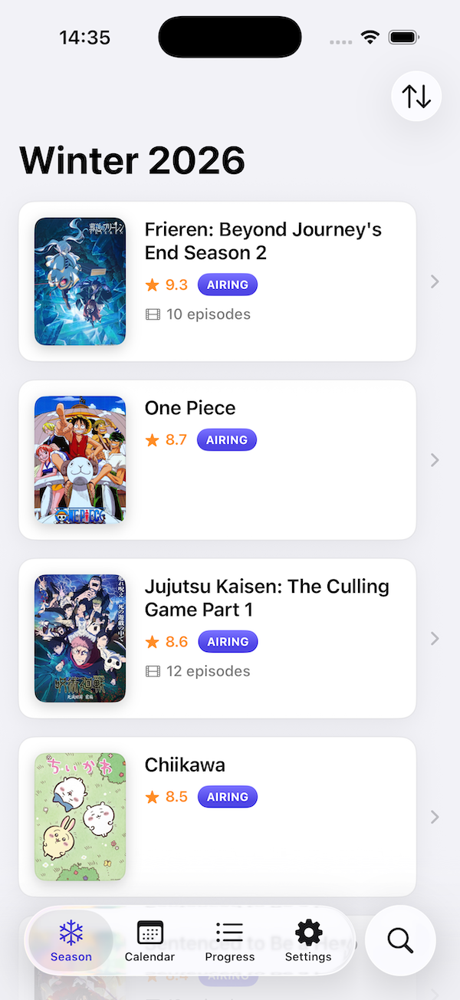
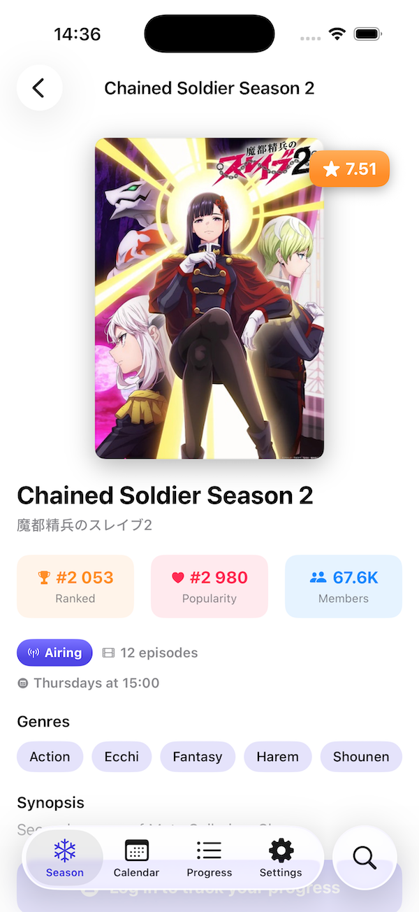
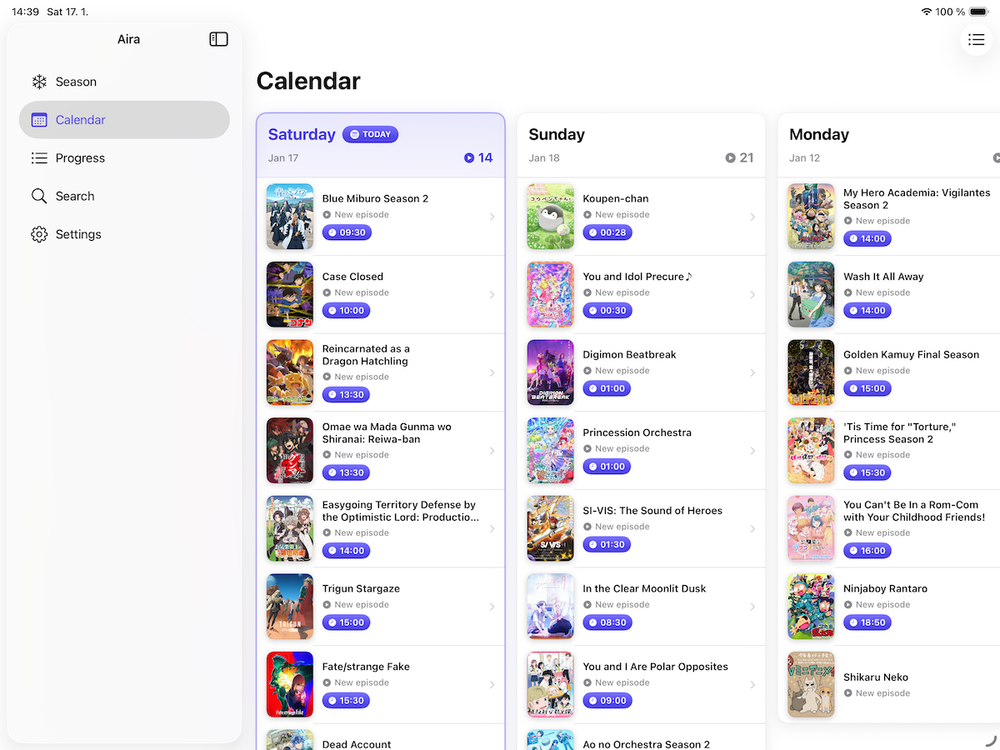

+++
title = "Building Aira: a calm anime tracker for myself"
description = "A personal reflection on building Aira, a simple anime tracker for seasonal watchers."
author = "Igor Kulman"
date = "2026-02-25T09:00:00+01:00"
tags = ["iOS", "Indie", "Product", "Anime"]
url = "/building-aira"
images = ["/building-aira/calendar.png"]
+++

Tracking anime has been part of my routine for years. I used [MyAnimeList](https://myanimelist.net/), updated it after every episode and never thought much about whether there might be a better way to do it. It worked well enough for the way I watched anime at the time.

When I first got into anime, I always had a backlog. There were older classics I wanted to see, highly rated shows I had missed and a long list of things I might watch someday. MyAnimeList was useful for keeping track of all of that.

Eventually I watched most of the older shows I cared about and my habits changed. I now mostly follow seasonal anime as it airs, week by week. This means I rarely open a tracker to decide what to watch next. I usually want to know what airs today, or to mark the latest episode of a show as watched.

The tools I was using could do much more than that, but they did not feel particularly good at this simple weekly routine.

## What I wanted from an anime tracker

The official MyAnimeList iOS app is busy, full of ads and designed to expose much more of the service than I need. I also tried several third-party clients. Most attempted to reproduce the whole website, included features I did not care about or were too unreliable for something I wanted to use after every episode.

I wanted the current season to be the main view rather than one section among many. I also wanted a weekly calendar, straightforward episode tracking and a detail screen with the information I actually look at. I had no interest in adding social features, recommendations or gamification around watching anime.

There was also no reason to require an account just to browse the current season and see what airs during the week. MyAnimeList synchronization is useful, but it should be an optional addition rather than the first screen shown when the app starts.

This was specific enough that building my own app started to seem easier than continuing to look for one. I called it Aira.

## Building around the current season

*The current season and episode tracking on iPhone.*

Aira opens with the current season and keeps the interaction around each show simple. The calendar answers the question I most often have: what is airing on a particular day?

*The weekly calendar on iPad.*

The app has no backend and works offline. It also has no ads, subscriptions, tracking or analytics. If you connect a MyAnimeList account, Aira can synchronize your progress; without an account, the season browser and calendar continue to work normally.

I kept the first version free. Before thinking about monetization, I wanted to use it for a while and make sure that the basic season and episode tracking was reliable.

## Keeping the scope under control

There are plenty of features that could be added to an anime tracker. Recommendations, ratings, social features, automation and background synchronization are all obvious candidates. They would also move Aira closer to the apps I had already tried and away from the reason I built it.

I do not have a detailed roadmap for that reason. I may add [AniList](https://anilist.co/) support or more customization later, but I do not want maintaining the app to become more work than using it saves me.

For now, Aira shows me the current season, tells me what airs during the week and lets me keep my progress up to date. That is the routine I built it for, and it is what I use it for now.

More information about the app is available at [airaapp.kulman.sk](https://airaapp.kulman.sk).
