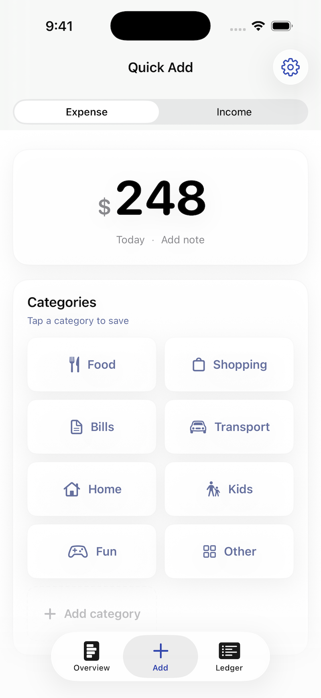
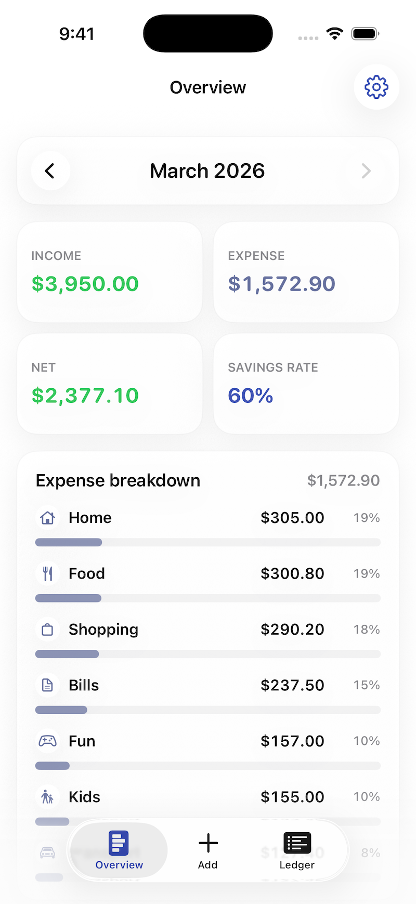
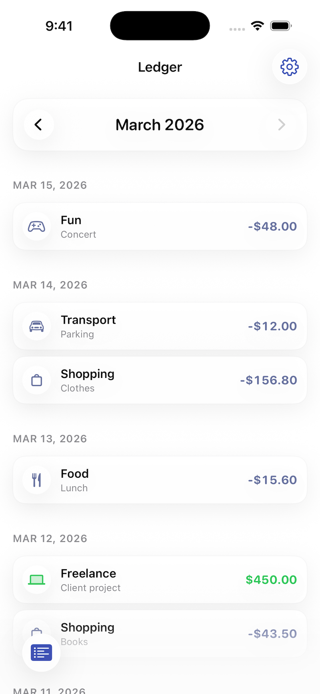

+++
title = "Why I built my own expense tracker"
author = "Igor Kulman"
date = "2026-03-25T07:00:00+01:00"
tags = ["iOS", "Indie", "Product", "Finance"]
url = "/building-ledgee"
+++

For years I kept trying different expense tracking apps.

At first they always seemed promising. I would install one, enter a few transactions, maybe explore the charts and reports. For a week or two I would even use it consistently.

Then gradually I stopped opening the app.

Not because it was bad. Many of them were actually great.

**The problem was different: they expected a mindset I simply do not have.**

Most days I do not want to “analyze spending behavior.” I just want to record that I spent money and continue with my day.

If entering an expense takes effort, I postpone it. If I postpone it, I forget. If I forget, the app is useless.

**That is the whole motivation behind Ledgee.**

## Recording spending should not feel like work

Most finance apps are optimized for reviewing data.  
**Ledgee is optimized for creating it.**

That sounds obvious, but it changes everything.

Instead of building “another personal finance app,” I focused on the one moment that matters most: the second right after you pay for something.

**In Ledgee the main flow looks like this:**

`enter amount → tap category → saved`

No forms, no confirmation screens, no extra “Save” tap.

The app assumes the default action is: this should be recorded immediately.

## Built for myself first

This project started the same way many of my apps start: I built the tool I wanted to use myself.

Over time, the apps I used either became more complex or moved basic features behind subscriptions. Neither felt good.

So I made something intentionally small that does a few things well:
- quick expense and income entry
- simple monthly overview
- a ledger of transactions
- automatic iCloud backup

That’s it.

**No account, no subscription, no analytics about your life choices.**

## Native software still matters

Ledgee is a fully native iOS app because **I still believe native software matters.**.

It supports light and dark mode, Dynamic Type, and iCloud sync. Your data stays private and is backed up automatically across your devices.

You do not create a new account just to type “coffee 4.50”. The app uses system capabilities that already exist and work well.

For this kind of utility app, that approach feels more honest than building custom infrastructure for things the system already does well.

## Trying to keep it small

The hardest part is not building features.  
**The hardest part is refusing to build them.**

There are always ideas: budgets, tags, charts, import from bank statements, integrations.

Some of those may show up later, but only if they do not slow down the core flow.

The goal is still the same: record quickly, keep a clear monthly view, and have a reliable ledger.

**If it stops being simple, it stops being useful.**

## If you want to try it

If this kind of minimal expense tracking sounds appealing, you can download Ledgee from the App Store.

There is also a small product page at [ledgeeapp.kulman.sk](https://ledgeeapp.kulman.sk/).

If you try it and something feels wrong, slow, or missing, I would like to hear about it.
