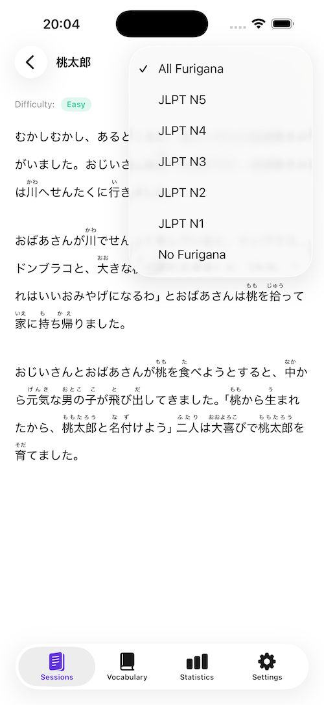
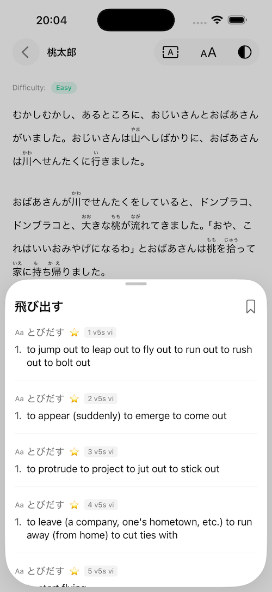
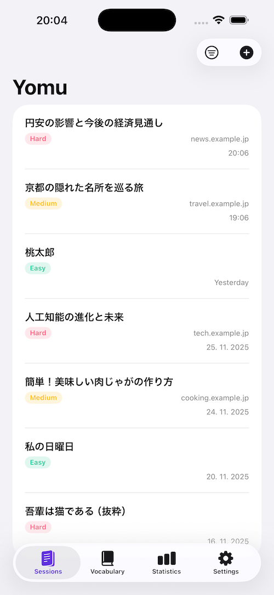

+++
Description = ""
Tags = ["iOS", "Swift", "Japanese", "Development", "Yomu"]
author = "Igor Kulman"
date = "2026-01-14T05:29:12+01:00"
title = "The Japanese reading problem that finally made me build my own app"
url = "/japanese-reading-problem"

+++

I’ve been learning Japanese for several years now. Not intensively, not full‑time, but consistently — textbooks, classes, homework, and a lot of reading that never quite felt as productive as it should.

In December I took the **JLPT N4**. While preparing for it, I spent a lot of time reading Japanese texts that were *supposed* to be appropriate for my level. And that’s where I kept running into the same problem over and over again.

Almost everything had **full furigana**.

*(Furigana are the small kana readings written above kanji in Japanese text to show how they are pronounced, for example <ruby>漢字<rt>かんじ</rt></ruby>)*

At an intermediate level, however, this has an unintended side effect. Over time, I noticed that I was relying on furigana even for kanji I already knew, which reduced the amount of actual kanji reading practice I was getting.

## When help turns into a crutch

I realized that during reading practice, I was not actually practicing reading anymore. I was decoding pronunciation. The kanji were there visually, but my brain was bypassing them completely.

One day in class, the teacher suggested a simple exercise: *cover the furigana with a strip of paper* and try reading the text that way.

It was immediately harder, and it required noticeably more concentration.

I had to slow down. I had to actually recognize kanji. I still stumbled — but in a productive way. The difficulty felt *right*.

That exercise stuck with me.

Because it raised an obvious question:

> Why is this all‑or‑nothing?

Why do learning materials either show **all** furigana or **none**?

Why cannot the text adapt to what I already know?

## The gap I could not unsee

If you’re studying for JLPT N4, you are *expected* to know all N5 and N4 kanji. Hiding furigana for those characters is not being harsh — it is being honest.

But I could not find a tool that did this cleanly.

* Textbooks: static, one‑size‑fits‑all
* Graded readers: either too easy or too hand‑holding
* Dictionary apps: great for lookups, terrible for flow
* Browsers: full furigana everywhere

What I wanted was simple:

* Hide furigana for kanji I *should* know
* Keep furigana for harder kanji
* Let me read real Japanese text
* Don’t break my reading flow

I wanted this **for myself**, first and foremost.

And once I realized it did not exist in the way I wanted it to, the next step was obvious.

## So I built it

I ended up building an iOS app called **Yomu**.

The core idea is straightforward:

* You select your JLPT level
* Furigana is automatically hidden for kanji at or below that level
* Furigana is kept for characters above your level

That is it.

Everything else exists to support *reading*:

* Import text from anywhere
* Scan physical books and printed material
* Tap words for instant dictionary lookup

* Save vocabulary and export it later
* Keep everything fast and offline

The goal was never to gamify Japanese learning or turn it into a streak‑based system. I already have tools for that.

This was about one thing:

> **Optimizing reading practice for what the learner already knows.**

## How Yomu changes reading

Here is a concrete example. Suppose you are studying for JLPT N4. Consider this sentence:

> 日本の歴史について詳しく説明してください。

With full furigana, it looks like this:

> <ruby>日本<rt>にほん</rt></ruby>の<ruby>歴史<rt>れきし</rt></ruby>について<ruby>詳<rt>くわ</rt></ruby>しく<ruby>説明<rt>せつめい</rt></ruby>してください。

But for JLPT N4, you are expected to know the kanji 日本 and 歴史. Yomu hides furigana for these, so you see:

> 日本の歴史について<ruby>詳<rt>くわ</rt></ruby>しく<ruby>説明<rt>せつめい</rt></ruby>してください。

If the sentence contained even harder kanji, Yomu would keep furigana for those as well, letting you focus on what you need to learn while practicing what you already know.

## Not a silver bullet

This does not magically make Japanese easy.

You still have to struggle.
You still have to look things up.
You still have to reread sentences.

The difficulty shifts back toward recognizing kanji and parsing sentences, rather than relying on pronunciation hints.

## Yomu is now live

I originally built Yomu to solve my own frustration while preparing for JLPT N4. Over time it became clear that this problem is fairly common among intermediate learners.

If this sounds familiar, the app is now live:

👉 **[https://yomuapp.kulman.sk](https://yomuapp.kulman.sk)**

This post is the first part of a short series about building Yomu. In the next posts, I will go into the technical side — rendering furigana correctly, tokenizing Japanese text, offline dictionaries, OCR, and the surprisingly messy reality of copying Japanese text from Safari.

This post describes the problem that motivated the project in the first place.
